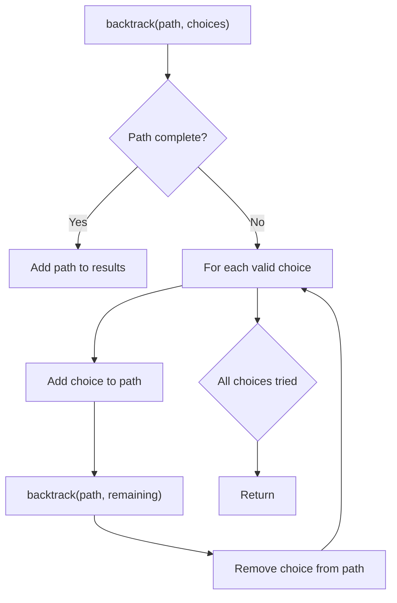
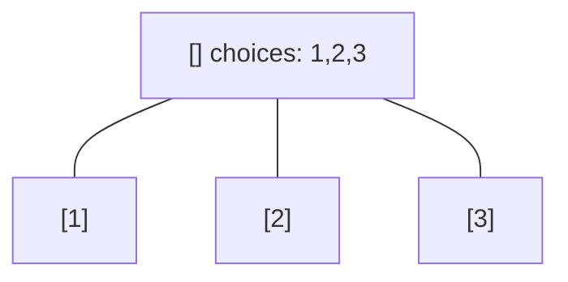
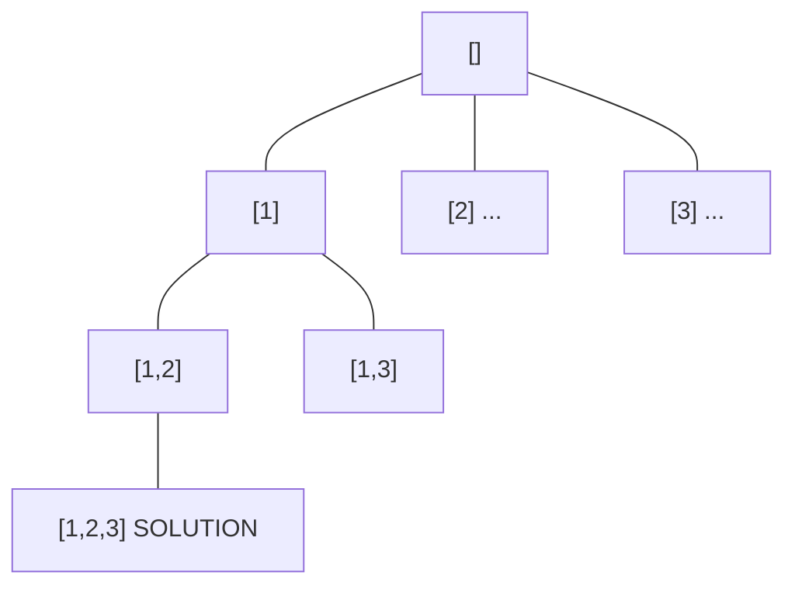
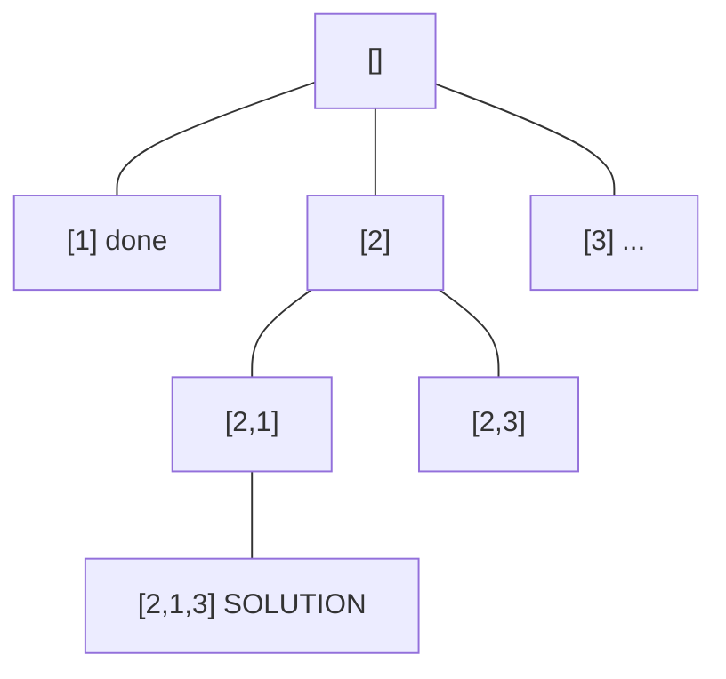
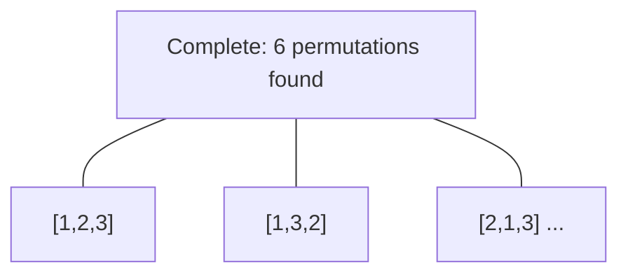

# Problem 52: N-Queens II

**Difficulty:** Hard  
**Tags:** Backtracking  
**Pattern:** Backtracking  
**Link:** [leetcode.com/problems/n-queens-ii](https://leetcode.com/problems/n-queens-ii/)

## Description

The **n-queens** puzzle is the problem of placing `n` queens on an `n x n` chessboard such that no two queens attack each other.

Given an integer `n`, return *the number of distinct solutions to the **n-queens puzzle***.

 

Example 1:

```

**Input:** n = 4
**Output:** 2
**Explanation:** There are two distinct solutions to the 4-queens puzzle as shown.

```

Example 2:

```

**Input:** n = 1
**Output:** 1

```

 

**Constraints:**

	- `1 <= n <= 9`

## Approach: Backtracking

Same as N-Queens I but just count solutions instead of storing boards.

## Pseudocode

```
Same as N-Queens but increment counter instead of recording
```

## Algorithm Flow



## Visual State Transitions

**Backtracking Decision Tree:**

**Frame 1: Root - start with empty path**


**Frame 2: Explore branch [1]**


**Frame 3: Backtrack, explore [2]**


**Frame 4: All solutions found**



## Complexity Analysis

- **Time:** O(n!)
- **Space:** O(n)

## Solution (Python3)

```python
class Solution:
    def totalNQueens(self, n: int) -> int:
        self.count = 0
        cols, d1, d2 = set(), set(), set()
        def solve(row):
            if row == n:
                self.count += 1
                return
            for col in range(n):
                if col in cols or row-col in d1 or row+col in d2:
                    continue
                cols.add(col); d1.add(row-col); d2.add(row+col)
                solve(row+1)
                cols.discard(col); d1.discard(row-col); d2.discard(row+col)
        solve(0)
        return self.count
```

## Solution (C++)

```cpp
#include <functional>
#include <string>
#include <vector>
using namespace std;

class Solution {
public:
    int totalNQueens(int n) {
        // Backtracking - O(2^n) or O(n!) time
        vector<vector<int>> result;
        vector<int> path;
        function<void(int)> backtrack = [&](int start) {
            result.push_back(path);
            for (int i = start; i < (int)n.size(); i++) {
                path.push_back(n[i]);
                backtrack(i + 1);
                path.pop_back();
            }
        };
        backtrack(0);
        return result;
    }
};
```
