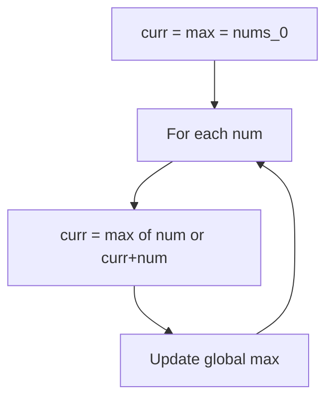
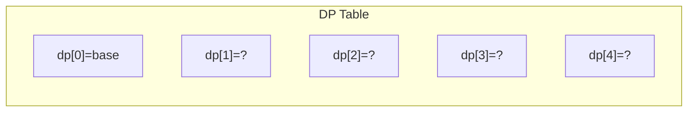
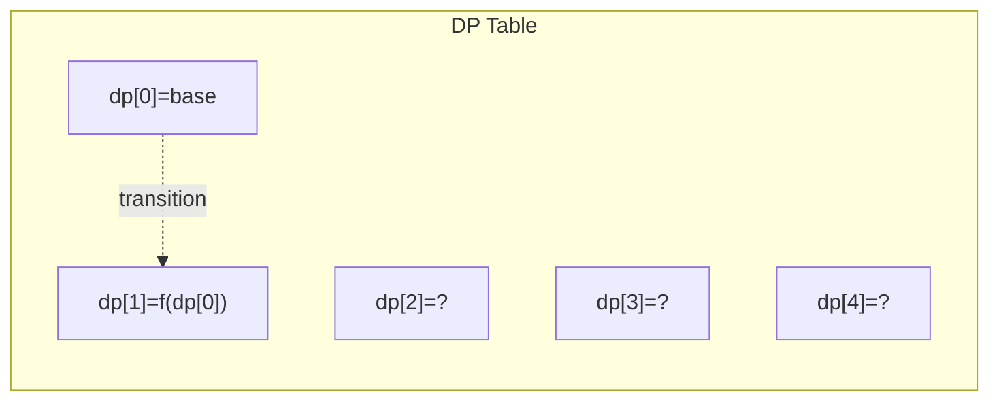
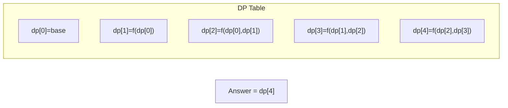

# Problem 53: Maximum Subarray

**Difficulty:** Medium  
**Tags:** Array, Divide and Conquer, Dynamic Programming  
**Pattern:** Kadane's Algorithm (DP)  
**Link:** [leetcode.com/problems/maximum-subarray](https://leetcode.com/problems/maximum-subarray/)

## Description

Given an integer array `nums`, find the subarray with the largest sum, and return *its sum*.

 

Example 1:

```

**Input:** nums = [-2,1,-3,4,-1,2,1,-5,4]
**Output:** 6
**Explanation:** The subarray [4,-1,2,1] has the largest sum 6.

```

Example 2:

```

**Input:** nums = [1]
**Output:** 1
**Explanation:** The subarray [1] has the largest sum 1.

```

Example 3:

```

**Input:** nums = [5,4,-1,7,8]
**Output:** 23
**Explanation:** The subarray [5,4,-1,7,8] has the largest sum 23.

```

 

**Constraints:**

	- `1 <= nums.length <= 10^5`
	- `-10^4 <= nums[i] <= 10^4`

 

**Follow up:** If you have figured out the `O(n)` solution, try coding another solution using the **divide and conquer** approach, which is more subtle.

## Approach: Kadane's Algorithm (DP)

**Kadane's Algorithm:** At each position, either extend the current subarray or start fresh. Track the global maximum.

## Pseudocode

```
1. curr_sum = max_sum = nums[0]
2. For each num from index 1:
   curr_sum = max(num, curr_sum + num)
   max_sum = max(max_sum, curr_sum)
3. Return max_sum
```

## Algorithm Flow



## Visual State Transitions

**1D Dynamic Programming Table Build:**

**Frame 1: Initialize base cases**


**Frame 2: Fill dp[1] from dp[0]**


**Frame 3: Fill remaining cells**



## Complexity Analysis

- **Time:** O(n)
- **Space:** O(1)

## Solution (Python3)

```python
class Solution:
    def maxSubArray(self, nums: list[int]) -> int:
        max_sum = curr_sum = nums[0]
        for num in nums[1:]:
            curr_sum = max(num, curr_sum + num)
            max_sum = max(max_sum, curr_sum)
        return max_sum
```

## Solution (C++)

```cpp
#include <string>
#include <vector>
using namespace std;

class Solution {
public:
    int maxSubArray(vector<int>& nums) {
        // Dynamic programming (1D) - O(n) time, O(n) space
        int n = nums;
        if (n <= 0) return 0;
        vector<int> dp(n + 1, 0);
        dp[0] = 1;
        for (int i = 1; i <= n; i++) {
            dp[i] = dp[i-1];
            if (i >= 2) dp[i] += dp[i-2];
        }
        return dp[n];
    }
};
```
