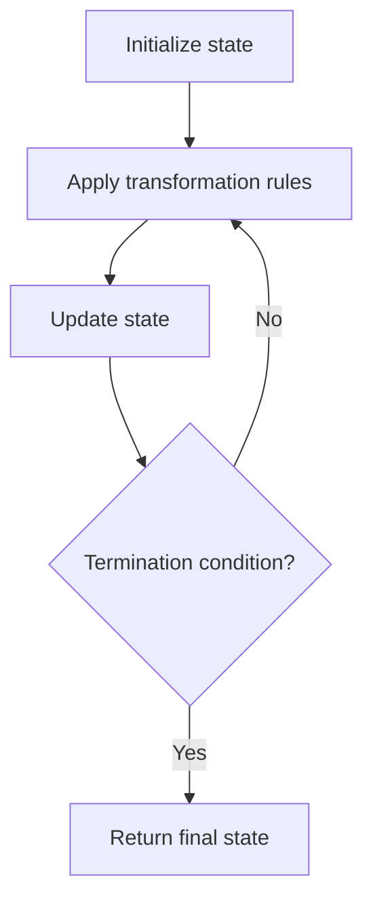

# Problem 54: Spiral Matrix

**Difficulty:** Medium  
**Tags:** Array, Matrix, Simulation  
**Pattern:** Matrix Simulation  
**Link:** [leetcode.com/problems/spiral-matrix](https://leetcode.com/problems/spiral-matrix/)

## Description

Given an `m x n` `matrix`, return *all elements of the* `matrix` *in spiral order*.

 

Example 1:

```

**Input:** matrix = [[1,2,3],[4,5,6],[7,8,9]]
**Output:** [1,2,3,6,9,8,7,4,5]

```

Example 2:

```

**Input:** matrix = [[1,2,3,4],[5,6,7,8],[9,10,11,12]]
**Output:** [1,2,3,4,8,12,11,10,9,5,6,7]

```

 

**Constraints:**

	- `m == matrix.length`
	- `n == matrix[i].length`
	- `1 <= m, n <= 10`
	- `-100 <= matrix[i][j] <= 100`

## Approach: Matrix Simulation

Peel layers: top row, right column, bottom row (reversed), left column (reversed). Repeat.

## Pseudocode

```
1. While matrix not empty:
   Pop top row
   Pop right column
   Pop bottom row reversed
   Pop left column reversed
```

## Algorithm Flow



## Complexity Analysis

- **Time:** O(m*n)
- **Space:** O(1) extra

## Solution (Python3)

```python
class Solution:
    def spiralOrder(self, matrix: list[list[int]]) -> list[int]:
        result = []
        while matrix:
            result += matrix.pop(0)
            if matrix and matrix[0]:
                for row in matrix:
                    result.append(row.pop())
            if matrix:
                result += matrix.pop()[::-1]
            if matrix and matrix[0]:
                for row in matrix[::-1]:
                    result.append(row.pop(0))
        return result
```

## Solution (C++)

```cpp
#include <string>
#include <vector>
using namespace std;

class Solution {
public:
    vector<int> spiralOrder(vector<vector<int>>& matrix) {
        // Simulation approach
        int n = matrix.size();
        for (int i = 0; i < n; i++) {
            // Simulate each step
        }
        return {};
    }
};
```
