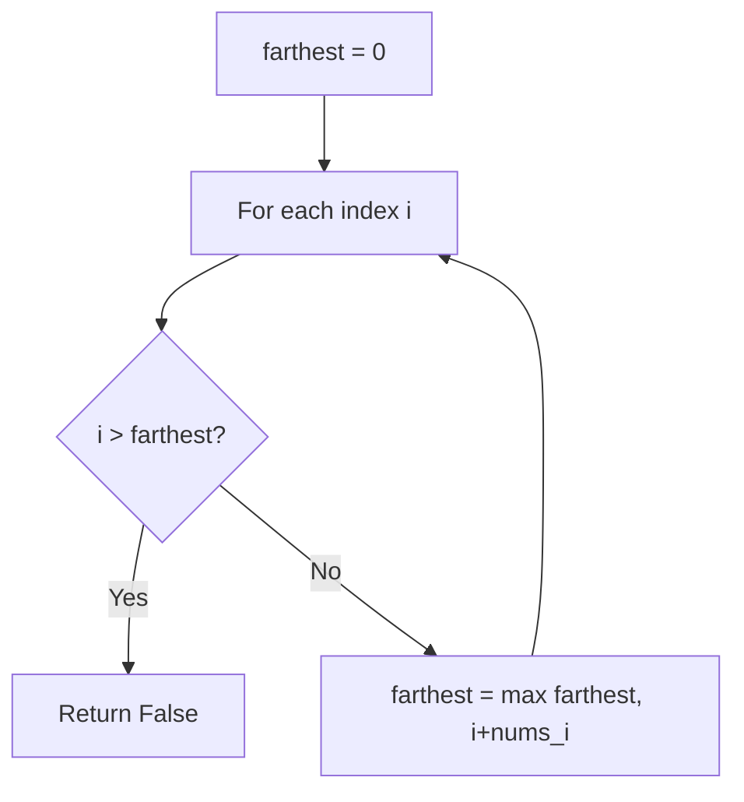
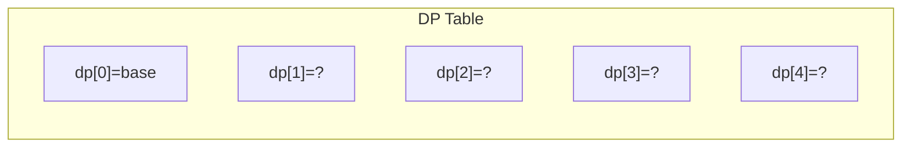
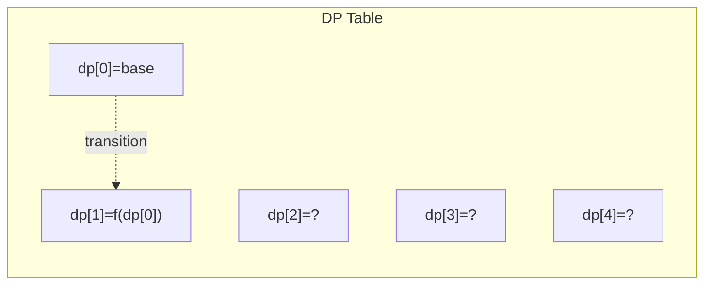
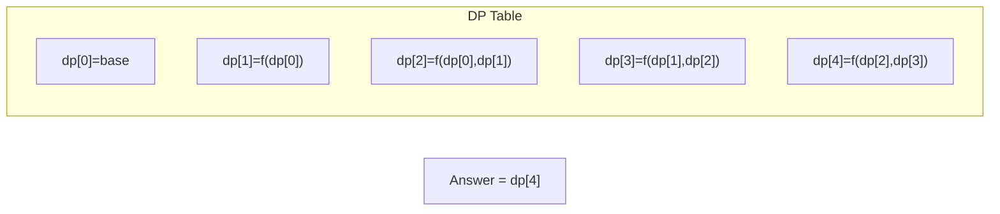

# Problem 55: Jump Game

**Difficulty:** Medium  
**Tags:** Array, Dynamic Programming, Greedy  
**Pattern:** Greedy  
**Link:** [leetcode.com/problems/jump-game](https://leetcode.com/problems/jump-game/)

## Description

You are given an integer array `nums`. You are initially positioned at the array's **first index**, and each element in the array represents your maximum jump length at that position.

Return `true`* if you can reach the last index, or *`false`* otherwise*.

 

Example 1:

```

**Input:** nums = [2,3,1,1,4]
**Output:** true
**Explanation:** Jump 1 step from index 0 to 1, then 3 steps to the last index.

```

Example 2:

```

**Input:** nums = [3,2,1,0,4]
**Output:** false
**Explanation:** You will always arrive at index 3 no matter what. Its maximum jump length is 0, which makes it impossible to reach the last index.

```

 

**Constraints:**

	- `1 <= nums.length <= 10^4`
	- `0 <= nums[i] <= 10^5`

## Approach: Greedy

Track the farthest reachable index. If current index exceeds it, return False.

## Pseudocode

```
1. farthest = 0
2. For each i: if i > farthest: False; farthest = max(farthest, i+nums[i])
3. Return True
```

## Algorithm Flow



## Visual State Transitions

**1D Dynamic Programming Table Build:**

**Frame 1: Initialize base cases**


**Frame 2: Fill dp[1] from dp[0]**


**Frame 3: Fill remaining cells**



## Complexity Analysis

- **Time:** O(n)
- **Space:** O(1)

## Solution (Python3)

```python
class Solution:
    def canJump(self, nums: list[int]) -> bool:
        farthest = 0
        for i in range(len(nums)):
            if i > farthest:
                return False
            farthest = max(farthest, i + nums[i])
        return True
```

## Solution (C++)

```cpp
#include <string>
#include <vector>
using namespace std;

class Solution {
public:
    bool canJump(vector<int>& nums) {
        // Dynamic programming (1D) - O(n) time, O(n) space
        int n = nums;
        if (n <= 0) return 0;
        vector<int> dp(n + 1, 0);
        dp[0] = 1;
        for (int i = 1; i <= n; i++) {
            dp[i] = dp[i-1];
            if (i >= 2) dp[i] += dp[i-2];
        }
        return dp[n];
    }
};
```
