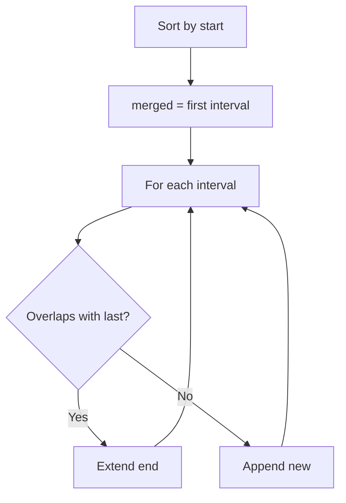

# Problem 56: Merge Intervals

**Difficulty:** Medium  
**Tags:** Array, Sorting  
**Pattern:** Intervals / Sort  
**Link:** [leetcode.com/problems/merge-intervals](https://leetcode.com/problems/merge-intervals/)

## Description

Given an array of `intervals` where `intervals[i] = [starti, endi]`, merge all overlapping intervals, and return *an array of the non-overlapping intervals that cover all the intervals in the input*.

 

Example 1:

```

**Input:** intervals = [[1,3],[2,6],[8,10],[15,18]]
**Output:** [[1,6],[8,10],[15,18]]
**Explanation:** Since intervals [1,3] and [2,6] overlap, merge them into [1,6].

```

Example 2:

```

**Input:** intervals = [[1,4],[4,5]]
**Output:** [[1,5]]
**Explanation:** Intervals [1,4] and [4,5] are considered overlapping.

```

Example 3:

```

**Input:** intervals = [[4,7],[1,4]]
**Output:** [[1,7]]
**Explanation:** Intervals [1,4] and [4,7] are considered overlapping.

```

 

**Constraints:**

	- `1 <= intervals.length <= 10^4`
	- `intervals[i].length == 2`
	- `0 <= starti <= endi <= 10^4`

## Approach: Intervals / Sort

Sort by start time. Merge overlapping intervals by extending the end of the last merged interval.

## Pseudocode

```
1. Sort intervals by start
2. For each interval:
   If overlaps with last merged: extend end
   Else: add new interval
```

## Algorithm Flow



## Complexity Analysis

- **Time:** O(n log n)
- **Space:** O(n)

## Solution (Python3)

```python
class Solution:
    def merge(self, intervals: list[list[int]]) -> list[list[int]]:
        intervals.sort()
        merged = [intervals[0]]
        for start, end in intervals[1:]:
            if start <= merged[-1][1]:
                merged[-1][1] = max(merged[-1][1], end)
            else:
                merged.append([start, end])
        return merged
```

## Solution (C++)

```cpp
#include <algorithm>
#include <string>
#include <vector>
using namespace std;

class Solution {
public:
    vector<vector<int>> merge(vector<vector<int>>& intervals) {
        // Sort-based approach - O(n log n) time
        sort(intervals.begin(), intervals.end());
        vector<vector<int>> result;
        result.push_back(intervals[0]);
        for (int i = 1; i < (int)intervals.size(); i++) {
            if (intervals[i][0] <= result.back()[1]) {
                result.back()[1] = max(result.back()[1], intervals[i][1]);
            } else {
                result.push_back(intervals[i]);
            }
        }
        return result;
    }
};
```
