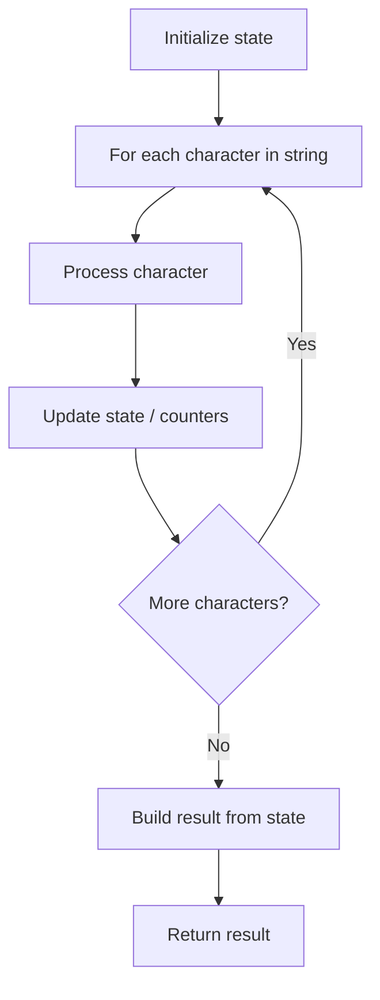

# Problem 58: Length of Last Word

**Difficulty:** Easy  
**Tags:** String  
**Pattern:** String  
**Link:** [leetcode.com/problems/length-of-last-word](https://leetcode.com/problems/length-of-last-word/)

## Description

Given a string `s` consisting of words and spaces, return *the length of the **last** word in the string.*

A **word** is a maximal substring consisting of non-space characters only.

 

Example 1:

```

**Input:** s = "Hello World"
**Output:** 5
**Explanation:** The last word is "World" with length 5.

```

Example 2:

```

**Input:** s = "   fly me   to   the moon  "
**Output:** 4
**Explanation:** The last word is "moon" with length 4.

```

Example 3:

```

**Input:** s = "luffy is still joyboy"
**Output:** 6
**Explanation:** The last word is "joyboy" with length 6.

```

 

**Constraints:**

	- `1 <= s.length <= 10^4`
	- `s` consists of only English letters and spaces `' '`.
	- There will be at least one word in `s`.

## Approach: String

Strip trailing spaces, split by spaces, return length of last word.

## Pseudocode

```
1. Strip trailing spaces
2. Split by spaces
3. Return length of last element
```

## Algorithm Flow



## Complexity Analysis

- **Time:** O(n)
- **Space:** O(n)

## Solution (Python3)

```python
class Solution:
    def lengthOfLastWord(self, s: str) -> int:
        return len(s.rstrip().split()[-1])
```

## Solution (C++)

```cpp
#include <algorithm>
#include <cctype>
#include <string>
#include <vector>
using namespace std;

class Solution {
public:
    int lengthOfLastWord(string& s) {
        // String processing approach - O(n) time
        string processed;
        for (char ch : s) {
            if (isalnum(ch)) {
                processed += tolower(ch);
            }
        }
        string rev = processed;
        reverse(rev.begin(), rev.end());
        return processed == rev;
    }
};
```
