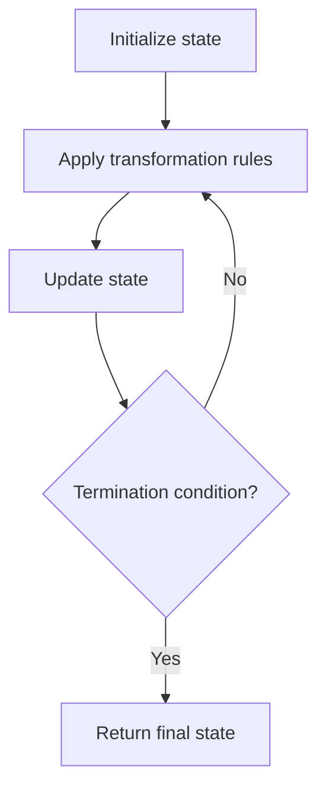

# Problem 59: Spiral Matrix II

**Difficulty:** Medium  
**Tags:** Array, Matrix, Simulation  
**Pattern:** Matrix Simulation  
**Link:** [leetcode.com/problems/spiral-matrix-ii](https://leetcode.com/problems/spiral-matrix-ii/)

## Description

Given a positive integer `n`, generate an `n x n` `matrix` filled with elements from `1` to `n^2` in spiral order.

 

Example 1:

```

**Input:** n = 3
**Output:** [[1,2,3],[8,9,4],[7,6,5]]

```

Example 2:

```

**Input:** n = 1
**Output:** [[1]]

```

 

**Constraints:**

	- `1 <= n <= 20`

## Approach: Matrix Simulation

Fill matrix in spiral order using boundary pointers (top, bottom, left, right).

## Pseudocode

```
1. Use four boundaries
2. Fill top row, right col, bottom row, left col
3. Shrink boundaries, repeat
```

## Algorithm Flow



## Complexity Analysis

- **Time:** O(n^2)
- **Space:** O(n^2)

## Solution (Python3)

```python
class Solution:
    def generateMatrix(self, n: int) -> list[list[int]]:
        matrix = [[0]*n for _ in range(n)]
        top, bottom, left, right = 0, n-1, 0, n-1
        num = 1
        while num <= n*n:
            for j in range(left, right+1):
                matrix[top][j] = num; num += 1
            top += 1
            for i in range(top, bottom+1):
                matrix[i][right] = num; num += 1
            right -= 1
            for j in range(right, left-1, -1):
                matrix[bottom][j] = num; num += 1
            bottom -= 1
            for i in range(bottom, top-1, -1):
                matrix[i][left] = num; num += 1
            left += 1
        return matrix
```

## Solution (C++)

```cpp
#include <string>
#include <vector>
using namespace std;

class Solution {
public:
    vector<vector<int>> generateMatrix(int n) {
        // Simulation approach
        int n = n.size();
        for (int i = 0; i < n; i++) {
            // Simulate each step
        }
        return {};
    }
};
```
