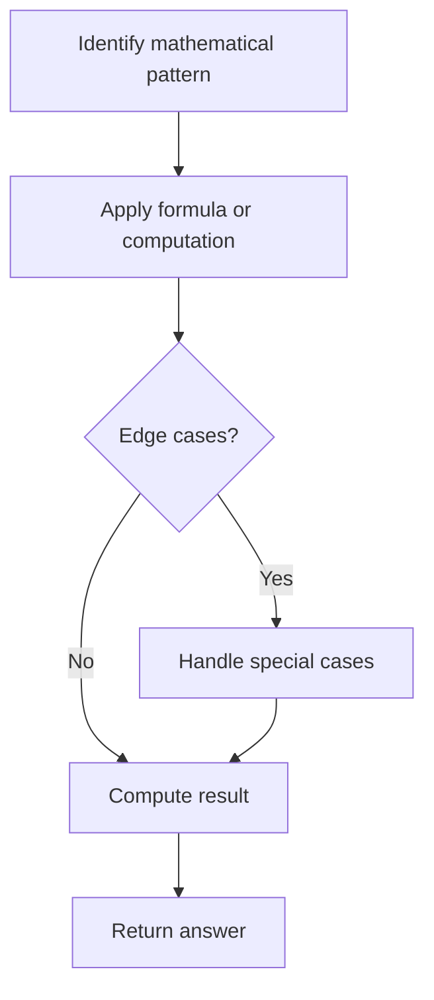

# Problem 60: Permutation Sequence

**Difficulty:** Hard  
**Tags:** Math, Recursion  
**Pattern:** Math  
**Link:** [leetcode.com/problems/permutation-sequence](https://leetcode.com/problems/permutation-sequence/)

## Description

The set `[1, 2, 3, ..., n]` contains a total of `n!` unique permutations.

By listing and labeling all of the permutations in order, we get the following sequence for `n = 3`:

	- `"123"`
	- `"132"`
	- `"213"`
	- `"231"`
	- `"312"`
	- `"321"`

Given `n` and `k`, return the `k^th` permutation sequence.

 

Example 1:

```
**Input:** n = 3, k = 3
**Output:** "213"

```
Example 2:

```
**Input:** n = 4, k = 9
**Output:** "2314"

```
Example 3:

```
**Input:** n = 3, k = 1
**Output:** "123"

```

 

**Constraints:**

	- `1 <= n <= 9`
	- `1 <= k <= n!`

## Approach: Math

Use factorial number system to directly compute the kth permutation without generating all permutations.

## Pseudocode

```
1. k -= 1 (0-indexed)
2. For each position: idx = k // (n-1)!, pick nums[idx], k %= (n-1)!
```

## Algorithm Flow



## Complexity Analysis

- **Time:** O(n^2)
- **Space:** O(n)

## Solution (Python3)

```python
class Solution:
    def getPermutation(self, n: int, k: int) -> str:
        from math import factorial
        nums = list(range(1, n+1))
        k -= 1
        result = []
        for i in range(n, 0, -1):
            f = factorial(i - 1)
            idx = k // f
            result.append(str(nums[idx]))
            nums.pop(idx)
            k %= f
        return ''.join(result)
```

## Solution (C++)

```cpp
#include <string>
#include <vector>
using namespace std;

class Solution {
public:
    string getPermutation(int n, int k) {
        // Mathematical approach
        long long result = 0;
        int x = n;
        while (x != 0) {
            result = result * 10 + x % 10;
            x /= 10;
        }
        return (int)result;
    }
};
```
