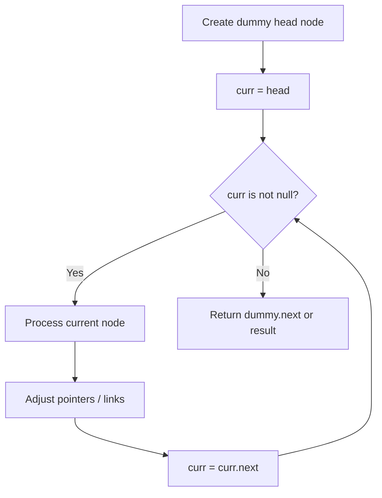
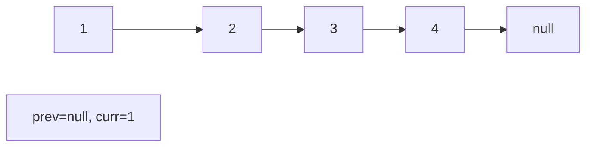
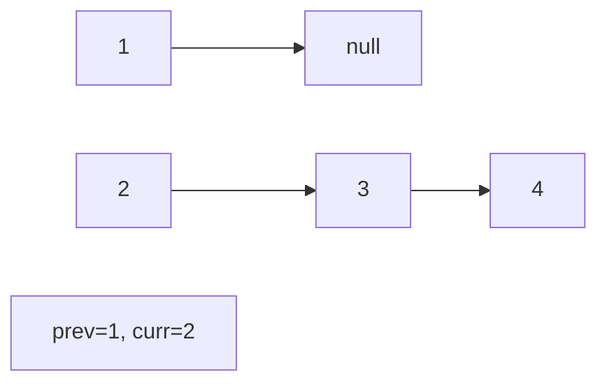
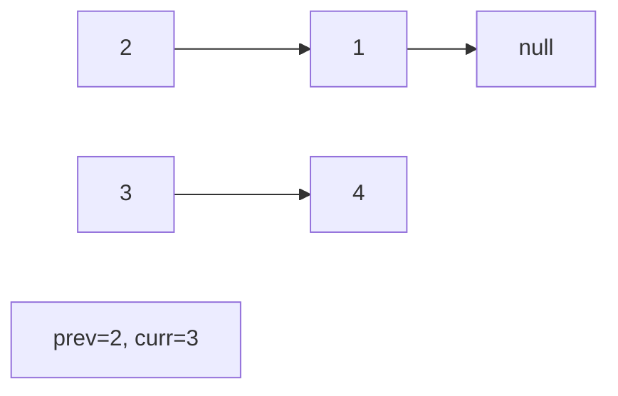
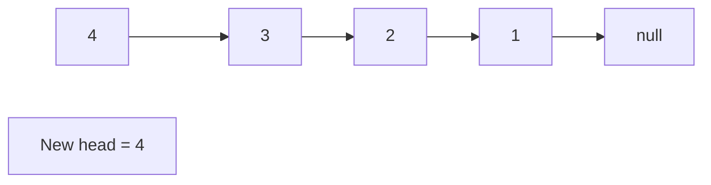

# Problem 61: Rotate List

**Difficulty:** Medium  
**Tags:** Linked List, Two Pointers  
**Pattern:** Linked List  
**Link:** [leetcode.com/problems/rotate-list](https://leetcode.com/problems/rotate-list/)

## Description

Given the `head` of a linked list, rotate the list to the right by `k` places.

 

Example 1:

```

**Input:** head = [1,2,3,4,5], k = 2
**Output:** [4,5,1,2,3]

```

Example 2:

```

**Input:** head = [0,1,2], k = 4
**Output:** [2,0,1]

```

 

**Constraints:**

	- The number of nodes in the list is in the range `[0, 500]`.
	- `-100 <= Node.val <= 100`
	- `0 <= k <= 2 * 10^9`

## Approach: Linked List

Make list circular, then break at the right point. k %= length to handle large k.

## Pseudocode

```
1. Find length, connect tail to head
2. k %= length
3. Walk length-k steps from head, break the link
```

## Algorithm Flow



## Visual State Transitions

**Linked List Operation (Reverse):**

**Frame 1: Initial list**


**Frame 2: Reverse first link**


**Frame 3: Reverse second link**


**Frame 4: Fully reversed**



## Complexity Analysis

- **Time:** O(n)
- **Space:** O(1)

## Solution (Python3)

```python
class Solution:
    def rotateRight(self, head, k):
        if not head or not head.next or k == 0:
            return head
        length = 1
        tail = head
        while tail.next:
            tail = tail.next
            length += 1
        k %= length
        if k == 0:
            return head
        tail.next = head
        steps = length - k
        new_tail = head
        for _ in range(steps - 1):
            new_tail = new_tail.next
        new_head = new_tail.next
        new_tail.next = None
        return new_head
```

## Solution (C++)

```cpp
#include <string>
#include <vector>
using namespace std;

class Solution {
public:
    ListNode* rotateRight(ListNode* head, int k) {
        // Linked list traversal/manipulation
        ListNode dummy(0);
        dummy.next = head;
        ListNode* prev = &dummy;
        ListNode* curr = head;
        while (curr) {
            ListNode* nxt = curr->next;
            // Process current node
            prev = curr;
            curr = nxt;
        }
        return dummy.next;
    }
};
```
