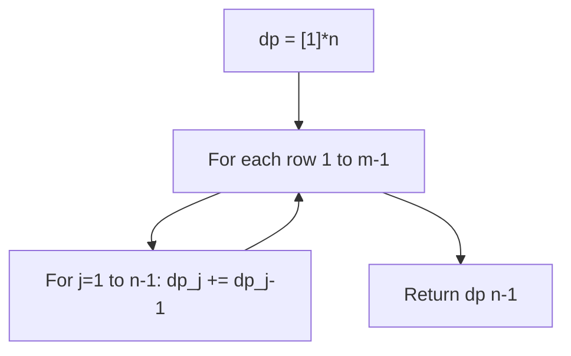
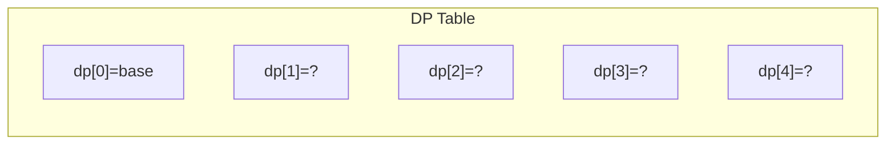
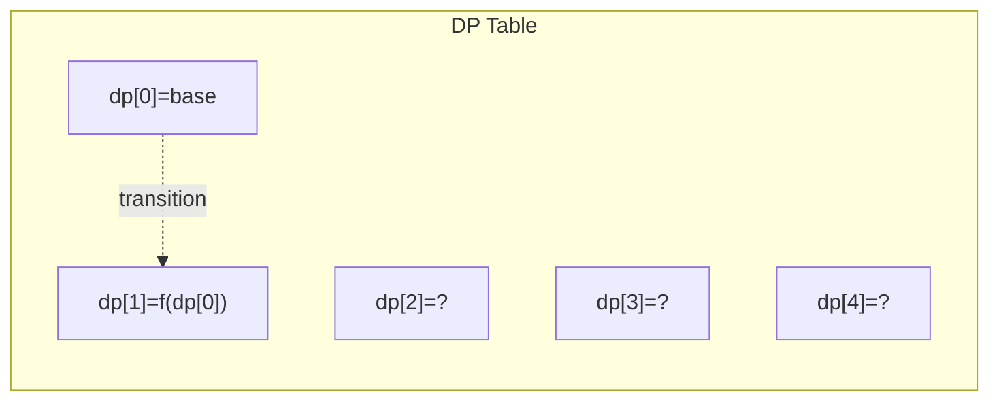
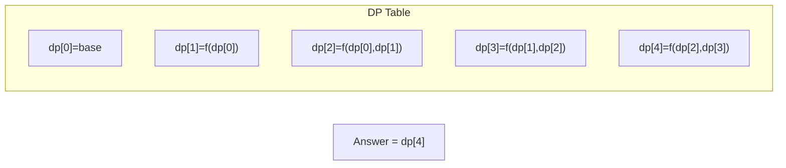

# Problem 62: Unique Paths

**Difficulty:** Medium  
**Tags:** Math, Dynamic Programming, Combinatorics  
**Pattern:** Dynamic Programming  
**Link:** [leetcode.com/problems/unique-paths](https://leetcode.com/problems/unique-paths/)

## Description

There is a robot on an `m x n` grid. The robot is initially located at the **top-left corner** (i.e., `grid[0][0]`). The robot tries to move to the **bottom-right corner** (i.e., `grid[m - 1][n - 1]`). The robot can only move either down or right at any point in time.

Given the two integers `m` and `n`, return *the number of possible unique paths that the robot can take to reach the bottom-right corner*.

The test cases are generated so that the answer will be less than or equal to `2 * 10^9`.

 

Example 1:

```

**Input:** m = 3, n = 7
**Output:** 28

```

Example 2:

```

**Input:** m = 3, n = 2
**Output:** 3
**Explanation:** From the top-left corner, there are a total of 3 ways to reach the bottom-right corner:
1. Right -> Down -> Down
2. Down -> Down -> Right
3. Down -> Right -> Down

```

 

**Constraints:**

	- `1 <= m, n <= 100`

## Approach: Dynamic Programming

DP: paths to (i,j) = paths from above + paths from left. Optimize to 1D array.

## Pseudocode

```
1. dp = [1]*n (first row all 1s)
2. For each row: dp[j] += dp[j-1]
3. Return dp[-1]
```

## Algorithm Flow



## Visual State Transitions

**1D Dynamic Programming Table Build:**

**Frame 1: Initialize base cases**


**Frame 2: Fill dp[1] from dp[0]**


**Frame 3: Fill remaining cells**



## Complexity Analysis

- **Time:** O(m*n)
- **Space:** O(n)

## Solution (Python3)

```python
class Solution:
    def uniquePaths(self, m: int, n: int) -> int:
        dp = [1] * n
        for _ in range(1, m):
            for j in range(1, n):
                dp[j] += dp[j-1]
        return dp[-1]
```

## Solution (C++)

```cpp
#include <string>
#include <vector>
using namespace std;

class Solution {
public:
    int uniquePaths(int m, int n) {
        // Dynamic programming (1D) - O(n) time, O(n) space
        int n = m;
        if (n <= 0) return 0;
        vector<int> dp(n + 1, 0);
        dp[0] = 1;
        for (int i = 1; i <= n; i++) {
            dp[i] = dp[i-1];
            if (i >= 2) dp[i] += dp[i-2];
        }
        return dp[n];
    }
};
```
