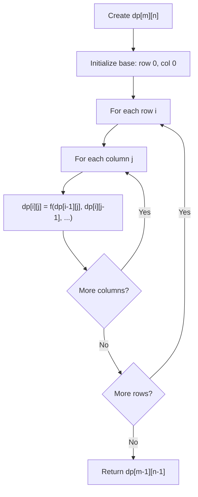
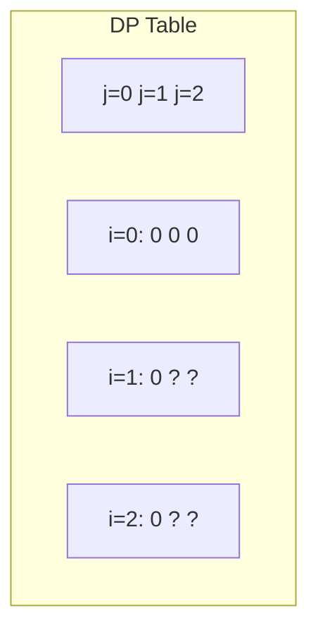
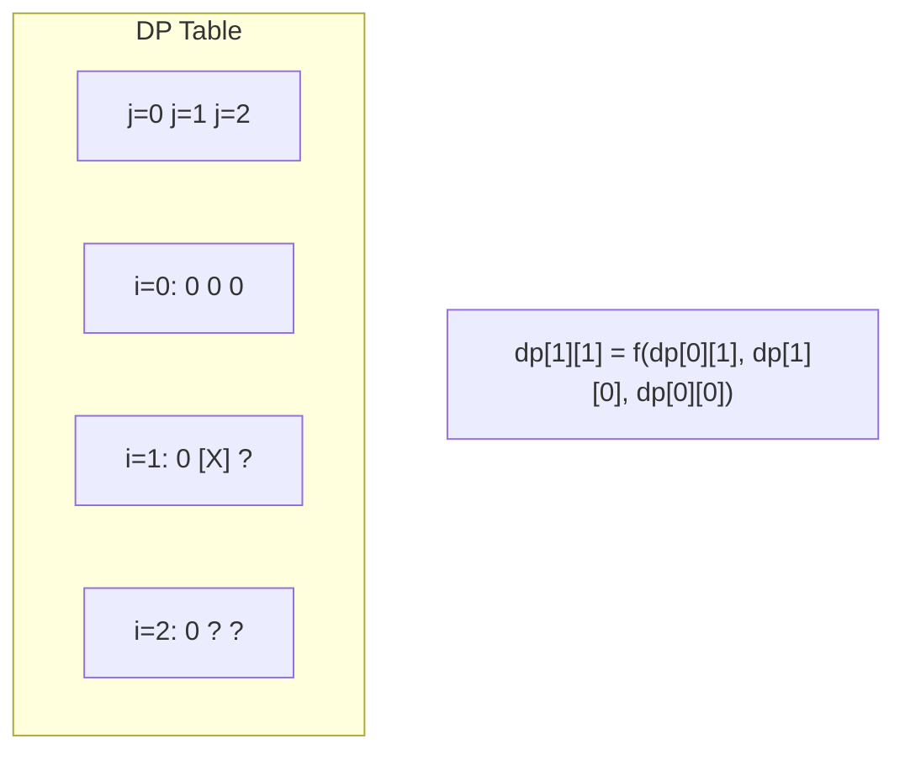
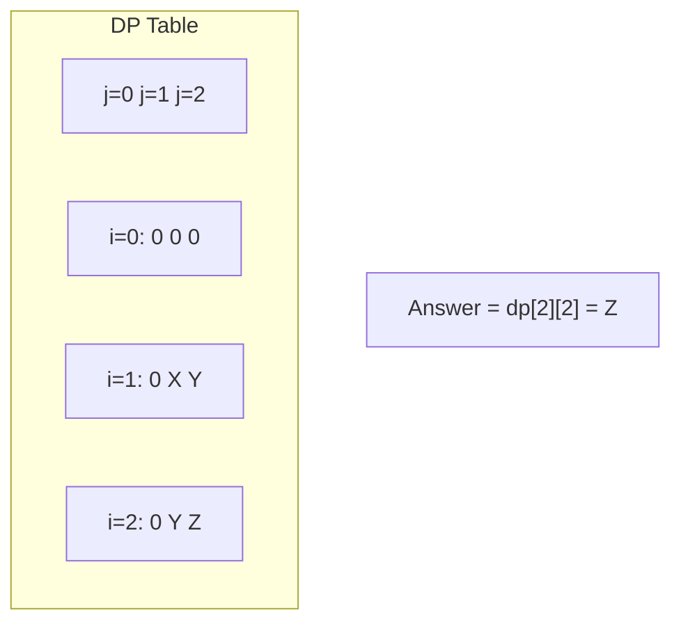

# Problem 63: Unique Paths II

**Difficulty:** Medium  
**Tags:** Array, Dynamic Programming, Matrix  
**Pattern:** Dynamic Programming  
**Link:** [leetcode.com/problems/unique-paths-ii](https://leetcode.com/problems/unique-paths-ii/)

## Description

You are given an `m x n` integer array `grid`. There is a robot initially located at the **top-left corner** (i.e., `grid[0][0]`). The robot tries to move to the **bottom-right corner** (i.e., `grid[m - 1][n - 1]`). The robot can only move either down or right at any point in time.

An obstacle and space are marked as `1` or `0` respectively in `grid`. A path that the robot takes cannot include **any** square that is an obstacle.

Return *the number of possible unique paths that the robot can take to reach the bottom-right corner*.

The testcases are generated so that the answer will be less than or equal to `2 * 10^9`.

 

Example 1:

```

**Input:** obstacleGrid = [[0,0,0],[0,1,0],[0,0,0]]
**Output:** 2
**Explanation:** There is one obstacle in the middle of the 3x3 grid above.
There are two ways to reach the bottom-right corner:
1. Right -> Right -> Down -> Down
2. Down -> Down -> Right -> Right

```

Example 2:

```

**Input:** obstacleGrid = [[0,1],[0,0]]
**Output:** 1

```

 

**Constraints:**

	- `m == obstacleGrid.length`
	- `n == obstacleGrid[i].length`
	- `1 <= m, n <= 100`
	- `obstacleGrid[i][j]` is `0` or `1`.

## Approach: Dynamic Programming

Same as Unique Paths but set dp[j]=0 for obstacles.

## Pseudocode

```
1. dp[0] = 1 if no obstacle
2. For each cell: if obstacle dp=0, else dp[j] += dp[j-1]
3. Return dp[-1]
```

## Algorithm Flow



## Visual State Transitions

**2D DP Table Build:**

**Frame 1: Initialize borders**


**Frame 2: Fill cell by cell**


**Frame 3: Table complete**



## Complexity Analysis

- **Time:** O(m*n)
- **Space:** O(n)

## Solution (Python3)

```python
class Solution:
    def uniquePathsWithObstacles(self, grid: list[list[int]]) -> int:
        n = len(grid[0])
        dp = [0] * n
        dp[0] = 1
        for row in grid:
            for j in range(n):
                if row[j] == 1:
                    dp[j] = 0
                elif j > 0:
                    dp[j] += dp[j-1]
        return dp[-1]
```

## Solution (C++)

```cpp
#include <algorithm>
#include <string>
#include <vector>
using namespace std;

class Solution {
public:
    int uniquePathsWithObstacles(vector<vector<int>>& obstacleGrid) {
        // Dynamic programming (2D) - O(m*n) time and space
        if (obstacleGrid.empty()) return 0;
        int m = obstacleGrid.size(), n = obstacleGrid[0].size();
        vector<vector<int>> dp(m + 1, vector<int>(n + 1, 0));
        for (int i = 1; i <= m; i++) {
            for (int j = 1; j <= n; j++) {
                dp[i][j] = max(dp[i-1][j], dp[i][j-1]);
            }
        }
        return dp[m][n];
    }
};
```
