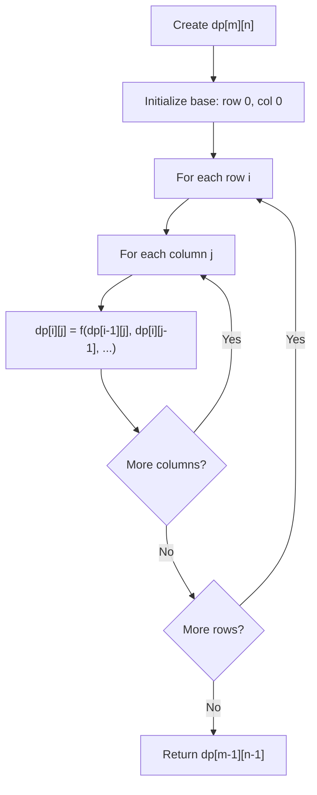
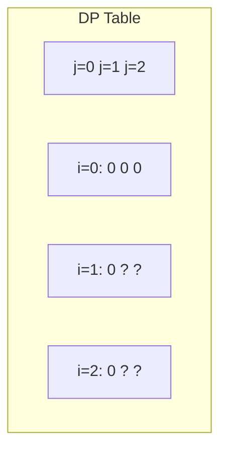
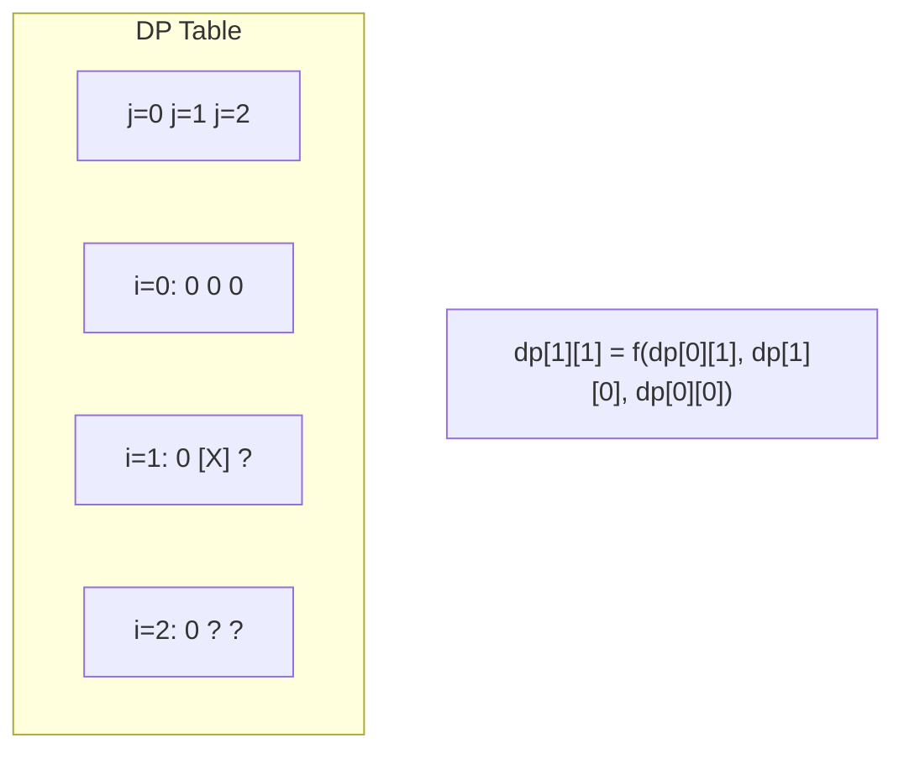
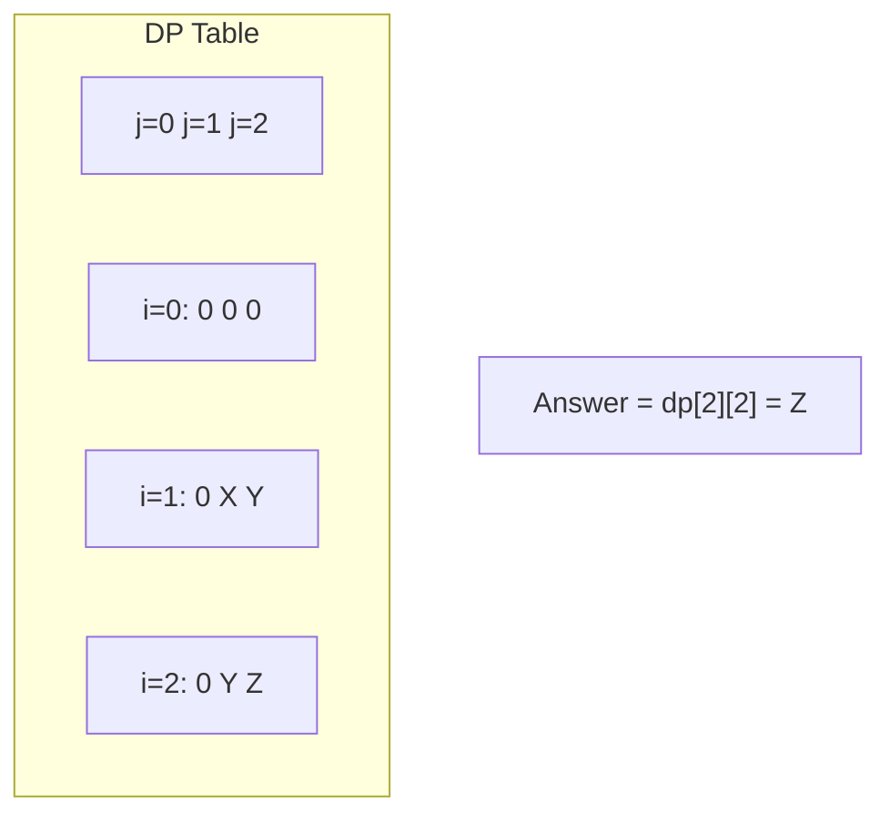

# Problem 64: Minimum Path Sum

**Difficulty:** Medium  
**Tags:** Array, Dynamic Programming, Matrix  
**Pattern:** Dynamic Programming  
**Link:** [leetcode.com/problems/minimum-path-sum](https://leetcode.com/problems/minimum-path-sum/)

## Description

Given a `m x n` `grid` filled with non-negative numbers, find a path from top left to bottom right, which minimizes the sum of all numbers along its path.

**Note:** You can only move either down or right at any point in time.

 

Example 1:

```

**Input:** grid = [[1,3,1],[1,5,1],[4,2,1]]
**Output:** 7
**Explanation:** Because the path 1 → 3 → 1 → 1 → 1 minimizes the sum.

```

Example 2:

```

**Input:** grid = [[1,2,3],[4,5,6]]
**Output:** 12

```

 

**Constraints:**

	- `m == grid.length`
	- `n == grid[i].length`
	- `1 <= m, n <= 200`
	- `0 <= grid[i][j] <= 200`

## Approach: Dynamic Programming

In-place DP: each cell += min of cell above and cell to the left.

## Pseudocode

```
1. For each cell (i,j):
   grid[i][j] += min(above, left)
2. Return grid[-1][-1]
```

## Algorithm Flow



## Visual State Transitions

**2D DP Table Build:**

**Frame 1: Initialize borders**


**Frame 2: Fill cell by cell**


**Frame 3: Table complete**



## Complexity Analysis

- **Time:** O(m*n)
- **Space:** O(1)

## Solution (Python3)

```python
class Solution:
    def minPathSum(self, grid: list[list[int]]) -> int:
        m, n = len(grid), len(grid[0])
        for i in range(m):
            for j in range(n):
                if i == 0 and j == 0:
                    continue
                elif i == 0:
                    grid[i][j] += grid[i][j-1]
                elif j == 0:
                    grid[i][j] += grid[i-1][j]
                else:
                    grid[i][j] += min(grid[i-1][j], grid[i][j-1])
        return grid[-1][-1]
```

## Solution (C++)

```cpp
#include <algorithm>
#include <string>
#include <vector>
using namespace std;

class Solution {
public:
    int minPathSum(vector<vector<int>>& grid) {
        // Dynamic programming (2D) - O(m*n) time and space
        if (grid.empty()) return 0;
        int m = grid.size(), n = grid[0].size();
        vector<vector<int>> dp(m + 1, vector<int>(n + 1, 0));
        for (int i = 1; i <= m; i++) {
            for (int j = 1; j <= n; j++) {
                dp[i][j] = max(dp[i-1][j], dp[i][j-1]);
            }
        }
        return dp[m][n];
    }
};
```
