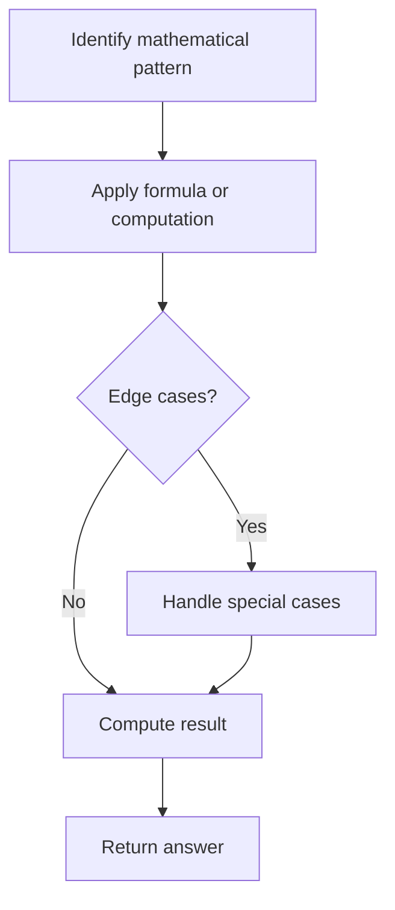

# Problem 66: Plus One

**Difficulty:** Easy  
**Tags:** Array, Math  
**Pattern:** Math / Array  
**Link:** [leetcode.com/problems/plus-one](https://leetcode.com/problems/plus-one/)

## Description

You are given a **large integer** represented as an integer array `digits`, where each `digits[i]` is the `i^th` digit of the integer. The digits are ordered from most significant to least significant in left-to-right order. The large integer does not contain any leading `0`'s.

Increment the large integer by one and return *the resulting array of digits*.

 

Example 1:

```

**Input:** digits = [1,2,3]
**Output:** [1,2,4]
**Explanation:** The array represents the integer 123.
Incrementing by one gives 123 + 1 = 124.
Thus, the result should be [1,2,4].

```

Example 2:

```

**Input:** digits = [4,3,2,1]
**Output:** [4,3,2,2]
**Explanation:** The array represents the integer 4321.
Incrementing by one gives 4321 + 1 = 4322.
Thus, the result should be [4,3,2,2].

```

Example 3:

```

**Input:** digits = [9]
**Output:** [1,0]
**Explanation:** The array represents the integer 9.
Incrementing by one gives 9 + 1 = 10.
Thus, the result should be [1,0].

```

 

**Constraints:**

	- `1 <= digits.length <= 100`
	- `0 <= digits[i] <= 9`
	- `digits` does not contain any leading `0`'s.

## Approach: Math / Array

Add 1 from the end. If digit < 9, increment and return. If 9, set to 0 and carry. If all 9s, prepend 1.

## Pseudocode

```
1. From rightmost digit:
   If < 9: increment, done
   If 9: set to 0, continue left
2. If all carried: prepend 1
```

## Algorithm Flow



## Complexity Analysis

- **Time:** O(n)
- **Space:** O(1)

## Solution (Python3)

```python
class Solution:
    def plusOne(self, digits: list[int]) -> list[int]:
        for i in range(len(digits) - 1, -1, -1):
            if digits[i] < 9:
                digits[i] += 1
                return digits
            digits[i] = 0
        return [1] + digits
```

## Solution (C++)

```cpp
#include <string>
#include <vector>
using namespace std;

class Solution {
public:
    vector<int> plusOne(vector<int>& digits) {
        // Mathematical approach
        long long result = 0;
        int x = digits;
        while (x != 0) {
            result = result * 10 + x % 10;
            x /= 10;
        }
        return (int)result;
    }
};
```
