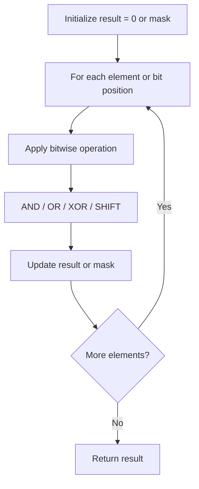

# Problem 67: Add Binary

**Difficulty:** Easy  
**Tags:** Math, String, Bit Manipulation, Simulation  
**Pattern:** Math / String  
**Link:** [leetcode.com/problems/add-binary](https://leetcode.com/problems/add-binary/)

## Description

Given two binary strings `a` and `b`, return *their sum as a binary string*.

 

Example 1:

```
**Input:** a = "11", b = "1"
**Output:** "100"

```
Example 2:

```
**Input:** a = "1010", b = "1011"
**Output:** "10101"

```

 

**Constraints:**

	- `1 <= a.length, b.length <= 10^4`
	- `a` and `b` consist only of `'0'` or `'1'` characters.
	- Each string does not contain leading zeros except for the zero itself.

## Approach: Math / String

Same as Add Two Numbers but for binary strings. Add from right with carry.

## Pseudocode

```
1. Process from right with carry
2. total = carry + a[i] + b[j]
3. Append total%2, carry = total//2
4. Return reversed result
```

## Algorithm Flow



## Complexity Analysis

- **Time:** O(max(m,n))
- **Space:** O(max(m,n))

## Solution (Python3)

```python
class Solution:
    def addBinary(self, a: str, b: str) -> str:
        result = []
        carry = 0
        i, j = len(a) - 1, len(b) - 1
        while i >= 0 or j >= 0 or carry:
            total = carry
            if i >= 0:
                total += int(a[i]); i -= 1
            if j >= 0:
                total += int(b[j]); j -= 1
            result.append(str(total % 2))
            carry = total // 2
        return ''.join(reversed(result))
```

## Solution (C++)

```cpp
#include <string>
#include <vector>
using namespace std;

class Solution {
public:
    string addBinary(string& a, string& b) {
        // Bit manipulation - O(n) time, O(1) space
        int result = 0;
        for (int val : a) {
            result ^= val;
        }
        return result;
    }
};
```
