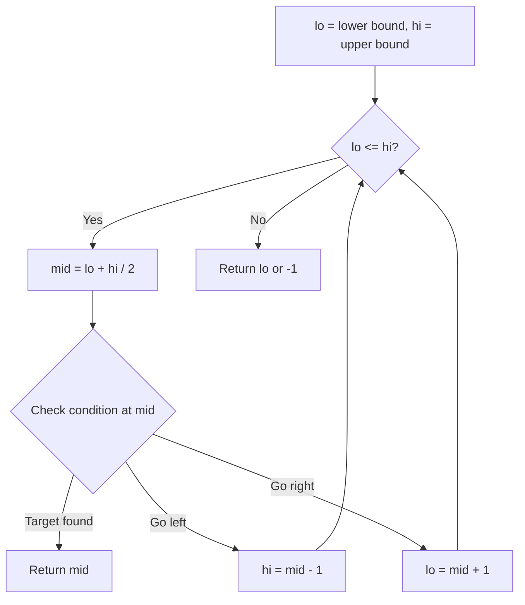
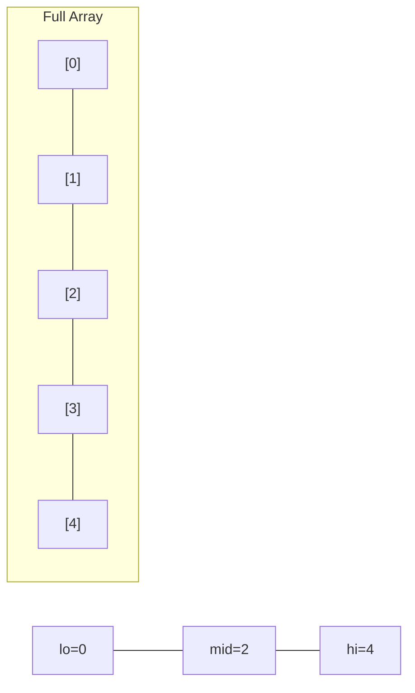
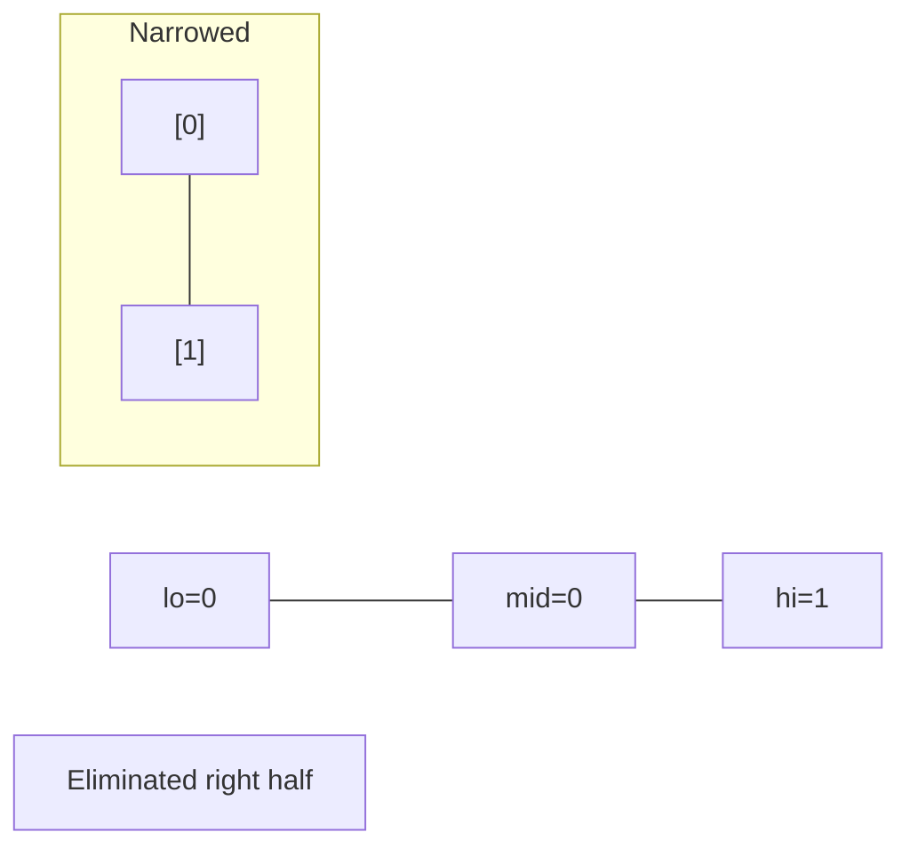
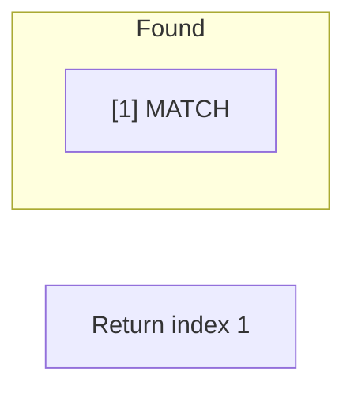

# Problem 69: Sqrt(x)

**Difficulty:** Easy  
**Tags:** Math, Binary Search  
**Pattern:** Binary Search  
**Link:** [leetcode.com/problems/sqrtx](https://leetcode.com/problems/sqrtx/)

## Description

Given a non-negative integer `x`, return *the square root of *`x`* rounded down to the nearest integer*. The returned integer should be **non-negative** as well.

You **must not use** any built-in exponent function or operator.

	- For example, do not use `pow(x, 0.5)` in c++ or `x ** 0.5` in python.

 

Example 1:

```

**Input:** x = 4
**Output:** 2
**Explanation:** The square root of 4 is 2, so we return 2.

```

Example 2:

```

**Input:** x = 8
**Output:** 2
**Explanation:** The square root of 8 is 2.82842..., and since we round it down to the nearest integer, 2 is returned.

```

 

**Constraints:**

	- `0 <= x <= 2^31 - 1`

## Approach: Binary Search

Binary search for the integer square root. Find largest mid where mid^2 <= x.

## Pseudocode

```
1. Binary search [0, x]
2. If mid^2 <= x < (mid+1)^2: return mid
3. Adjust lo/hi accordingly
```

## Algorithm Flow



## Visual State Transitions

**Binary Search Step-by-Step:**

**Frame 1: Initial search space**


**Frame 2: Compare mid, narrow search**


**Frame 3: Found target**



## Complexity Analysis

- **Time:** O(log n)
- **Space:** O(1)

## Solution (Python3)

```python
class Solution:
    def mySqrt(self, x: int) -> int:
        lo, hi = 0, x
        while lo <= hi:
            mid = (lo + hi) // 2
            if mid * mid <= x < (mid + 1) * (mid + 1):
                return mid
            elif mid * mid > x:
                hi = mid - 1
            else:
                lo = mid + 1
        return lo
```

## Solution (C++)

```cpp
#include <string>
#include <vector>
using namespace std;

class Solution {
public:
    int mySqrt(int x) {
        // Binary search - O(log n) time, O(1) space
        int lo = 0, hi = x.size() - 1;
        while (lo <= hi) {
            int mid = lo + (hi - lo) / 2;
            if (x[mid] == x) {
                return mid;
            } else if (x[mid] < x) {
                lo = mid + 1;
            } else {
                hi = mid - 1;
            }
        }
        return 0;
    }
};
```
