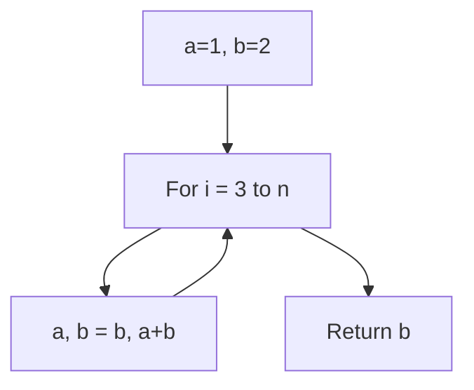
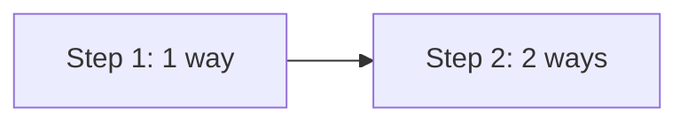
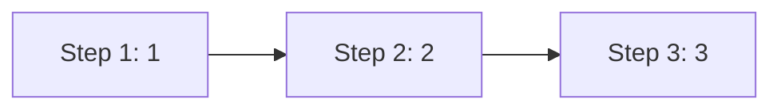
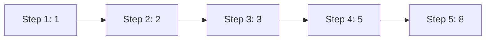

# Problem 70: Climbing Stairs

**Difficulty:** Easy  
**Tags:** Math, Dynamic Programming, Memoization  
**Pattern:** Dynamic Programming (Fibonacci)  
**Link:** [leetcode.com/problems/climbing-stairs](https://leetcode.com/problems/climbing-stairs/)

## Description

You are climbing a staircase. It takes `n` steps to reach the top.

Each time you can either climb `1` or `2` steps. In how many distinct ways can you climb to the top?

 

Example 1:

```

**Input:** n = 2
**Output:** 2
**Explanation:** There are two ways to climb to the top.
1. 1 step + 1 step
2. 2 steps

```

Example 2:

```

**Input:** n = 3
**Output:** 3
**Explanation:** There are three ways to climb to the top.
1. 1 step + 1 step + 1 step
2. 1 step + 2 steps
3. 2 steps + 1 step

```

 

**Constraints:**

	- `1 <= n <= 45`

## Approach: Dynamic Programming (Fibonacci)

**Key Insight:** Same as Fibonacci. Ways to reach step n = ways(n-1) + ways(n-2).

## Pseudocode

```
1. Base: step 1 = 1 way, step 2 = 2 ways
2. For 3 to n: ways[i] = ways[i-1] + ways[i-2]
3. Return ways[n]
```

## Algorithm Flow



## Visual State Transitions

**DP State Transition for n=5:**

**Step 1:** Base cases



**Step 2:** Step 3 = 1 + 2 = 3 ways



**Step 3:** Step 4 = 2 + 3 = 5 ways, Step 5 = 3 + 5 = 8 ways



## Complexity Analysis

- **Time:** O(n)
- **Space:** O(1)

## Solution (Python3)

```python
class Solution:
    def climbStairs(self, n: int) -> int:
        if n <= 2:
            return n
        a, b = 1, 2
        for _ in range(3, n + 1):
            a, b = b, a + b
        return b
```

## Solution (C++)

```cpp
#include <string>
#include <vector>
using namespace std;

class Solution {
public:
    int climbStairs(int n) {
        // Dynamic programming (1D) - O(n) time, O(n) space
        int n = n;
        if (n <= 0) return 0;
        vector<int> dp(n + 1, 0);
        dp[0] = 1;
        for (int i = 1; i <= n; i++) {
            dp[i] = dp[i-1];
            if (i >= 2) dp[i] += dp[i-2];
        }
        return dp[n];
    }
};
```
