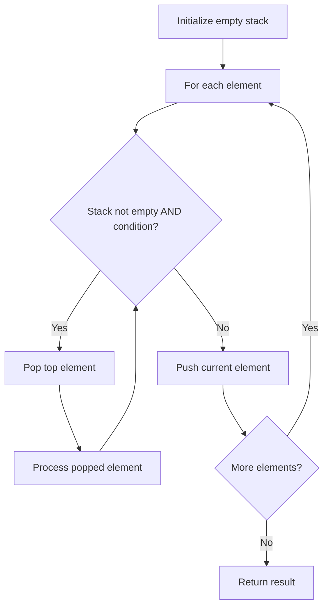

# Problem 71: Simplify Path

**Difficulty:** Medium  
**Tags:** String, Stack  
**Pattern:** Stack  
**Link:** [leetcode.com/problems/simplify-path](https://leetcode.com/problems/simplify-path/)

## Description

You are given an *absolute* path for a Unix-style file system, which always begins with a slash `'/'`. Your task is to transform this absolute path into its **simplified canonical path**.

The *rules* of a Unix-style file system are as follows:

	- A single period `'.'` represents the current directory.
	- A double period `'..'` represents the previous/parent directory.
	- Multiple consecutive slashes such as `'//'` and `'///'` are treated as a single slash `'/'`.
	- Any sequence of periods that does **not match** the rules above should be treated as a **valid directory or** **file ****name**. For example, `'...' `and `'....'` are valid directory or file names.

The simplified canonical path should follow these *rules*:

	- The path must start with a single slash `'/'`.
	- Directories within the path must be separated by exactly one slash `'/'`.
	- The path must not end with a slash `'/'`, unless it is the root directory.
	- The path must not have any single or double periods (`'.'` and `'..'`) used to denote current or parent directories.

Return the **simplified canonical path**.

 

Example 1:

**Input:** path = "/home/"

**Output:** "/home"

**Explanation:**

The trailing slash should be removed.

Example 2:

**Input:** path = "/home//foo/"

**Output:** "/home/foo"

**Explanation:**

Multiple consecutive slashes are replaced by a single one.

Example 3:

**Input:** path = "/home/user/Documents/../Pictures"

**Output:** "/home/user/Pictures"

**Explanation:**

A double period `".."` refers to the directory up a level (the parent directory).

Example 4:

**Input:** path = "/../"

**Output:** "/"

**Explanation:**

Going one level up from the root directory is not possible.

Example 5:

**Input:** path = "/.../a/../b/c/../d/./"

**Output:** "/.../b/d"

**Explanation:**

`"..."` is a valid name for a directory in this problem.

 

**Constraints:**

	- `1 <= path.length <= 3000`
	- `path` consists of English letters, digits, period `'.'`, slash `'/'` or `'_'`.
	- `path` is a valid absolute Unix path.

## Approach: Stack

Split by '/', use stack: push directories, pop on '..', ignore '.' and empty.

## Pseudocode

```
1. Split path by '/'
2. For each part: '..' = pop, '.' = skip, else push
3. Return '/' + '/'.join(stack)
```

## Algorithm Flow



## Complexity Analysis

- **Time:** O(n)
- **Space:** O(n)

## Solution (Python3)

```python
class Solution:
    def simplifyPath(self, path: str) -> str:
        stack = []
        for part in path.split('/'):
            if part == '..':
                if stack:
                    stack.pop()
            elif part and part != '.':
                stack.append(part)
        return '/' + '/'.join(stack)
```

## Solution (C++)

```cpp
#include <stack>
#include <string>
#include <unordered_map>
#include <vector>
using namespace std;

class Solution {
public:
    string simplifyPath(string& path) {
        // Stack-based approach - O(n) time
        stack<char> st;
        unordered_map<char, char> pairs = {{'(', ')'}, {'[', ']'}, {'{', '}'}};
        for (char ch : path) {
            if (!st.empty() && pairs.count(st.top()) && pairs[st.top()] == ch) {
                st.pop();
            } else {
                st.push(ch);
            }
        }
        return st.empty();
    }
};
```
