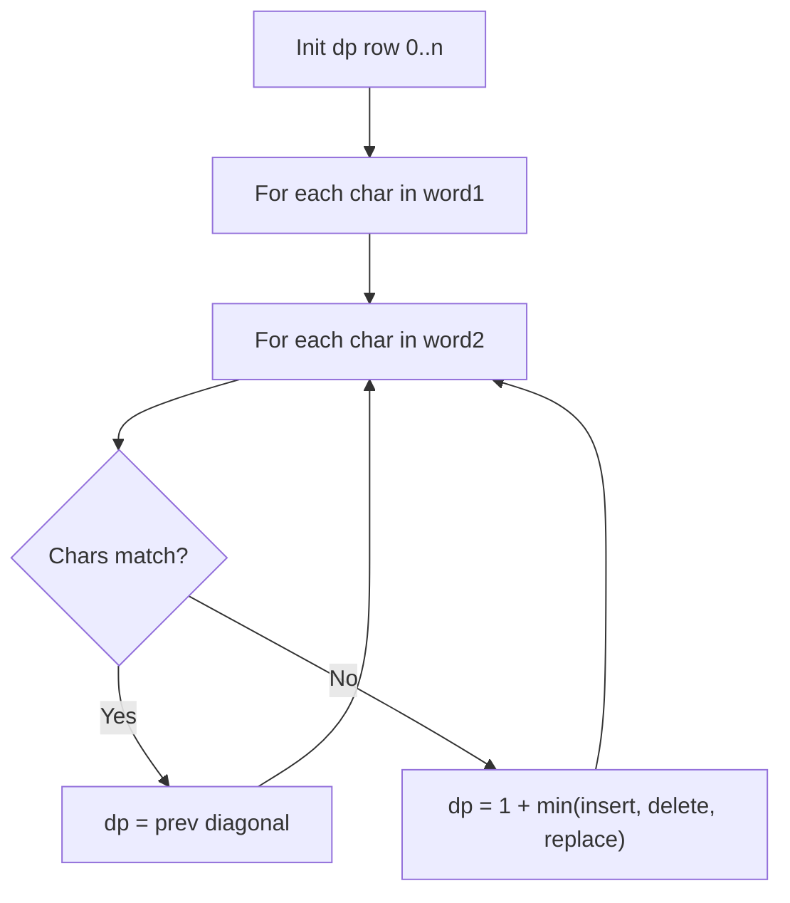

# Problem 72: Edit Distance

**Difficulty:** Medium  
**Tags:** String, Dynamic Programming  
**Pattern:** Dynamic Programming  
**Link:** [leetcode.com/problems/edit-distance](https://leetcode.com/problems/edit-distance/)

## Description

Given two strings `word1` and `word2`, return *the minimum number of operations required to convert `word1` to `word2`*.

You have the following three operations permitted on a word:

	- Insert a character
	- Delete a character
	- Replace a character

 

Example 1:

```

**Input:** word1 = "horse", word2 = "ros"
**Output:** 3
**Explanation:** 
horse -> rorse (replace 'h' with 'r')
rorse -> rose (remove 'r')
rose -> ros (remove 'e')

```

Example 2:

```

**Input:** word1 = "intention", word2 = "execution"
**Output:** 5
**Explanation:** 
intention -> inention (remove 't')
inention -> enention (replace 'i' with 'e')
enention -> exention (replace 'n' with 'x')
exention -> exection (replace 'n' with 'c')
exection -> execution (insert 'u')

```

 

**Constraints:**

	- `0 <= word1.length, word2.length <= 500`
	- `word1` and `word2` consist of lowercase English letters.

## Approach: Dynamic Programming

**Edit Distance DP:** dp[i][j] = min ops to convert word1[:i] to word2[:j]. Insert/delete/replace.

## Pseudocode

```
1. dp[j] = j for base case
2. For each i,j:
   If chars match: dp = diagonal
   Else: 1 + min(insert, delete, replace)
3. Return dp[n]
```

## Algorithm Flow



## Complexity Analysis

- **Time:** O(m*n)
- **Space:** O(n)

## Solution (Python3)

```python
class Solution:
    def minDistance(self, word1: str, word2: str) -> int:
        m, n = len(word1), len(word2)
        dp = list(range(n + 1))
        for i in range(1, m + 1):
            prev = dp[0]
            dp[0] = i
            for j in range(1, n + 1):
                temp = dp[j]
                if word1[i-1] == word2[j-1]:
                    dp[j] = prev
                else:
                    dp[j] = 1 + min(prev, dp[j], dp[j-1])
                prev = temp
        return dp[n]
```

## Solution (C++)

```cpp
#include <algorithm>
#include <string>
#include <vector>
using namespace std;

class Solution {
public:
    int minDistance(string& word1, string& word2) {
        // String DP - O(m*n) time and space
        int m = word1.size(), n = word2.size();
        vector<vector<int>> dp(m + 1, vector<int>(n + 1, 0));
        for (int i = 1; i <= m; i++) {
            for (int j = 1; j <= n; j++) {
                if (word1[i-1] == word2[j-1])
                    dp[i][j] = dp[i-1][j-1] + 1;
                else
                    dp[i][j] = max(dp[i-1][j], dp[i][j-1]);
            }
        }
        return dp[m][n];
    }
};
```
