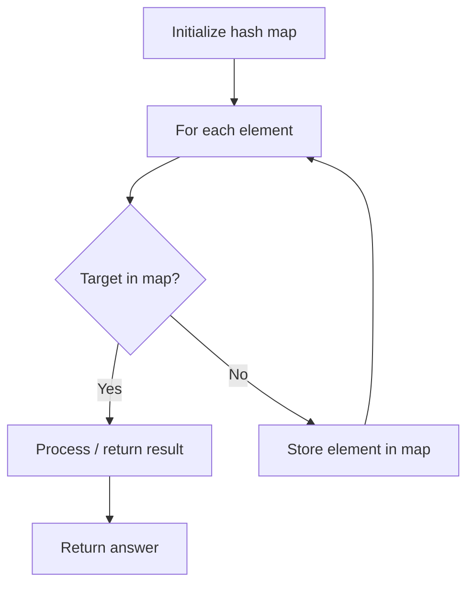

# Problem 73: Set Matrix Zeroes

**Difficulty:** Medium  
**Tags:** Array, Hash Table, Matrix  
**Pattern:** Matrix / In-place  
**Link:** [leetcode.com/problems/set-matrix-zeroes](https://leetcode.com/problems/set-matrix-zeroes/)

## Description

Given an `m x n` integer matrix `matrix`, if an element is `0`, set its entire row and column to `0`'s.

You must do it in place.

 

Example 1:

```

**Input:** matrix = [[1,1,1],[1,0,1],[1,1,1]]
**Output:** [[1,0,1],[0,0,0],[1,0,1]]

```

Example 2:

```

**Input:** matrix = [[0,1,2,0],[3,4,5,2],[1,3,1,5]]
**Output:** [[0,0,0,0],[0,4,5,0],[0,3,1,0]]

```

 

**Constraints:**

	- `m == matrix.length`
	- `n == matrix[0].length`
	- `1 <= m, n <= 200`
	- `-2^31 <= matrix[i][j] <= 2^31 - 1`

 

**Follow up:**

	- A straightforward solution using `O(mn)` space is probably a bad idea.
	- A simple improvement uses `O(m + n)` space, but still not the best solution.
	- Could you devise a constant space solution?

## Approach: Matrix / In-place

Use first row/col as markers. Track if first row/col themselves need zeroing.

## Pseudocode

```
1. Mark first row/col flags
2. Use first row/col to mark zero rows/cols
3. Zero based on markers
4. Handle first row/col
```

## Algorithm Flow



## Complexity Analysis

- **Time:** O(m*n)
- **Space:** O(1)

## Solution (Python3)

```python
class Solution:
    def setZeroes(self, matrix: list[list[int]]) -> None:
        m, n = len(matrix), len(matrix[0])
        first_row = any(matrix[0][j] == 0 for j in range(n))
        first_col = any(matrix[i][0] == 0 for i in range(m))
        for i in range(1, m):
            for j in range(1, n):
                if matrix[i][j] == 0:
                    matrix[i][0] = 0
                    matrix[0][j] = 0
        for i in range(1, m):
            for j in range(1, n):
                if matrix[i][0] == 0 or matrix[0][j] == 0:
                    matrix[i][j] = 0
        if first_row:
            for j in range(n):
                matrix[0][j] = 0
        if first_col:
            for i in range(m):
                matrix[i][0] = 0
```

## Solution (C++)

```cpp
#include <string>
#include <unordered_map>
#include <vector>
using namespace std;

class Solution {
public:
    void setZeroes(vector<vector<int>>& matrix) {
        // Hash map approach - O(n) time, O(n) space
        unordered_map<int, int> seen;
        for (int i = 0; i < matrix.size(); i++) {
            int complement = matrix - matrix[i];
            if (seen.count(complement)) {
                return {seen[complement], i};
            }
            seen[matrix[i]] = i;
        }
        return ;
    }
};
```
