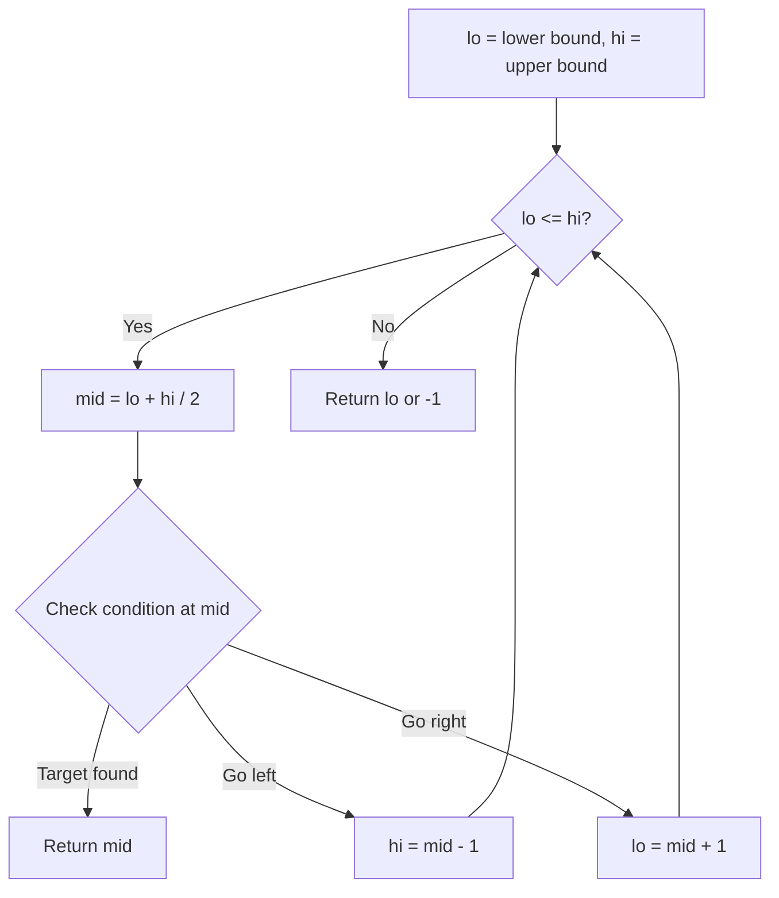
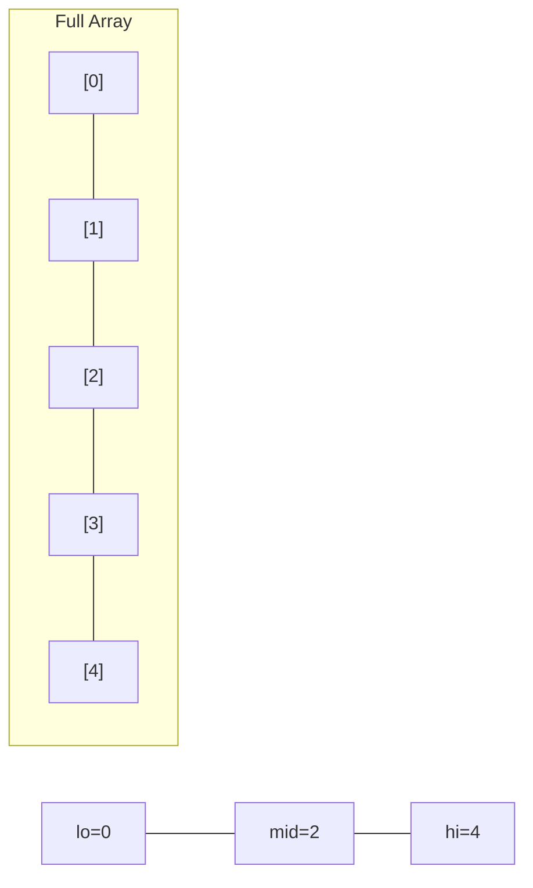
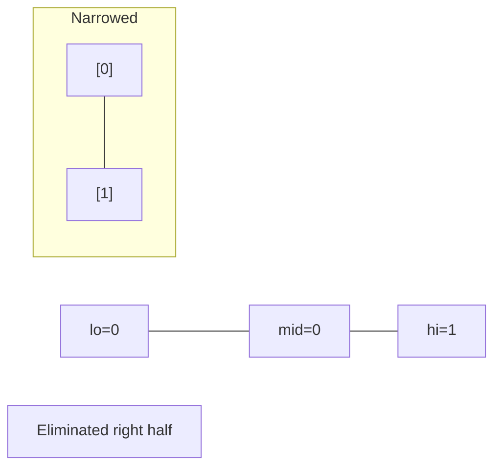
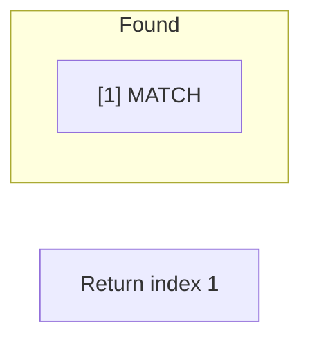

# Problem 74: Search a 2D Matrix

**Difficulty:** Medium  
**Tags:** Array, Binary Search, Matrix  
**Pattern:** Binary Search  
**Link:** [leetcode.com/problems/search-a-2d-matrix](https://leetcode.com/problems/search-a-2d-matrix/)

## Description

You are given an `m x n` integer matrix `matrix` with the following two properties:

	- Each row is sorted in non-decreasing order.
	- The first integer of each row is greater than the last integer of the previous row.

Given an integer `target`, return `true` *if* `target` *is in* `matrix` *or* `false` *otherwise*.

You must write a solution in `O(log(m * n))` time complexity.

 

Example 1:

```

**Input:** matrix = [[1,3,5,7],[10,11,16,20],[23,30,34,60]], target = 3
**Output:** true

```

Example 2:

```

**Input:** matrix = [[1,3,5,7],[10,11,16,20],[23,30,34,60]], target = 13
**Output:** false

```

 

**Constraints:**

	- `m == matrix.length`
	- `n == matrix[i].length`
	- `1 <= m, n <= 100`
	- `-10^4 <= matrix[i][j], target <= 10^4`

## Approach: Binary Search

Treat 2D matrix as 1D sorted array. Binary search with index mapping: row=mid//n, col=mid%n.

## Pseudocode

```
1. Binary search [0, m*n-1]
2. Map mid to matrix[mid//n][mid%n]
3. Standard binary search logic
```

## Algorithm Flow



## Visual State Transitions

**Binary Search Step-by-Step:**

**Frame 1: Initial search space**


**Frame 2: Compare mid, narrow search**


**Frame 3: Found target**



## Complexity Analysis

- **Time:** O(log(m*n))
- **Space:** O(1)

## Solution (Python3)

```python
class Solution:
    def searchMatrix(self, matrix: list[list[int]], target: int) -> bool:
        m, n = len(matrix), len(matrix[0])
        lo, hi = 0, m * n - 1
        while lo <= hi:
            mid = (lo + hi) // 2
            val = matrix[mid // n][mid % n]
            if val == target:
                return True
            elif val < target:
                lo = mid + 1
            else:
                hi = mid - 1
        return False
```

## Solution (C++)

```cpp
#include <string>
#include <vector>
using namespace std;

class Solution {
public:
    bool searchMatrix(vector<vector<int>>& matrix, int target) {
        // Binary search - O(log n) time, O(1) space
        int lo = 0, hi = matrix.size() - 1;
        while (lo <= hi) {
            int mid = lo + (hi - lo) / 2;
            if (matrix[mid] == target) {
                return mid;
            } else if (matrix[mid] < target) {
                lo = mid + 1;
            } else {
                hi = mid - 1;
            }
        }
        return false;
    }
};
```
