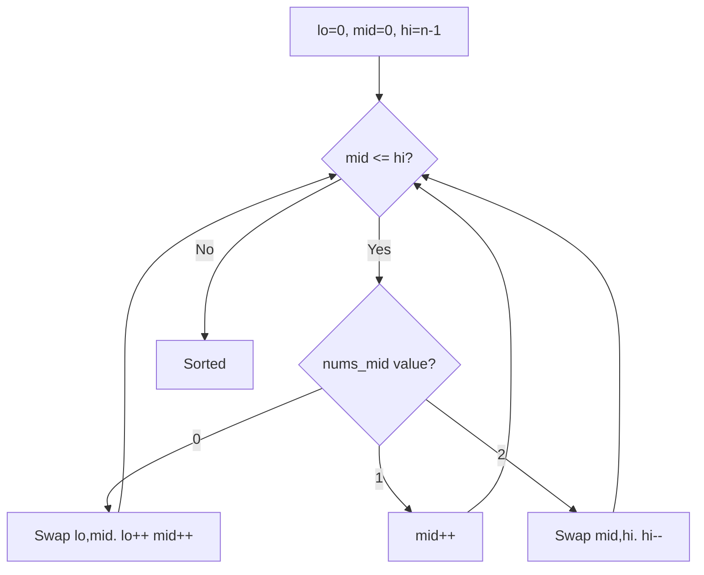

# Problem 75: Sort Colors

**Difficulty:** Medium  
**Tags:** Array, Two Pointers, Sorting  
**Pattern:** Dutch National Flag / Three Pointers  
**Link:** [leetcode.com/problems/sort-colors](https://leetcode.com/problems/sort-colors/)

## Description

Given an array `nums` with `n` objects colored red, white, or blue, sort them **in-place **so that objects of the same color are adjacent, with the colors in the order red, white, and blue.

We will use the integers `0`, `1`, and `2` to represent the color red, white, and blue, respectively.

You must solve this problem without using the library's sort function.

 

Example 1:

```

**Input:** nums = [2,0,2,1,1,0]
**Output:** [0,0,1,1,2,2]

```

Example 2:

```

**Input:** nums = [2,0,1]
**Output:** [0,1,2]

```

 

**Constraints:**

	- `n == nums.length`
	- `1 <= n <= 300`
	- `nums[i]` is either `0`, `1`, or `2`.

 

**Follow up:** Could you come up with a one-pass algorithm using only constant extra space?

## Approach: Dutch National Flag / Three Pointers

**Dutch National Flag:** Three pointers (lo, mid, hi). 0s go to front, 2s go to back, 1s stay in middle.

## Pseudocode

```
1. lo=0, mid=0, hi=n-1
2. While mid <= hi:
   0: swap with lo, advance both
   1: advance mid
   2: swap with hi, decrement hi
```

## Algorithm Flow



## Complexity Analysis

- **Time:** O(n)
- **Space:** O(1)

## Solution (Python3)

```python
class Solution:
    def sortColors(self, nums: list[int]) -> None:
        lo, mid, hi = 0, 0, len(nums) - 1
        while mid <= hi:
            if nums[mid] == 0:
                nums[lo], nums[mid] = nums[mid], nums[lo]
                lo += 1; mid += 1
            elif nums[mid] == 1:
                mid += 1
            else:
                nums[mid], nums[hi] = nums[hi], nums[mid]
                hi -= 1
```

## Solution (C++)

```cpp
#include <algorithm>
#include <string>
#include <vector>
using namespace std;

class Solution {
public:
    void sortColors(vector<int>& nums) {
        // Sort + two pointers - O(n log n) time
        sort(nums.begin(), nums.end());
        int left = 0, right = nums.size() - 1;
        while (left < right) {
            int curr = nums[left] + nums[right];
            if (curr < nums) {
                left++;
            } else {
                right--;
            }
        }
        return ;
    }
};
```
