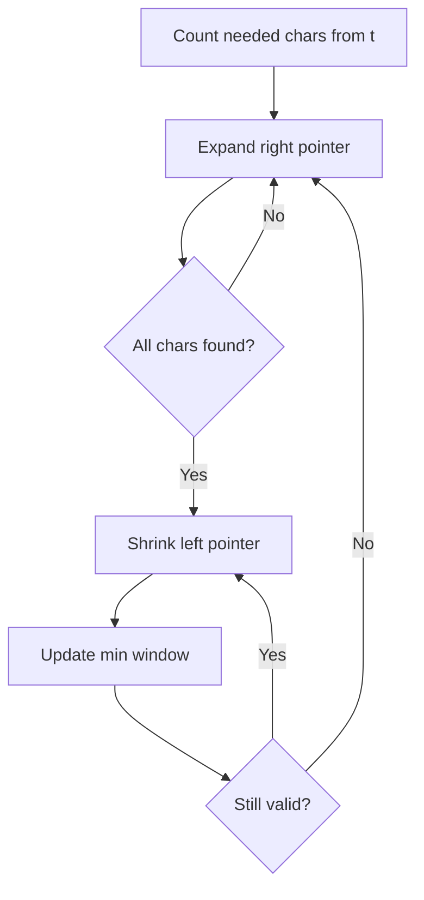
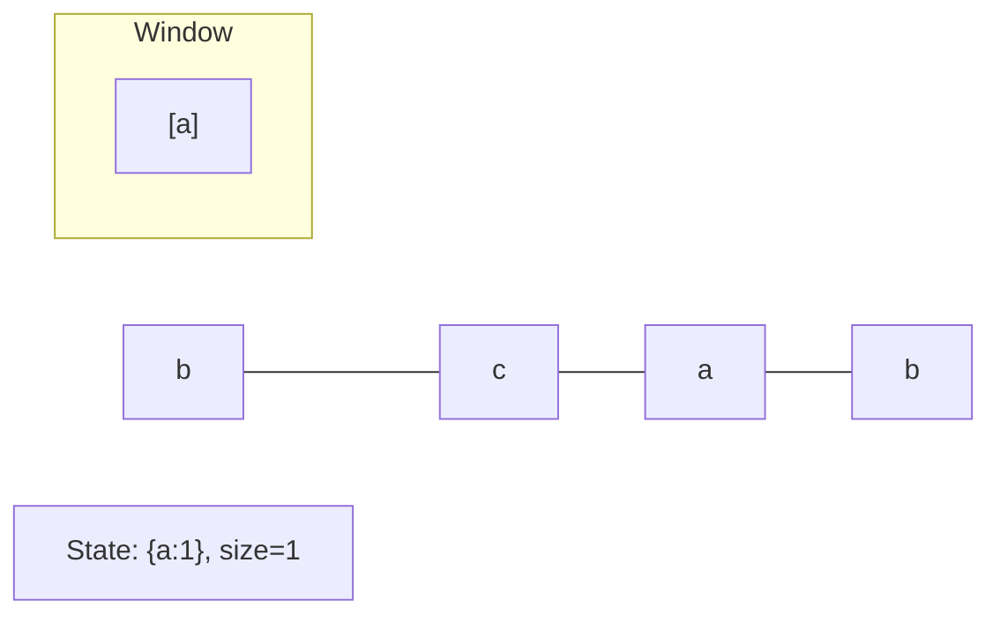
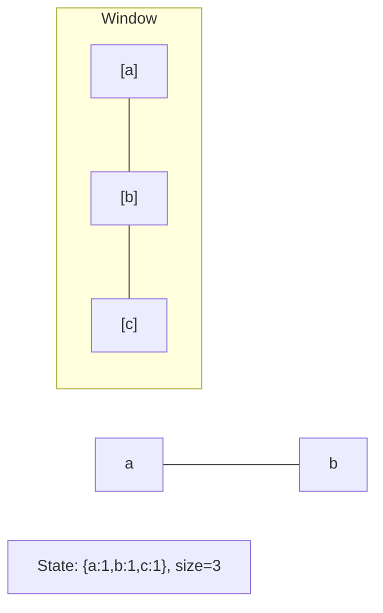
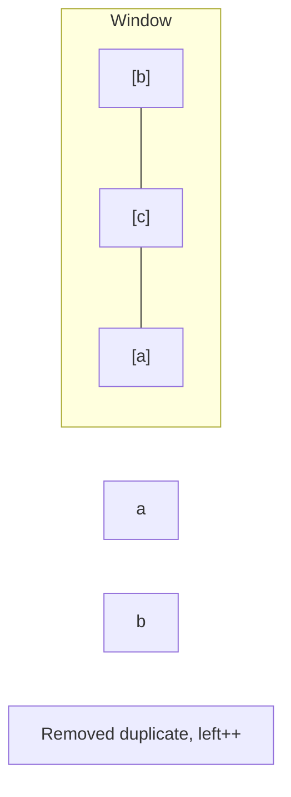
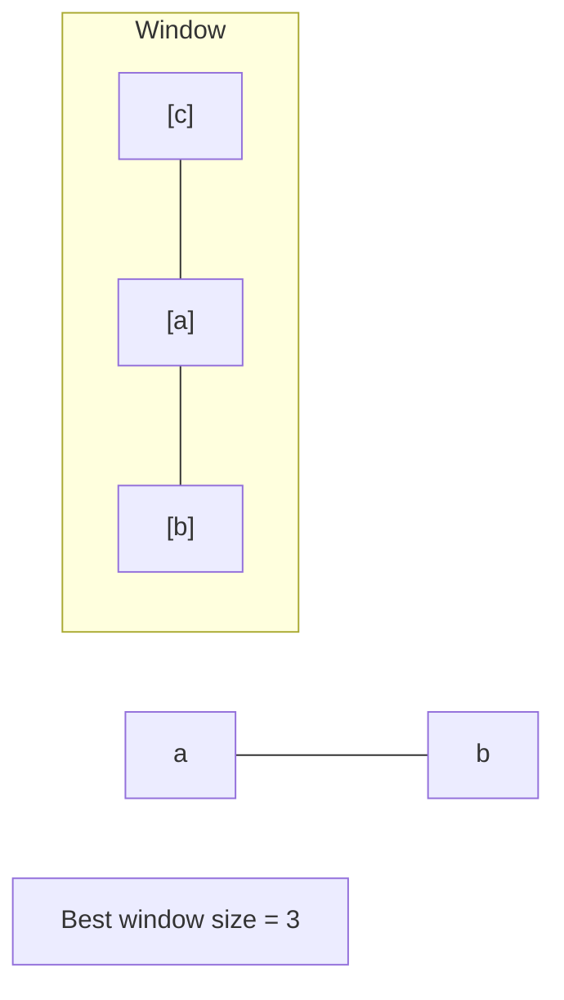

# Problem 76: Minimum Window Substring

**Difficulty:** Hard  
**Tags:** Hash Table, String, Sliding Window  
**Pattern:** Sliding Window  
**Link:** [leetcode.com/problems/minimum-window-substring](https://leetcode.com/problems/minimum-window-substring/)

## Description

Given two strings `s` and `t` of lengths `m` and `n` respectively, return *the **minimum window*** ***substring**** of *`s`* such that every character in *`t`* (**including duplicates**) is included in the window*. If there is no such substring, return *the empty string *`""`.

The testcases will be generated such that the answer is **unique**.

 

Example 1:

```

**Input:** s = "ADOBECODEBANC", t = "ABC"
**Output:** "BANC"
**Explanation:** The minimum window substring "BANC" includes 'A', 'B', and 'C' from string t.

```

Example 2:

```

**Input:** s = "a", t = "a"
**Output:** "a"
**Explanation:** The entire string s is the minimum window.

```

Example 3:

```

**Input:** s = "a", t = "aa"
**Output:** ""
**Explanation:** Both 'a's from t must be included in the window.
Since the largest window of s only has one 'a', return empty string.

```

 

**Constraints:**

	- `m == s.length`
	- `n == t.length`
	- `1 <= m, n <= 10^5`
	- `s` and `t` consist of uppercase and lowercase English letters.

 

**Follow up:** Could you find an algorithm that runs in `O(m + n)` time?

## Approach: Sliding Window

**Key Insight:** Expand right to include all needed chars, then shrink left to minimize window. Track missing count.

## Pseudocode

```
1. Count needed chars
2. Expand right: decrement need, if was needed decrement missing
3. While missing==0: try shrink left, update best window
4. Return minimum window
```

## Algorithm Flow



## Visual State Transitions

**Sliding Window Step-by-Step:**

**Frame 1: Initial window (left=0, right=0)**


**Frame 2: Expand right (right=2)**


**Frame 3: Violation - shrink left**


**Frame 4: Continue expanding**



## Complexity Analysis

- **Time:** O(m+n)
- **Space:** O(m+n)

## Solution (Python3)

```python
from collections import Counter

class Solution:
    def minWindow(self, s: str, t: str) -> str:
        need = Counter(t)
        missing = len(t)
        left = 0
        start, end = 0, float('inf')
        for right, ch in enumerate(s):
            if need[ch] > 0:
                missing -= 1
            need[ch] -= 1
            while missing == 0:
                if right - left < end - start:
                    start, end = left, right
                need[s[left]] += 1
                if need[s[left]] > 0:
                    missing += 1
                left += 1
        return s[start:end+1] if end != float('inf') else '' 
```

## Solution (C++)

```cpp
#include <algorithm>
#include <string>
#include <unordered_map>
#include <vector>
using namespace std;

class Solution {
public:
    string minWindow(string& s, string& t) {
        // Sliding window approach - O(n) time, O(k) space
        unordered_map<char, int> window;
        int left = 0, result = 0;
        for (int right = 0; right < s.size(); right++) {
            window[s[right]]++;
            while ((int)window.size() > t) {
                window[s[left]]--;
                if (window[s[left]] == 0)
                    window.erase(s[left]);
                left++;
            }
            result = max(result, right - left + 1);
        }
        return result;
    }
};
```
