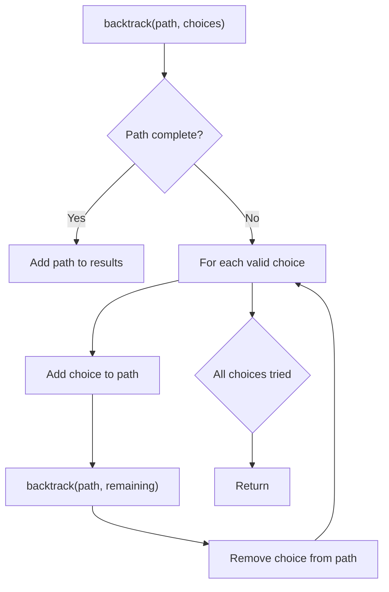
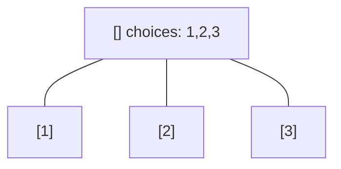
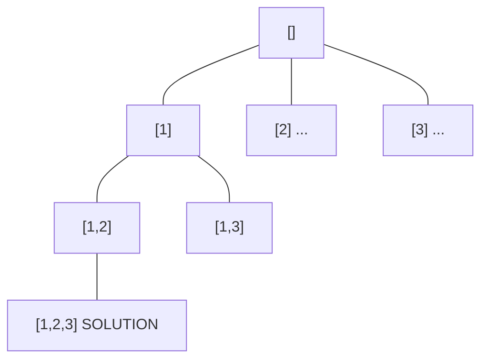
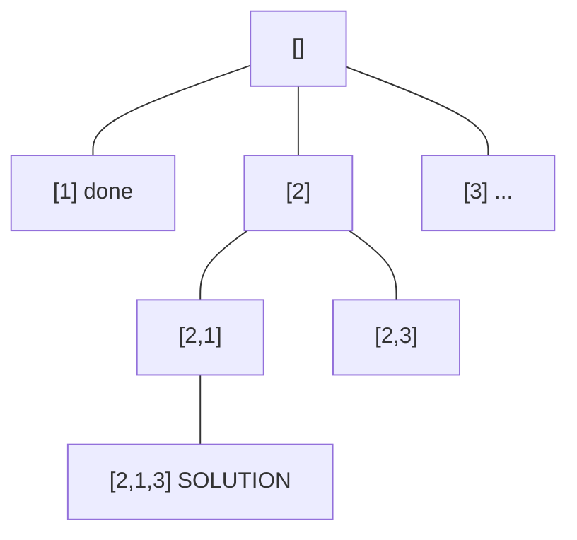
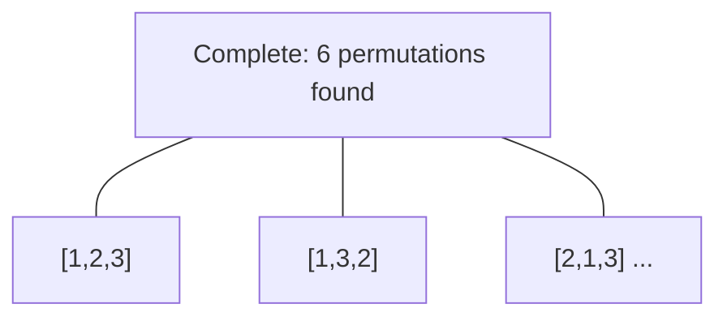

# Problem 77: Combinations

**Difficulty:** Medium  
**Tags:** Backtracking  
**Pattern:** Backtracking  
**Link:** [leetcode.com/problems/combinations](https://leetcode.com/problems/combinations/)

## Description

Given two integers `n` and `k`, return *all possible combinations of* `k` *numbers chosen from the range* `[1, n]`.

You may return the answer in **any order**.

 

Example 1:

```

**Input:** n = 4, k = 2
**Output:** [[1,2],[1,3],[1,4],[2,3],[2,4],[3,4]]
**Explanation:** There are 4 choose 2 = 6 total combinations.
Note that combinations are unordered, i.e., [1,2] and [2,1] are considered to be the same combination.

```

Example 2:

```

**Input:** n = 1, k = 1
**Output:** [[1]]
**Explanation:** There is 1 choose 1 = 1 total combination.

```

 

**Constraints:**

	- `1 <= n <= 20`
	- `1 <= k <= n`

## Approach: Backtracking

Backtrack: pick elements in order to avoid duplicates.

## Pseudocode

```
1. backtrack(start, path):
   If len(path)==k: record
   For i from start to n: try i, recurse with i+1
```

## Algorithm Flow



## Visual State Transitions

**Backtracking Decision Tree:**

**Frame 1: Root - start with empty path**


**Frame 2: Explore branch [1]**


**Frame 3: Backtrack, explore [2]**


**Frame 4: All solutions found**



## Complexity Analysis

- **Time:** O(C(n,k))
- **Space:** O(k)

## Solution (Python3)

```python
class Solution:
    def combine(self, n: int, k: int) -> list[list[int]]:
        result = []
        def backtrack(start, path):
            if len(path) == k:
                result.append(path[:])
                return
            for i in range(start, n + 1):
                path.append(i)
                backtrack(i + 1, path)
                path.pop()
        backtrack(1, [])
        return result
```

## Solution (C++)

```cpp
#include <functional>
#include <string>
#include <vector>
using namespace std;

class Solution {
public:
    vector<vector<int>> combine(int n, int k) {
        // Backtracking - O(2^n) or O(n!) time
        vector<vector<int>> result;
        vector<int> path;
        function<void(int)> backtrack = [&](int start) {
            result.push_back(path);
            for (int i = start; i < (int)n.size(); i++) {
                path.push_back(n[i]);
                backtrack(i + 1);
                path.pop_back();
            }
        };
        backtrack(0);
        return result;
    }
};
```
