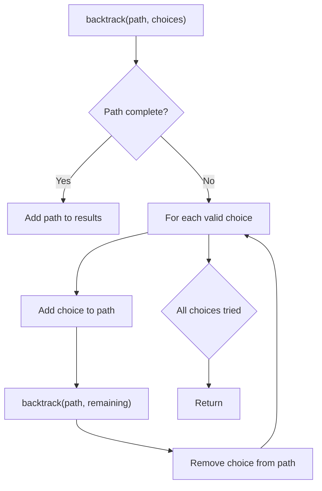
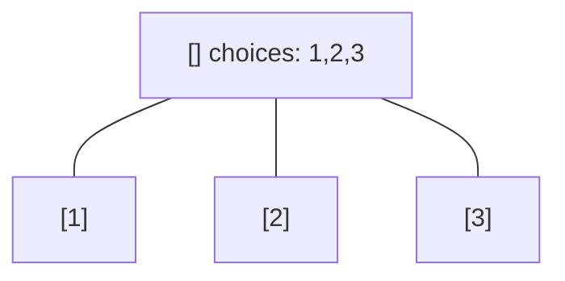
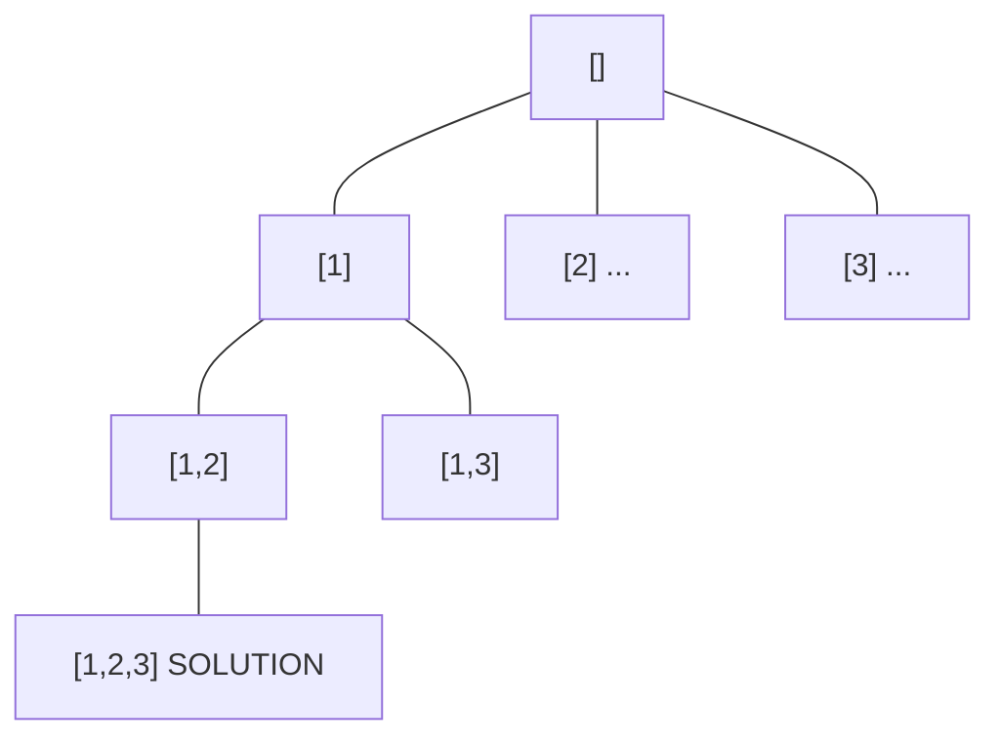
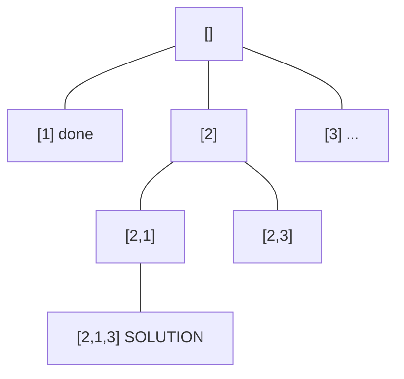
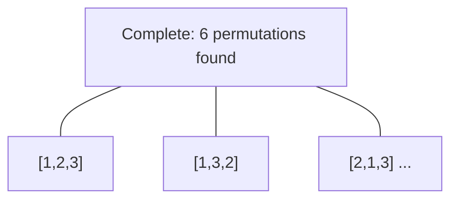

# Problem 78: Subsets

**Difficulty:** Medium  
**Tags:** Array, Backtracking, Bit Manipulation  
**Pattern:** Backtracking  
**Link:** [leetcode.com/problems/subsets](https://leetcode.com/problems/subsets/)

## Description

Given an integer array `nums` of **unique** elements, return *all possible* *subsets* *(the power set)*.

The solution set **must not** contain duplicate subsets. Return the solution in **any order**.

 

Example 1:

```

**Input:** nums = [1,2,3]
**Output:** [[],[1],[2],[1,2],[3],[1,3],[2,3],[1,2,3]]

```

Example 2:

```

**Input:** nums = [0]
**Output:** [[],[0]]

```

 

**Constraints:**

	- `1 <= nums.length <= 10`
	- `-10 <= nums[i] <= 10`
	- All the numbers of `nums` are **unique**.

## Approach: Backtracking

At each step, include or exclude the current element.

## Pseudocode

```
1. backtrack(start, path):
   Record path (every subset valid)
   For i from start: add nums[i], recurse, remove
```

## Algorithm Flow



## Visual State Transitions

**Backtracking Decision Tree:**

**Frame 1: Root - start with empty path**


**Frame 2: Explore branch [1]**


**Frame 3: Backtrack, explore [2]**


**Frame 4: All solutions found**



## Complexity Analysis

- **Time:** O(2^n)
- **Space:** O(n)

## Solution (Python3)

```python
class Solution:
    def subsets(self, nums: list[int]) -> list[list[int]]:
        result = []
        def backtrack(start, path):
            result.append(path[:])
            for i in range(start, len(nums)):
                path.append(nums[i])
                backtrack(i + 1, path)
                path.pop()
        backtrack(0, [])
        return result
```

## Solution (C++)

```cpp
#include <functional>
#include <string>
#include <vector>
using namespace std;

class Solution {
public:
    vector<vector<int>> subsets(vector<int>& nums) {
        // Backtracking - O(2^n) or O(n!) time
        vector<vector<int>> result;
        vector<int> path;
        function<void(int)> backtrack = [&](int start) {
            result.push_back(path);
            for (int i = start; i < (int)nums.size(); i++) {
                path.push_back(nums[i]);
                backtrack(i + 1);
                path.pop_back();
            }
        };
        backtrack(0);
        return result;
    }
};
```
