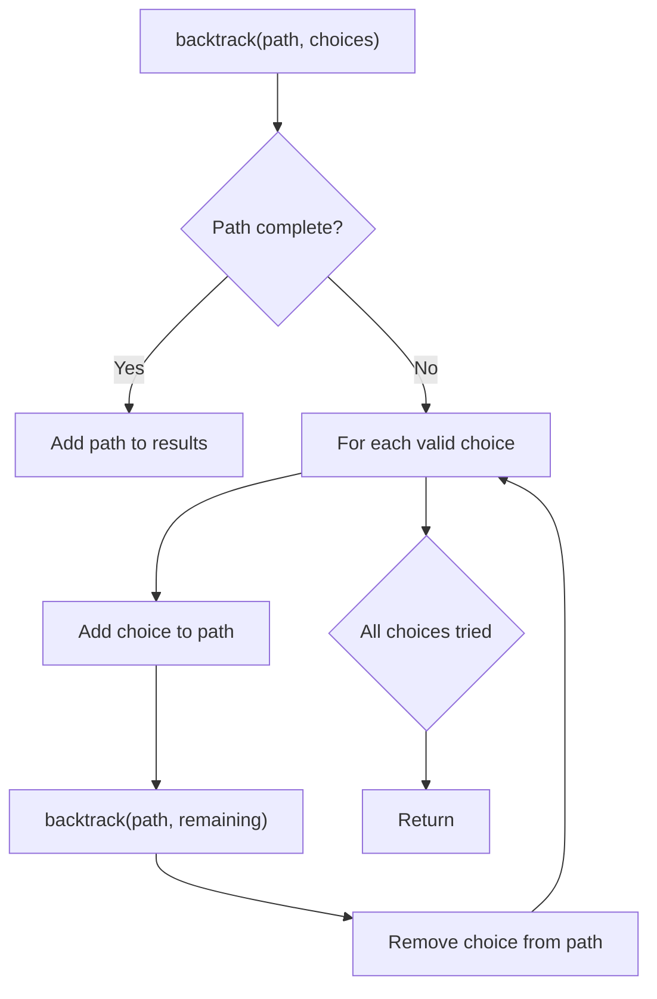
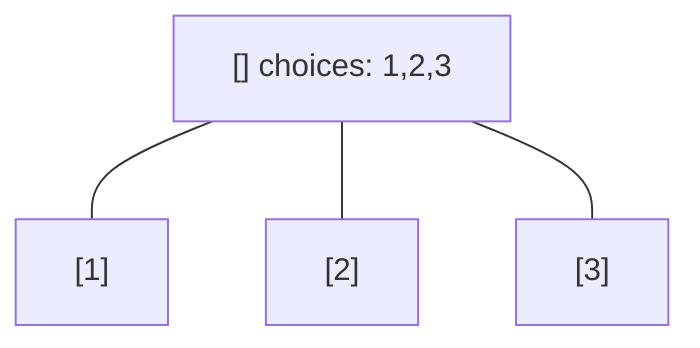
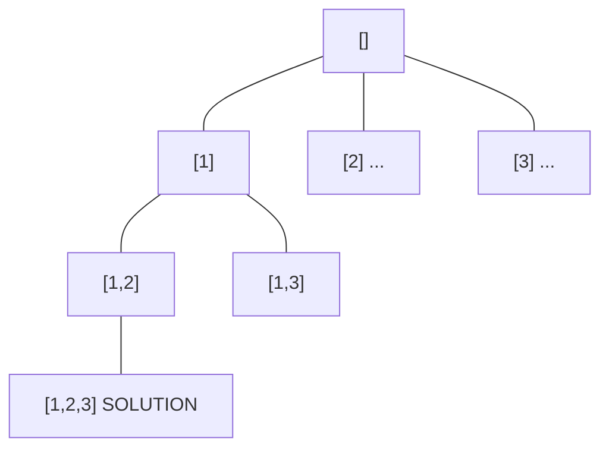
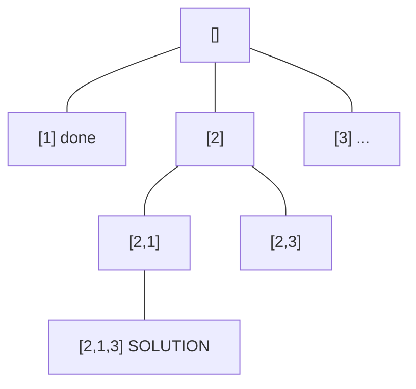
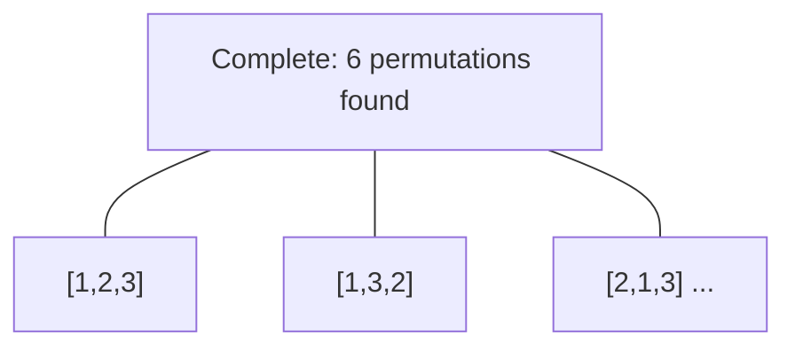

# Problem 79: Word Search

**Difficulty:** Medium  
**Tags:** Array, String, Backtracking, Depth-First Search, Matrix  
**Pattern:** Backtracking / DFS  
**Link:** [leetcode.com/problems/word-search](https://leetcode.com/problems/word-search/)

## Description

Given an `m x n` grid of characters `board` and a string `word`, return `true` *if* `word` *exists in the grid*.

The word can be constructed from letters of sequentially adjacent cells, where adjacent cells are horizontally or vertically neighboring. The same letter cell may not be used more than once.

 

Example 1:

```

**Input:** board = [["A","B","C","E"],["S","F","C","S"],["A","D","E","E"]], word = "ABCCED"
**Output:** true

```

Example 2:

```

**Input:** board = [["A","B","C","E"],["S","F","C","S"],["A","D","E","E"]], word = "SEE"
**Output:** true

```

Example 3:

```

**Input:** board = [["A","B","C","E"],["S","F","C","S"],["A","D","E","E"]], word = "ABCB"
**Output:** false

```

 

**Constraints:**

	- `m == board.length`
	- `n = board[i].length`
	- `1 <= m, n <= 6`
	- `1 <= word.length <= 15`
	- `board` and `word` consists of only lowercase and uppercase English letters.

 

**Follow up:** Could you use search pruning to make your solution faster with a larger `board`?

## Approach: Backtracking / DFS

DFS from each cell, mark visited, backtrack.

## Pseudocode

```
1. For each cell: start DFS if first char matches
2. DFS: check bounds, mark visited, try 4 directions
3. Backtrack: restore cell
```

## Algorithm Flow



## Visual State Transitions

**Backtracking Decision Tree:**

**Frame 1: Root - start with empty path**


**Frame 2: Explore branch [1]**


**Frame 3: Backtrack, explore [2]**


**Frame 4: All solutions found**



## Complexity Analysis

- **Time:** O(m*n*4^L)
- **Space:** O(L)

## Solution (Python3)

```python
class Solution:
    def exist(self, board: list[list[str]], word: str) -> bool:
        m, n = len(board), len(board[0])
        def dfs(i, j, k):
            if k == len(word):
                return True
            if i < 0 or i >= m or j < 0 or j >= n or board[i][j] != word[k]:
                return False
            tmp = board[i][j]
            board[i][j] = '#'
            found = any(dfs(i+di, j+dj, k+1) for di, dj in [(-1,0),(1,0),(0,-1),(0,1)])
            board[i][j] = tmp
            return found
        return any(dfs(i, j, 0) for i in range(m) for j in range(n))
```

## Solution (C++)

```cpp
#include <functional>
#include <string>
#include <vector>
using namespace std;

class Solution {
public:
    bool exist(vector<vector<string>>& board, string& word) {
        // Backtracking - O(2^n) or O(n!) time
        vector<vector<int>> result;
        vector<int> path;
        function<void(int)> backtrack = [&](int start) {
            result.push_back(path);
            for (int i = start; i < (int)board.size(); i++) {
                path.push_back(board[i]);
                backtrack(i + 1);
                path.pop_back();
            }
        };
        backtrack(0);
        return result;
    }
};
```
