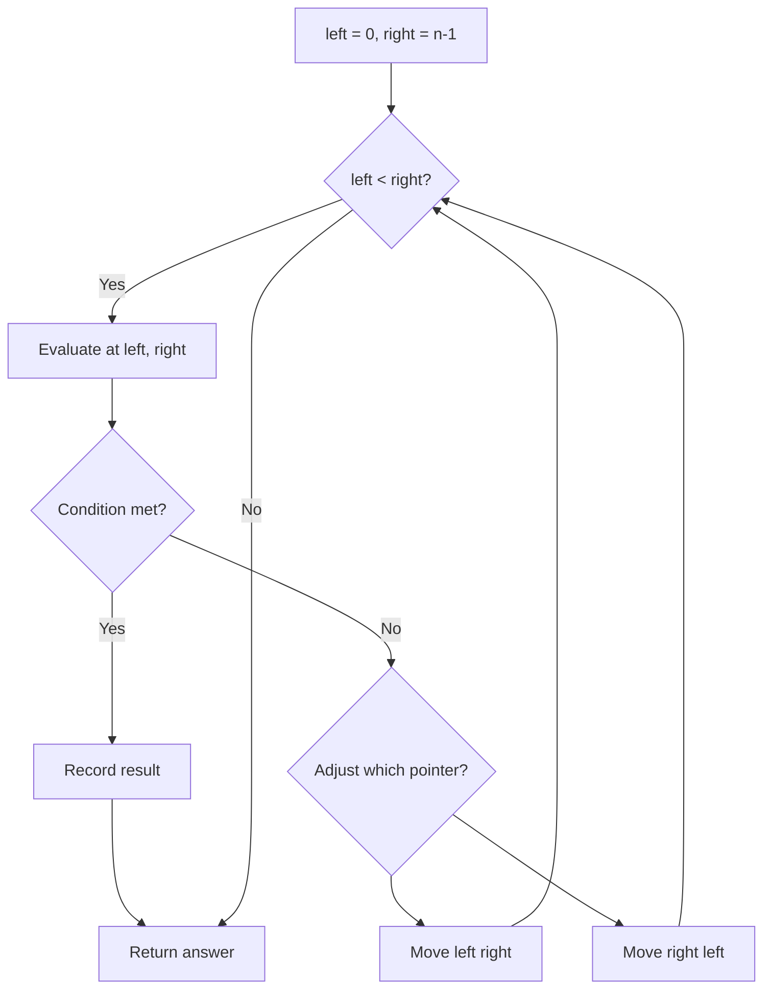
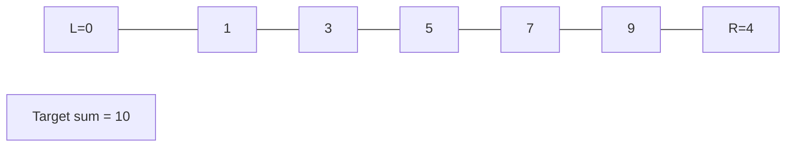
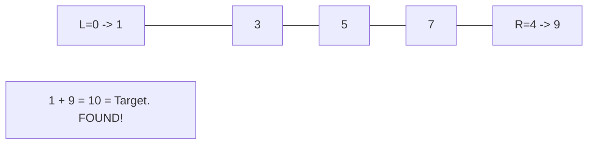

# Problem 80: Remove Duplicates from Sorted Array II

**Difficulty:** Medium  
**Tags:** Array, Two Pointers  
**Pattern:** Two Pointers  
**Link:** [leetcode.com/problems/remove-duplicates-from-sorted-array-ii](https://leetcode.com/problems/remove-duplicates-from-sorted-array-ii/)

## Description

Given an integer array `nums` sorted in **non-decreasing order**, remove some duplicates **in-place** such that each unique element appears **at most twice**. The **relative order** of the elements should be kept the **same**.

Since it is impossible to change the length of the array in some languages, you must instead have the result be placed in the **first part** of the array `nums`. More formally, if there are `k` elements after removing the duplicates, then the first `k` elements of `nums` should hold the final result. It does not matter what you leave beyond the first `k` elements.

Return `k`* after placing the final result in the first *`k`* slots of *`nums`.

Do **not** allocate extra space for another array. You must do this by **modifying the input array in-place** with O(1) extra memory.

**Custom Judge:**

The judge will test your solution with the following code:

```

int[] nums = [...]; // Input array
int[] expectedNums = [...]; // The expected answer with correct length

int k = removeDuplicates(nums); // Calls your implementation

assert k == expectedNums.length;
for (int i = 0; i < k; i++) {
    assert nums[i] == expectedNums[i];
}

```

If all assertions pass, then your solution will be **accepted**.

 

Example 1:

```

**Input:** nums = [1,1,1,2,2,3]
**Output:** 5, nums = [1,1,2,2,3,_]
**Explanation:** Your function should return k = 5, with the first five elements of nums being 1, 1, 2, 2 and 3 respectively.
It does not matter what you leave beyond the returned k (hence they are underscores).

```

Example 2:

```

**Input:** nums = [0,0,1,1,1,1,2,3,3]
**Output:** 7, nums = [0,0,1,1,2,3,3,_,_]
**Explanation:** Your function should return k = 7, with the first seven elements of nums being 0, 0, 1, 1, 2, 3 and 3 respectively.
It does not matter what you leave beyond the returned k (hence they are underscores).

```

 

**Constraints:**

	- `1 <= nums.length <= 3 * 10^4`
	- `-10^4 <= nums[i] <= 10^4`
	- `nums` is sorted in **non-decreasing** order.

## Approach: Two Pointers

Write pointer allows at most 2 of each value.

## Pseudocode

```
1. write = 0
2. For each num: if write<2 or num!=nums[write-2]: write it
3. Return write
```

## Algorithm Flow



## Visual State Transitions

**Two Pointer Convergence:**

**Frame 1: Initialize pointers**


**Frame 2: Sum = 1+9 = 10, found!**



## Complexity Analysis

- **Time:** O(n)
- **Space:** O(1)

## Solution (Python3)

```python
class Solution:
    def removeDuplicates(self, nums: list[int]) -> int:
        write = 0
        for num in nums:
            if write < 2 or num != nums[write - 2]:
                nums[write] = num
                write += 1
        return write
```

## Solution (C++)

```cpp
#include <string>
#include <vector>
using namespace std;

class Solution {
public:
    int removeDuplicates(vector<int>& nums) {
        // Two pointer approach - O(n) time, O(1) space
        int left = 0, right = nums.size() - 1;
        while (left < right) {
            int curr = nums[left] + nums[right];
            if (curr == nums) {
                return {left, right};
            } else if (curr < nums) {
                left++;
            } else {
                right--;
            }
        }
        return 0;
    }
};
```
