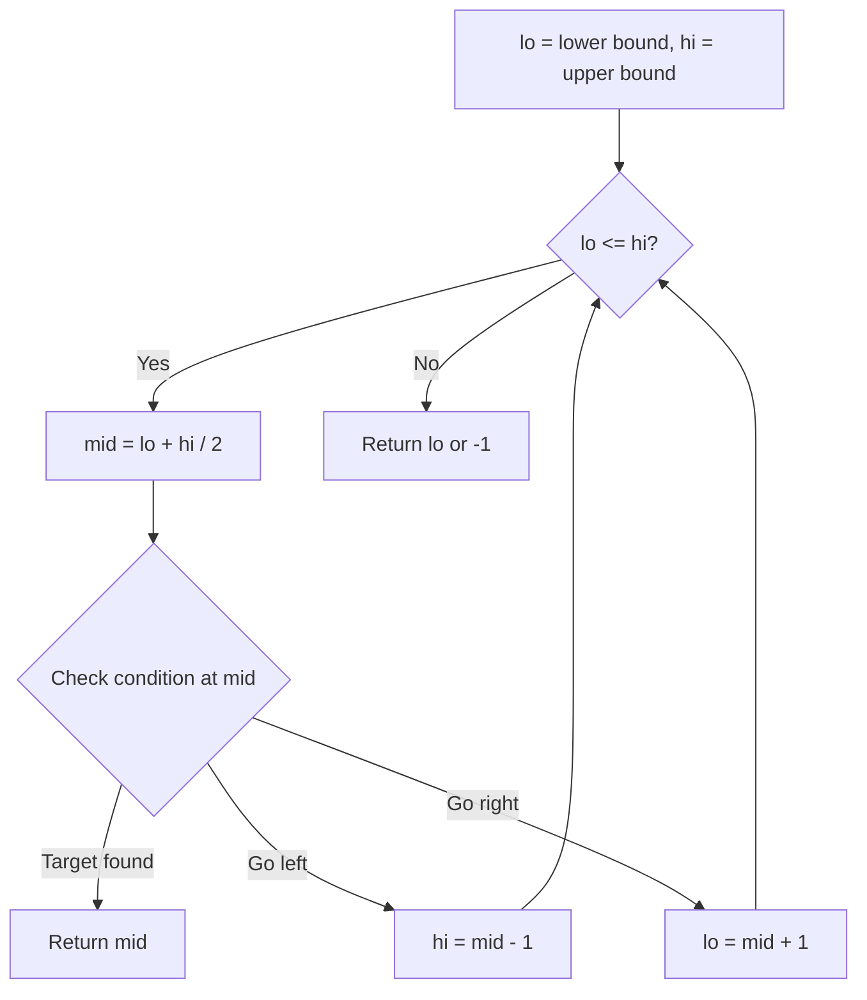
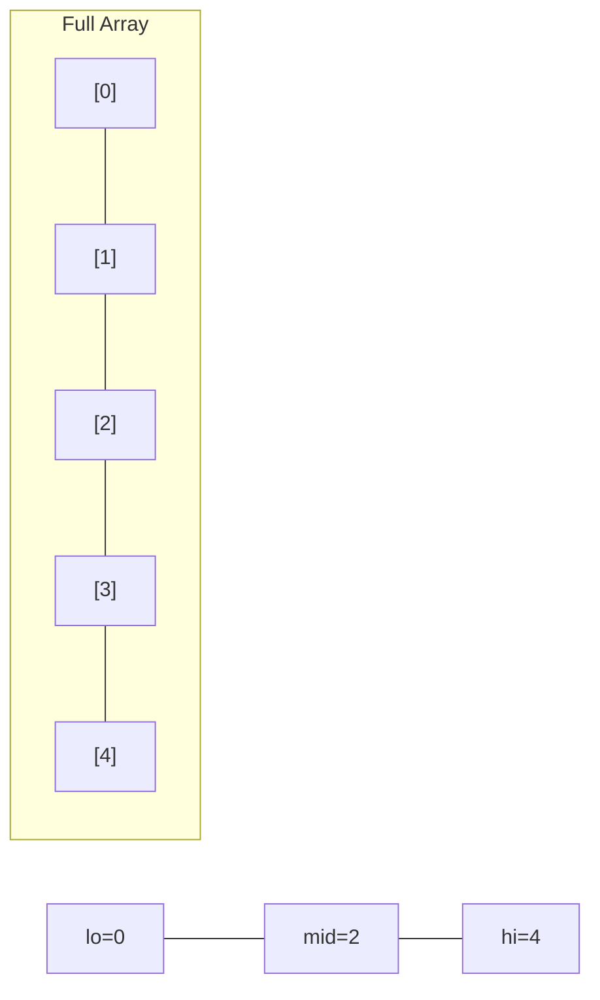
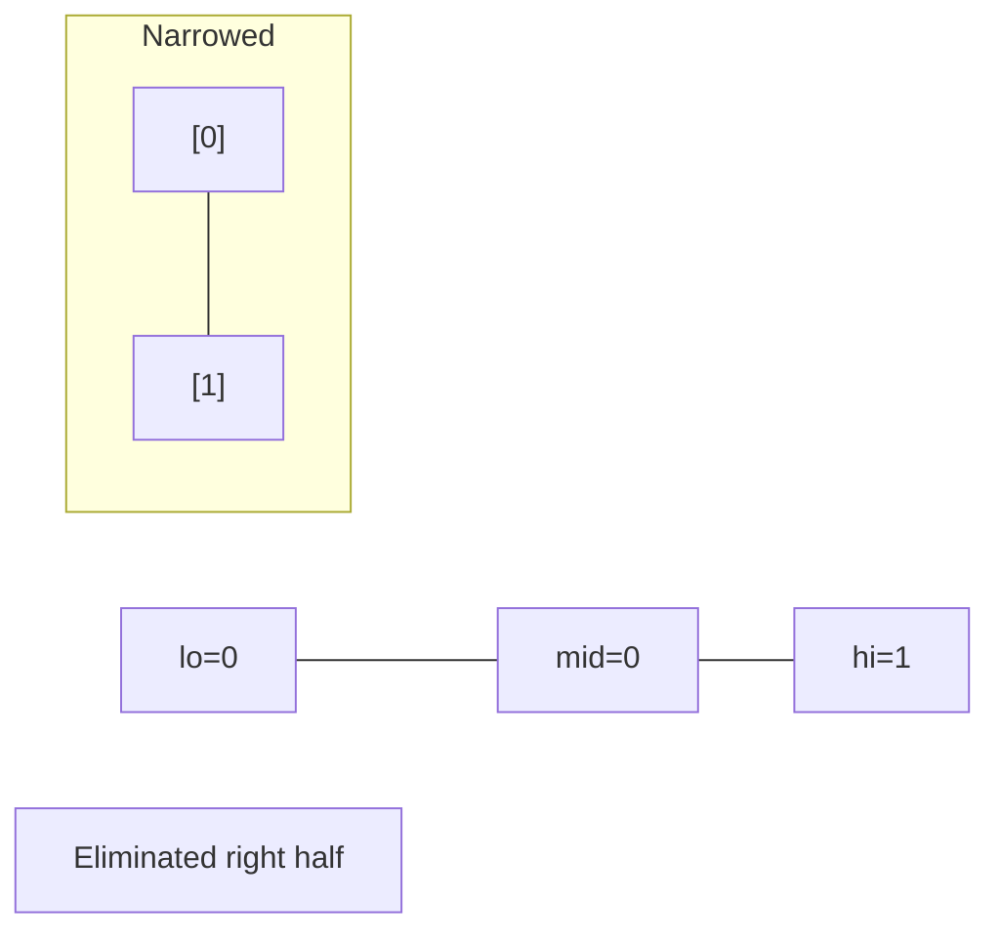
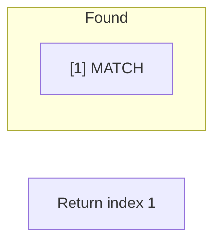

# Problem 81: Search in Rotated Sorted Array II

**Difficulty:** Medium  
**Tags:** Array, Binary Search  
**Pattern:** Binary Search  
**Link:** [leetcode.com/problems/search-in-rotated-sorted-array-ii](https://leetcode.com/problems/search-in-rotated-sorted-array-ii/)

## Description

There is an integer array `nums` sorted in non-decreasing order (not necessarily with **distinct** values).

Before being passed to your function, `nums` is **rotated** at an unknown pivot index `k` (`0 <= k < nums.length`) such that the resulting array is `[nums[k], nums[k+1], ..., nums[n-1], nums[0], nums[1], ..., nums[k-1]]` (**0-indexed**). For example, `[0,1,2,4,4,4,5,6,6,7]` might be rotated at pivot index `5` and become `[4,5,6,6,7,0,1,2,4,4]`.

Given the array `nums` **after** the rotation and an integer `target`, return `true`* if *`target`* is in *`nums`*, or *`false`* if it is not in *`nums`*.*

You must decrease the overall operation steps as much as possible.

 

Example 1:

```
**Input:** nums = [2,5,6,0,0,1,2], target = 0
**Output:** true

```
Example 2:

```
**Input:** nums = [2,5,6,0,0,1,2], target = 3
**Output:** false

```

 

**Constraints:**

	- `1 <= nums.length <= 5000`
	- `-10^4 <= nums[i] <= 10^4`
	- `nums` is guaranteed to be rotated at some pivot.
	- `-10^4 <= target <= 10^4`

 

**Follow up:** This problem is similar to Search in Rotated Sorted Array, but `nums` may contain **duplicates**. Would this affect the runtime complexity? How and why?

## Approach: Binary Search

Like problem 33 but handle duplicates by shrinking both ends when ambiguous.

## Pseudocode

```
1. Same as Search in Rotated Sorted Array
2. When lo==mid==hi: shrink both ends
3. Otherwise determine sorted half and search
```

## Algorithm Flow



## Visual State Transitions

**Binary Search Step-by-Step:**

**Frame 1: Initial search space**


**Frame 2: Compare mid, narrow search**


**Frame 3: Found target**



## Complexity Analysis

- **Time:** O(n) worst, O(log n) avg
- **Space:** O(1)

## Solution (Python3)

```python
class Solution:
    def search(self, nums: list[int], target: int) -> bool:
        lo, hi = 0, len(nums) - 1
        while lo <= hi:
            mid = (lo + hi) // 2
            if nums[mid] == target:
                return True
            if nums[lo] == nums[mid] == nums[hi]:
                lo += 1; hi -= 1
            elif nums[lo] <= nums[mid]:
                if nums[lo] <= target < nums[mid]:
                    hi = mid - 1
                else:
                    lo = mid + 1
            else:
                if nums[mid] < target <= nums[hi]:
                    lo = mid + 1
                else:
                    hi = mid - 1
        return False
```

## Solution (C++)

```cpp
#include <string>
#include <vector>
using namespace std;

class Solution {
public:
    bool search(vector<int>& nums, int target) {
        // Binary search - O(log n) time, O(1) space
        int lo = 0, hi = nums.size() - 1;
        while (lo <= hi) {
            int mid = lo + (hi - lo) / 2;
            if (nums[mid] == target) {
                return mid;
            } else if (nums[mid] < target) {
                lo = mid + 1;
            } else {
                hi = mid - 1;
            }
        }
        return false;
    }
};
```
