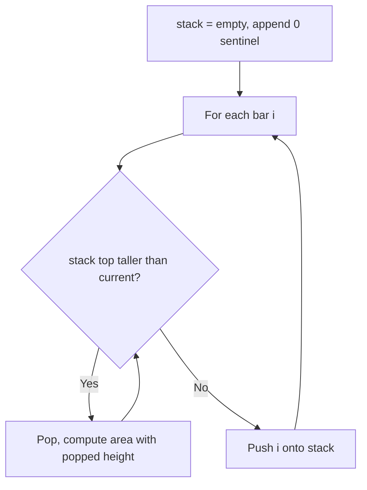
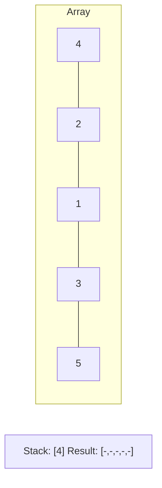
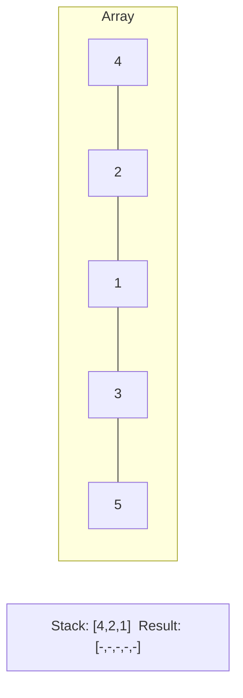
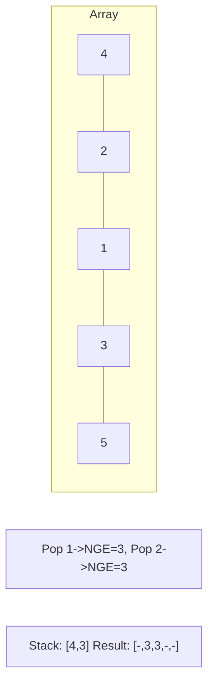
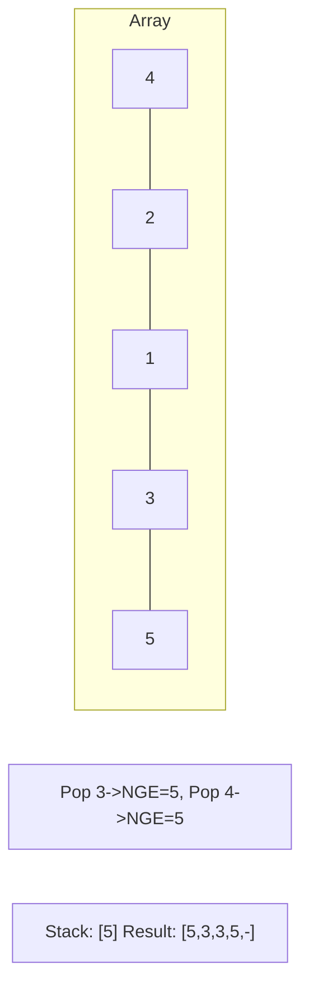

# Problem 84: Largest Rectangle in Histogram

**Difficulty:** Hard  
**Tags:** Array, Stack, Monotonic Stack  
**Pattern:** Monotonic Stack  
**Link:** [leetcode.com/problems/largest-rectangle-in-histogram](https://leetcode.com/problems/largest-rectangle-in-histogram/)

## Description

Given an array of integers `heights` representing the histogram's bar height where the width of each bar is `1`, return *the area of the largest rectangle in the histogram*.

 

Example 1:

```

**Input:** heights = [2,1,5,6,2,3]
**Output:** 10
**Explanation:** The above is a histogram where width of each bar is 1.
The largest rectangle is shown in the red area, which has an area = 10 units.

```

Example 2:

```

**Input:** heights = [2,4]
**Output:** 4

```

 

**Constraints:**

	- `1 <= heights.length <= 10^5`
	- `0 <= heights[i] <= 10^4`

## Approach: Monotonic Stack

**Key Insight:** Maintain a stack of increasing heights. When a shorter bar appears, pop and compute rectangles.

## Pseudocode

```
1. Stack of indices (increasing heights)
2. For each bar: pop taller bars, compute area
3. Width = i - stack[-1] - 1
```

## Algorithm Flow



## Visual State Transitions

**Monotonic Stack (Next Greater Element):**

**Frame 1: Process first elements**


**Frame 2: Push smaller elements**


**Frame 3: Element 3 pops 1 and 2**


**Frame 4: Element 5 pops all**



## Complexity Analysis

- **Time:** O(n)
- **Space:** O(n)

## Solution (Python3)

```python
class Solution:
    def largestRectangleArea(self, heights: list[int]) -> int:
        stack = []
        max_area = 0
        heights.append(0)
        for i, h in enumerate(heights):
            while stack and heights[stack[-1]] > h:
                height = heights[stack.pop()]
                width = i if not stack else i - stack[-1] - 1
                max_area = max(max_area, height * width)
            stack.append(i)
        heights.pop()
        return max_area
```

## Solution (C++)

```cpp
#include <stack>
#include <string>
#include <vector>
using namespace std;

class Solution {
public:
    int largestRectangleArea(vector<int>& heights) {
        // Monotonic stack - O(n) time, O(n) space
        int n = heights.size();
        vector<int> result(n, 0);
        stack<int> st;
        for (int i = 0; i < n; i++) {
            while (!st.empty() && heights[i] > heights[st.top()]) {
                int idx = st.top(); st.pop();
                result[idx] = i - idx;
            }
            st.push(i);
        }
        return result;
    }
};
```
