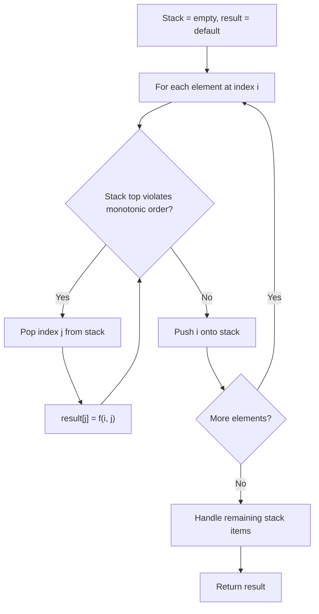
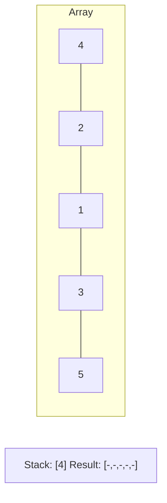
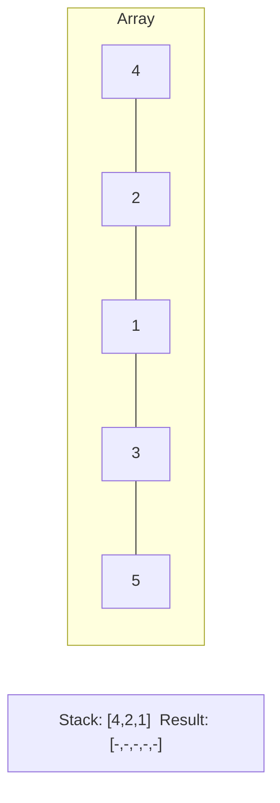
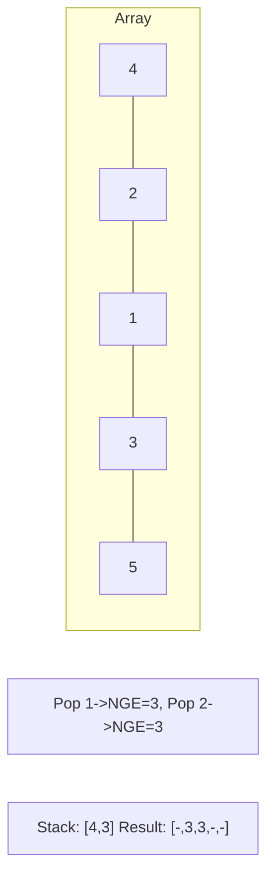
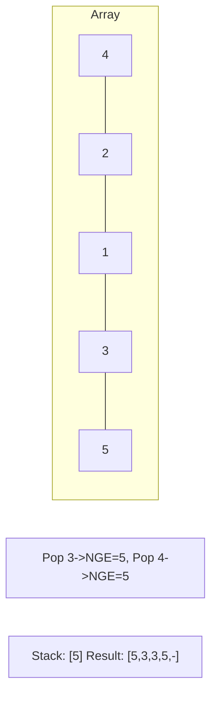

# Problem 85: Maximal Rectangle

**Difficulty:** Hard  
**Tags:** Array, Dynamic Programming, Stack, Matrix, Monotonic Stack  
**Pattern:** Monotonic Stack / DP  
**Link:** [leetcode.com/problems/maximal-rectangle](https://leetcode.com/problems/maximal-rectangle/)

## Description

Given a `rows x cols` binary `matrix` filled with `0`'s and `1`'s, find the largest rectangle containing only `1`'s and return *its area*.

 

Example 1:

```

**Input:** matrix = [["1","0","1","0","0"],["1","0","1","1","1"],["1","1","1","1","1"],["1","0","0","1","0"]]
**Output:** 6
**Explanation:** The maximal rectangle is shown in the above picture.

```

Example 2:

```

**Input:** matrix = [["0"]]
**Output:** 0

```

Example 3:

```

**Input:** matrix = [["1"]]
**Output:** 1

```

 

**Constraints:**

	- `rows == matrix.length`
	- `cols == matrix[i].length`
	- `1 <= rows, cols <= 200`
	- `matrix[i][j]` is `'0'` or `'1'`.

## Approach: Monotonic Stack / DP

Build histogram for each row, then apply Largest Rectangle in Histogram.

## Pseudocode

```
1. For each row: update heights (cumulative or reset)
2. Apply problem 84 to each histogram
3. Track global max area
```

## Algorithm Flow



## Visual State Transitions

**Monotonic Stack (Next Greater Element):**

**Frame 1: Process first elements**


**Frame 2: Push smaller elements**


**Frame 3: Element 3 pops 1 and 2**


**Frame 4: Element 5 pops all**



## Complexity Analysis

- **Time:** O(m*n)
- **Space:** O(n)

## Solution (Python3)

```python
class Solution:
    def maximalRectangle(self, matrix: list[list[str]]) -> int:
        if not matrix:
            return 0
        n = len(matrix[0])
        heights = [0] * n
        max_area = 0
        for row in matrix:
            for j in range(n):
                heights[j] = heights[j] + 1 if row[j] == '1' else 0
            # Largest rectangle in histogram
            stack = []
            h = heights + [0]
            for i in range(len(h)):
                while stack and h[stack[-1]] > h[i]:
                    height = h[stack.pop()]
                    width = i if not stack else i - stack[-1] - 1
                    max_area = max(max_area, height * width)
                stack.append(i)
        return max_area
```

## Solution (C++)

```cpp
#include <stack>
#include <string>
#include <vector>
using namespace std;

class Solution {
public:
    int maximalRectangle(vector<vector<string>>& matrix) {
        // Monotonic stack - O(n) time, O(n) space
        int n = matrix.size();
        vector<int> result(n, 0);
        stack<int> st;
        for (int i = 0; i < n; i++) {
            while (!st.empty() && matrix[i] > matrix[st.top()]) {
                int idx = st.top(); st.pop();
                result[idx] = i - idx;
            }
            st.push(i);
        }
        return result;
    }
};
```
