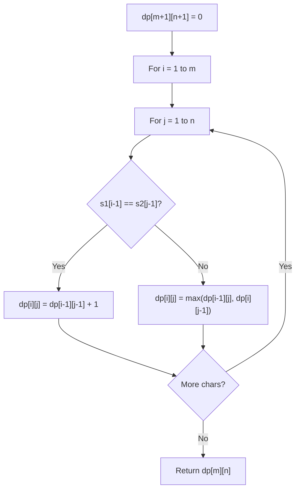

# Problem 87: Scramble String

**Difficulty:** Hard  
**Tags:** String, Dynamic Programming  
**Pattern:** Dynamic Programming (String)  
**Link:** [leetcode.com/problems/scramble-string](https://leetcode.com/problems/scramble-string/)

## Description

We can scramble a string s to get a string t using the following algorithm:

	- If the length of the string is 1, stop.
	- If the length of the string is > 1, do the following:
	
		Split the string into two non-empty substrings at a random index, i.e., if the string is `s`, divide it to `x` and `y` where `s = x + y`.
		- **Randomly** decide to swap the two substrings or to keep them in the same order. i.e., after this step, `s` may become `s = x + y` or `s = y + x`.
		- Apply step 1 recursively on each of the two substrings `x` and `y`.
	
	

Given two strings `s1` and `s2` of **the same length**, return `true` if `s2` is a scrambled string of `s1`, otherwise, return `false`.

 

Example 1:

```

**Input:** s1 = "great", s2 = "rgeat"
**Output:** true
**Explanation:** One possible scenario applied on s1 is:
"great" --> "gr/eat" // divide at random index.
"gr/eat" --> "gr/eat" // random decision is not to swap the two substrings and keep them in order.
"gr/eat" --> "g/r / e/at" // apply the same algorithm recursively on both substrings. divide at random index each of them.
"g/r / e/at" --> "r/g / e/at" // random decision was to swap the first substring and to keep the second substring in the same order.
"r/g / e/at" --> "r/g / e/ a/t" // again apply the algorithm recursively, divide "at" to "a/t".
"r/g / e/ a/t" --> "r/g / e/ a/t" // random decision is to keep both substrings in the same order.
The algorithm stops now, and the result string is "rgeat" which is s2.
As one possible scenario led s1 to be scrambled to s2, we return true.

```

Example 2:

```

**Input:** s1 = "abcde", s2 = "caebd"
**Output:** false

```

Example 3:

```

**Input:** s1 = "a", s2 = "a"
**Output:** true

```

 

**Constraints:**

	- `s1.length == s2.length`
	- `1 <= s1.length <= 30`
	- `s1` and `s2` consist of lowercase English letters.

## Approach: Dynamic Programming (String)

Compare or match two strings using a 2D DP table. dp[i][j] represents the answer for substrings s1[0..i-1] and s2[0..j-1]. Common patterns: LCS, edit distance, regex matching.

## Pseudocode

```
1. Create dp[m+1][n+1]
2. Initialize base cases
3. For i from 1 to m:
   For j from 1 to n:
     If s1[i-1] == s2[j-1]: dp[i][j] = dp[i-1][j-1] + 1
     Else: dp[i][j] = best of (dp[i-1][j], dp[i][j-1], dp[i-1][j-1])
4. Return dp[m][n]
```

## Algorithm Flow



## Complexity Analysis

- **Time:** O(m * n)
- **Space:** O(m * n)

## Solution (Python3)

```python
class Solution:
    def isScramble(self, s1: str, s2: str) -> bool:
        # String DP - O(m*n) time and space
        m, n = len(s1), len(s2)
        dp = [[0] * (n + 1) for _ in range(m + 1)]
        for i in range(1, m + 1):
            for j in range(1, n + 1):
                if s1[i-1] == s2[j-1]:
                    dp[i][j] = dp[i-1][j-1] + 1
                else:
                    dp[i][j] = max(dp[i-1][j], dp[i][j-1])
        return dp[m][n]
```

## Solution (C++)

```cpp
#include <algorithm>
#include <string>
#include <vector>
using namespace std;

class Solution {
public:
    bool isScramble(string& s1, string& s2) {
        // String DP - O(m*n) time and space
        int m = s1.size(), n = s2.size();
        vector<vector<int>> dp(m + 1, vector<int>(n + 1, 0));
        for (int i = 1; i <= m; i++) {
            for (int j = 1; j <= n; j++) {
                if (s1[i-1] == s2[j-1])
                    dp[i][j] = dp[i-1][j-1] + 1;
                else
                    dp[i][j] = max(dp[i-1][j], dp[i][j-1]);
            }
        }
        return dp[m][n];
    }
};
```
