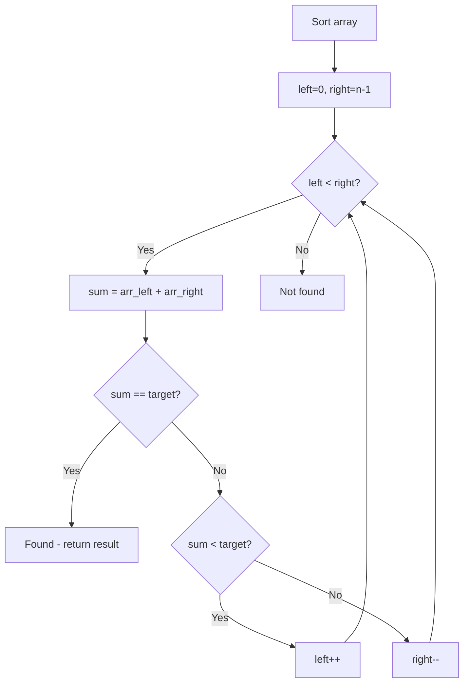

# Problem 88: Merge Sorted Array

**Difficulty:** Easy  
**Tags:** Array, Two Pointers, Sorting  
**Pattern:** Two Pointers / Merge  
**Link:** [leetcode.com/problems/merge-sorted-array](https://leetcode.com/problems/merge-sorted-array/)

## Description

You are given two integer arrays `nums1` and `nums2`, sorted in **non-decreasing order**, and two integers `m` and `n`, representing the number of elements in `nums1` and `nums2` respectively.

**Merge** `nums1` and `nums2` into a single array sorted in **non-decreasing order**.

The final sorted array should not be returned by the function, but instead be *stored inside the array *`nums1`. To accommodate this, `nums1` has a length of `m + n`, where the first `m` elements denote the elements that should be merged, and the last `n` elements are set to `0` and should be ignored. `nums2` has a length of `n`.

 

Example 1:

```

**Input:** nums1 = [1,2,3,0,0,0], m = 3, nums2 = [2,5,6], n = 3
**Output:** [1,2,2,3,5,6]
**Explanation:** The arrays we are merging are [1,2,3] and [2,5,6].
The result of the merge is [1,2,2,3,5,6] with the underlined elements coming from nums1.

```

Example 2:

```

**Input:** nums1 = [1], m = 1, nums2 = [], n = 0
**Output:** [1]
**Explanation:** The arrays we are merging are [1] and [].
The result of the merge is [1].

```

Example 3:

```

**Input:** nums1 = [0], m = 0, nums2 = [1], n = 1
**Output:** [1]
**Explanation:** The arrays we are merging are [] and [1].
The result of the merge is [1].
Note that because m = 0, there are no elements in nums1. The 0 is only there to ensure the merge result can fit in nums1.

```

 

**Constraints:**

	- `nums1.length == m + n`
	- `nums2.length == n`
	- `0 <= m, n <= 200`
	- `1 <= m + n <= 200`
	- `-10^9 <= nums1[i], nums2[j] <= 10^9`

 

**Follow up: **Can you come up with an algorithm that runs in `O(m + n)` time?

## Approach: Two Pointers / Merge

Merge from the end to avoid overwriting. Fill nums1 from position m+n-1 backwards.

## Pseudocode

```
1. i=m-1, j=n-1, k=m+n-1
2. While j >= 0: pick larger of nums1[i], nums2[j]
3. Place at nums1[k], decrement pointers
```

## Algorithm Flow



## Complexity Analysis

- **Time:** O(m+n)
- **Space:** O(1)

## Solution (Python3)

```python
class Solution:
    def merge(self, nums1: list[int], m: int, nums2: list[int], n: int) -> None:
        i, j, k = m - 1, n - 1, m + n - 1
        while j >= 0:
            if i >= 0 and nums1[i] > nums2[j]:
                nums1[k] = nums1[i]
                i -= 1
            else:
                nums1[k] = nums2[j]
                j -= 1
            k -= 1
```

## Solution (C++)

```cpp
#include <algorithm>
#include <string>
#include <vector>
using namespace std;

class Solution {
public:
    void merge(vector<int>& nums1, int m, vector<int>& nums2, int n) {
        // Sort + two pointers - O(n log n) time
        sort(nums1.begin(), nums1.end());
        int left = 0, right = nums1.size() - 1;
        while (left < right) {
            int curr = nums1[left] + nums1[right];
            if (curr < m) {
                left++;
            } else {
                right--;
            }
        }
        return ;
    }
};
```
