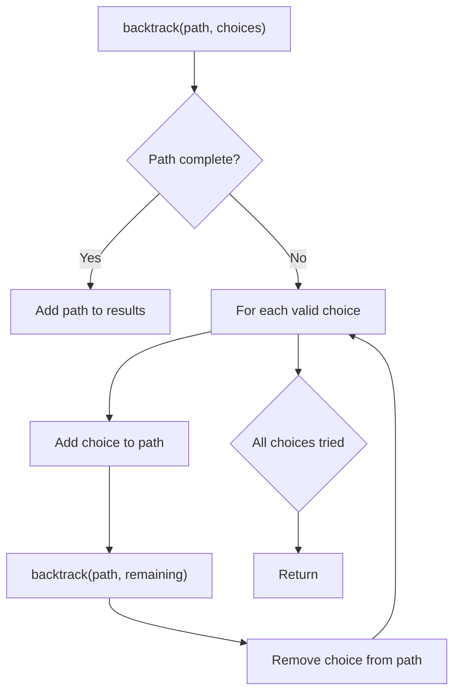
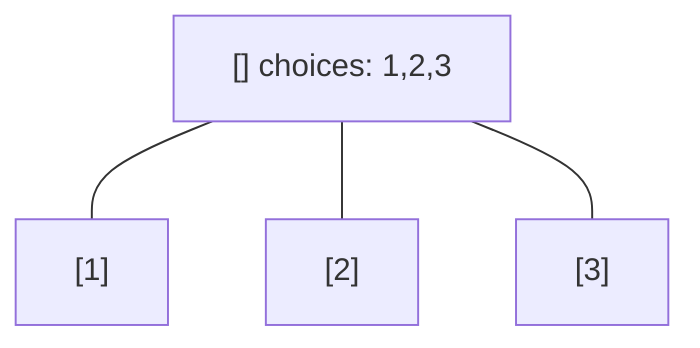
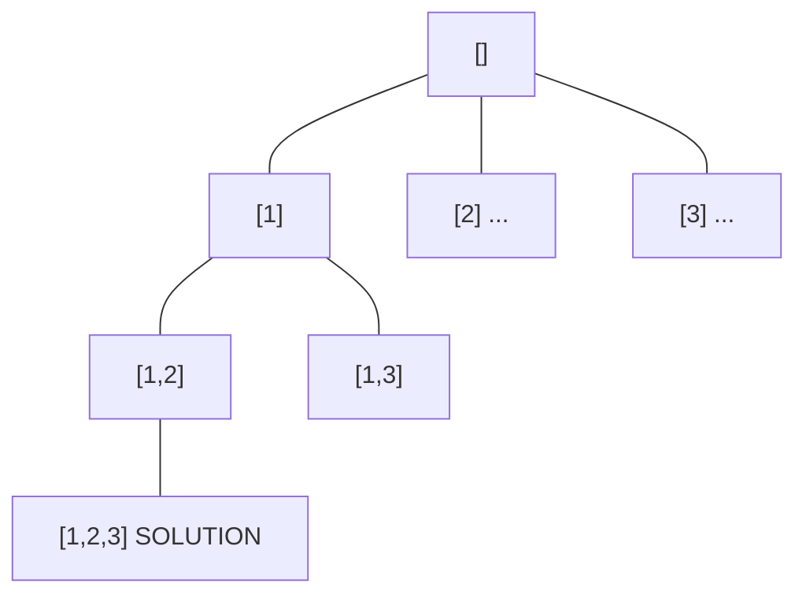
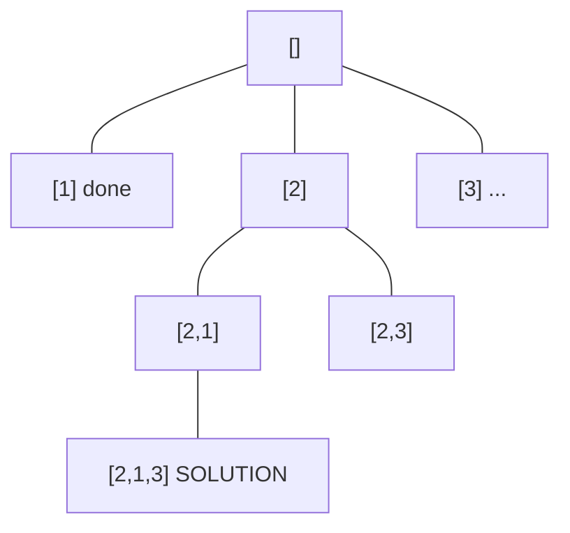
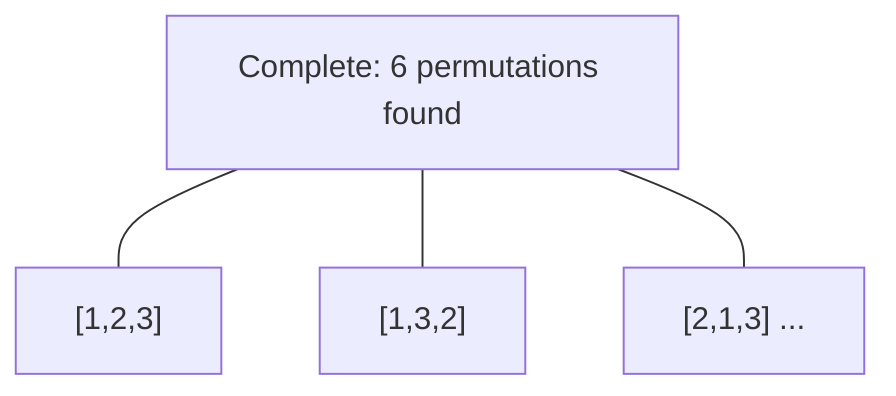

# Problem 89: Gray Code

**Difficulty:** Medium  
**Tags:** Math, Backtracking, Bit Manipulation  
**Pattern:** Backtracking  
**Link:** [leetcode.com/problems/gray-code](https://leetcode.com/problems/gray-code/)

## Description

An **n-bit gray code sequence** is a sequence of `2^n` integers where:

	- Every integer is in the **inclusive** range `[0, 2^n - 1]`,
	- The first integer is `0`,
	- An integer appears **no more than once** in the sequence,
	- The binary representation of every pair of **adjacent** integers differs by **exactly one bit**, and
	- The binary representation of the **first** and **last** integers differs by **exactly one bit**.

Given an integer `n`, return *any valid **n-bit gray code sequence***.

 

Example 1:

```

**Input:** n = 2
**Output:** [0,1,3,2]
**Explanation:**
The binary representation of [0,1,3,2] is [00,01,11,10].
- 00 and 01 differ by one bit
- 01 and 11 differ by one bit
- 11 and 10 differ by one bit
- 10 and 00 differ by one bit
[0,2,3,1] is also a valid gray code sequence, whose binary representation is [00,10,11,01].
- 00 and 10 differ by one bit
- 10 and 11 differ by one bit
- 11 and 01 differ by one bit
- 01 and 00 differ by one bit

```

Example 2:

```

**Input:** n = 1
**Output:** [0,1]

```

 

**Constraints:**

	- `1 <= n <= 16`

## Approach: Backtracking

Explore all possible solutions by building candidates incrementally. At each step, make a choice and recurse. If the choice leads to a dead end, undo the choice (backtrack) and try the next option.

## Pseudocode

```
1. Define backtrack(path, choices):
   a. If path is a complete solution: add to results
   b. For each choice in choices:
      - If choice is valid:
        * Add choice to path
        * backtrack(path, remaining_choices)
        * Remove choice from path (backtrack)
2. Call backtrack([], all_choices)
```

## Algorithm Flow



## Visual State Transitions

**Backtracking Decision Tree:**

**Frame 1: Root - start with empty path**


**Frame 2: Explore branch [1]**


**Frame 3: Backtrack, explore [2]**


**Frame 4: All solutions found**



## Complexity Analysis

- **Time:** O(k^n) or O(n!)
- **Space:** O(n)

## Solution (Python3)

```python
class Solution:
    def grayCode(self, n: int) -> List[int]:
        # Backtracking - O(2^n) or O(n!) time
        result = []
        
        def backtrack(path, start):
            result.append(path[:])
            for i in range(start, len(n)):
                path.append(n[i])
                backtrack(path, i + 1)
                path.pop()
        
        backtrack([], 0)
        return result
```

## Solution (C++)

```cpp
#include <functional>
#include <string>
#include <vector>
using namespace std;

class Solution {
public:
    vector<int> grayCode(int n) {
        // Backtracking - O(2^n) or O(n!) time
        vector<vector<int>> result;
        vector<int> path;
        function<void(int)> backtrack = [&](int start) {
            result.push_back(path);
            for (int i = start; i < (int)n.size(); i++) {
                path.push_back(n[i]);
                backtrack(i + 1);
                path.pop_back();
            }
        };
        backtrack(0);
        return result;
    }
};
```
