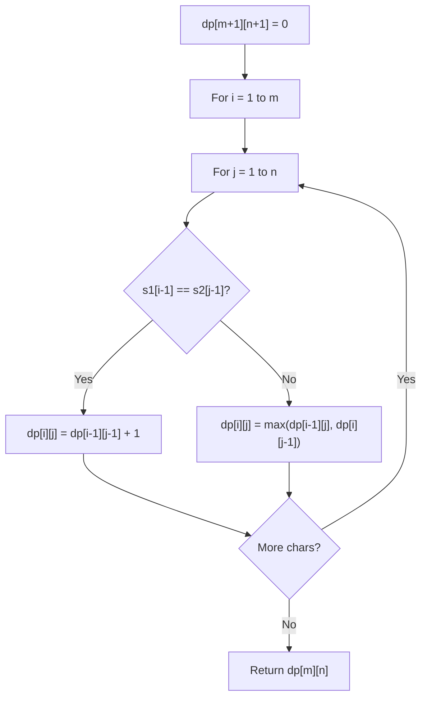

# Problem 91: Decode Ways

**Difficulty:** Medium  
**Tags:** String, Dynamic Programming  
**Pattern:** Dynamic Programming  
**Link:** [leetcode.com/problems/decode-ways](https://leetcode.com/problems/decode-ways/)

## Description

You have intercepted a secret message encoded as a string of numbers. The message is **decoded** via the following mapping:

"1" -> 'A'

"2" -> 'B'

...

"25" -> 'Y'

"26" -> 'Z'

However, while decoding the message, you realize that there are many different ways you can decode the message because some codes are contained in other codes (`"2"` and `"5"` vs `"25"`).

For example, `"11106"` can be decoded into:

	- `"AAJF"` with the grouping `(1, 1, 10, 6)`
	- `"KJF"` with the grouping `(11, 10, 6)`
	- The grouping `(1, 11, 06)` is invalid because `"06"` is not a valid code (only `"6"` is valid).

Note: there may be strings that are impossible to decode.

Given a string s containing only digits, return the **number of ways** to **decode** it. If the entire string cannot be decoded in any valid way, return `0`.

The test cases are generated so that the answer fits in a **32-bit** integer.

 

Example 1:

**Input:** s = "12"

**Output:** 2

**Explanation:**

"12" could be decoded as "AB" (1 2) or "L" (12).

Example 2:

**Input:** s = "226"

**Output:** 3

**Explanation:**

"226" could be decoded as "BZ" (2 26), "VF" (22 6), or "BBF" (2 2 6).

Example 3:

**Input:** s = "06"

**Output:** 0

**Explanation:**

"06" cannot be mapped to "F" because of the leading zero ("6" is different from "06"). In this case, the string is not a valid encoding, so return 0.

 

**Constraints:**

	- `1 <= s.length <= 100`
	- `s` contains only digits and may contain leading zero(s).

## Approach: Dynamic Programming

DP: dp[i] = ways to decode s[:i]. Check single digit and two-digit decodings.

## Pseudocode

```
1. dp[0]=dp[1]=1
2. For i>=2: if single digit valid: dp[i]+=dp[i-1]; if two-digit valid: dp[i]+=dp[i-2]
3. Return dp[n]
```

## Algorithm Flow



## Complexity Analysis

- **Time:** O(n)
- **Space:** O(n)

## Solution (Python3)

```python
class Solution:
    def numDecodings(self, s: str) -> int:
        if not s or s[0] == '0':
            return 0
        n = len(s)
        dp = [0] * (n + 1)
        dp[0] = dp[1] = 1
        for i in range(2, n + 1):
            if s[i-1] != '0':
                dp[i] += dp[i-1]
            two = int(s[i-2:i])
            if 10 <= two <= 26:
                dp[i] += dp[i-2]
        return dp[n]
```

## Solution (C++)

```cpp
#include <algorithm>
#include <string>
#include <vector>
using namespace std;

class Solution {
public:
    int numDecodings(string& s) {
        // String DP - O(m*n) time and space
        int m = s.size(), n = s.size();
        vector<vector<int>> dp(m + 1, vector<int>(n + 1, 0));
        for (int i = 1; i <= m; i++) {
            for (int j = 1; j <= n; j++) {
                if (s[i-1] == s[j-1])
                    dp[i][j] = dp[i-1][j-1] + 1;
                else
                    dp[i][j] = max(dp[i-1][j], dp[i][j-1]);
            }
        }
        return dp[m][n];
    }
};
```
