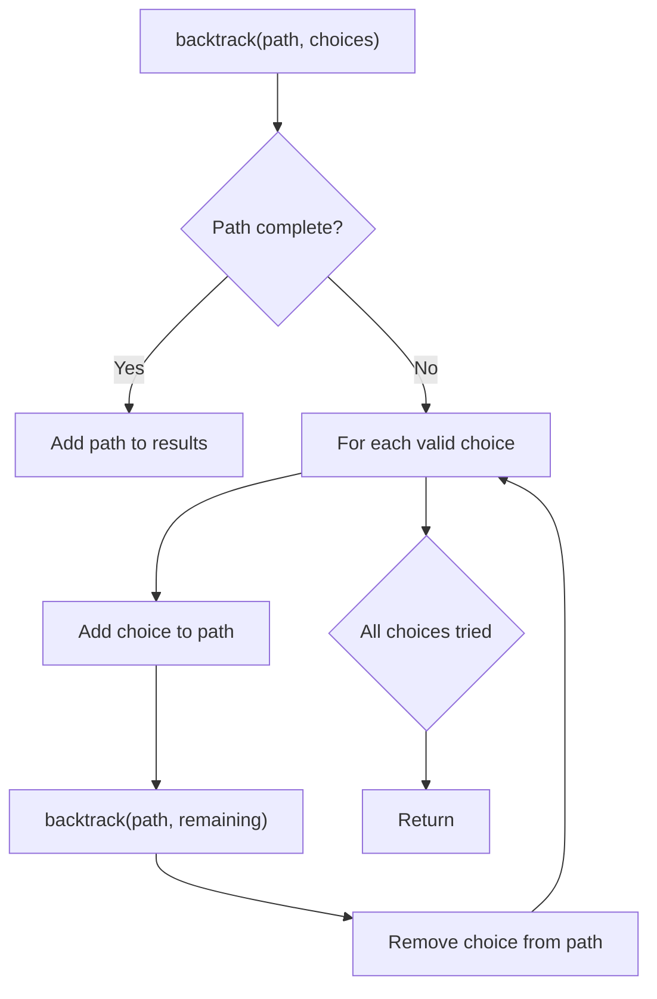
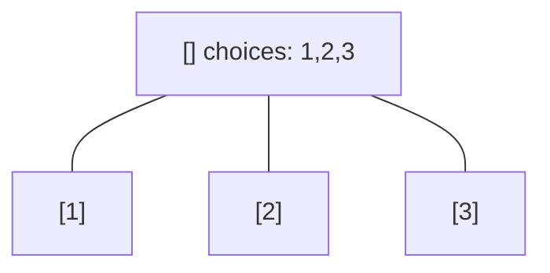
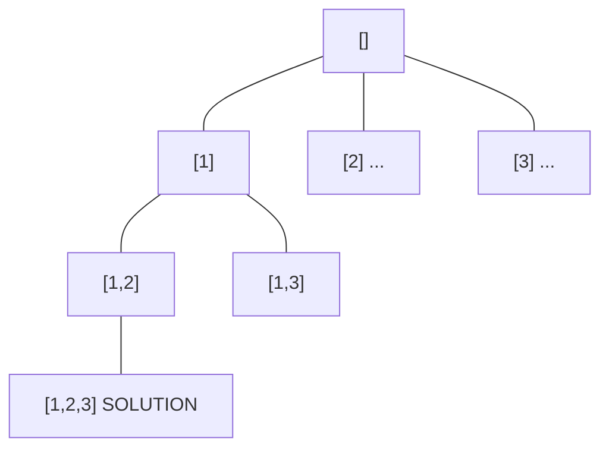
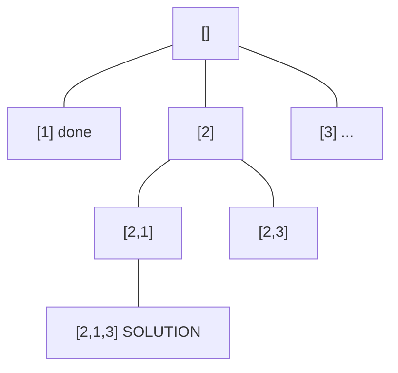
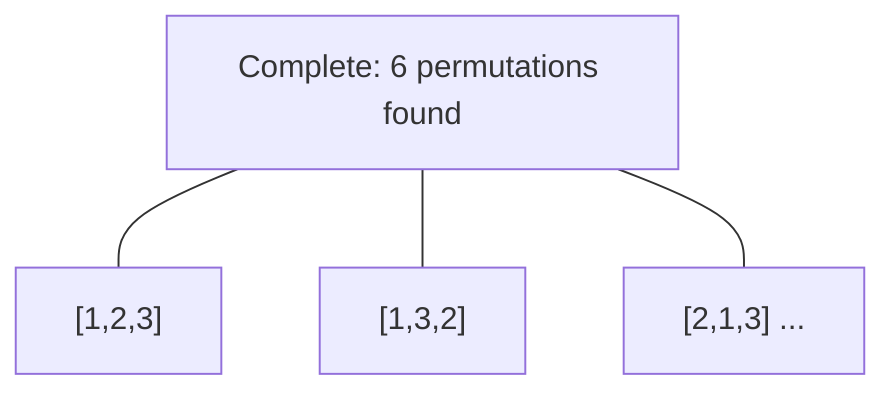

# Problem 93: Restore IP Addresses

**Difficulty:** Medium  
**Tags:** String, Backtracking  
**Pattern:** Backtracking  
**Link:** [leetcode.com/problems/restore-ip-addresses](https://leetcode.com/problems/restore-ip-addresses/)

## Description

A **valid IP address** consists of exactly four integers separated by single dots. Each integer is between `0` and `255` (**inclusive**) and cannot have leading zeros.

	- For example, `"0.1.2.201"` and `"192.168.1.1"` are **valid** IP addresses, but `"0.011.255.245"`, `"192.168.1.312"` and `"192.168@1.1"` are **invalid** IP addresses.

Given a string `s` containing only digits, return *all possible valid IP addresses that can be formed by inserting dots into *`s`. You are **not** allowed to reorder or remove any digits in `s`. You may return the valid IP addresses in **any** order.

 

Example 1:

```

**Input:** s = "25525511135"
**Output:** ["255.255.11.135","255.255.111.35"]

```

Example 2:

```

**Input:** s = "0000"
**Output:** ["0.0.0.0"]

```

Example 3:

```

**Input:** s = "101023"
**Output:** ["1.0.10.23","1.0.102.3","10.1.0.23","10.10.2.3","101.0.2.3"]

```

 

**Constraints:**

	- `1 <= s.length <= 20`
	- `s` consists of digits only.

## Approach: Backtracking

Explore all possible solutions by building candidates incrementally. At each step, make a choice and recurse. If the choice leads to a dead end, undo the choice (backtrack) and try the next option.

## Pseudocode

```
1. Define backtrack(path, choices):
   a. If path is a complete solution: add to results
   b. For each choice in choices:
      - If choice is valid:
        * Add choice to path
        * backtrack(path, remaining_choices)
        * Remove choice from path (backtrack)
2. Call backtrack([], all_choices)
```

## Algorithm Flow



## Visual State Transitions

**Backtracking Decision Tree:**

**Frame 1: Root - start with empty path**


**Frame 2: Explore branch [1]**


**Frame 3: Backtrack, explore [2]**


**Frame 4: All solutions found**



## Complexity Analysis

- **Time:** O(k^n) or O(n!)
- **Space:** O(n)

## Solution (Python3)

```python
class Solution:
    def restoreIpAddresses(self, s: str) -> List[str]:
        # Backtracking - O(2^n) or O(n!) time
        result = []
        
        def backtrack(path, start):
            result.append(path[:])
            for i in range(start, len(s)):
                path.append(s[i])
                backtrack(path, i + 1)
                path.pop()
        
        backtrack([], 0)
        return result
```

## Solution (C++)

```cpp
#include <functional>
#include <string>
#include <vector>
using namespace std;

class Solution {
public:
    vector<string> restoreIpAddresses(string& s) {
        // Backtracking - O(2^n) or O(n!) time
        vector<vector<int>> result;
        vector<int> path;
        function<void(int)> backtrack = [&](int start) {
            result.push_back(path);
            for (int i = start; i < (int)s.size(); i++) {
                path.push_back(s[i]);
                backtrack(i + 1);
                path.pop_back();
            }
        };
        backtrack(0);
        return result;
    }
};
```
