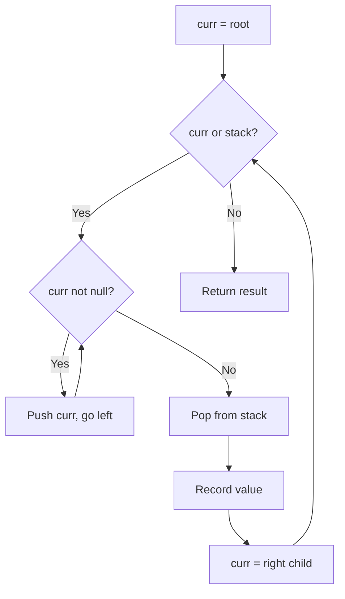
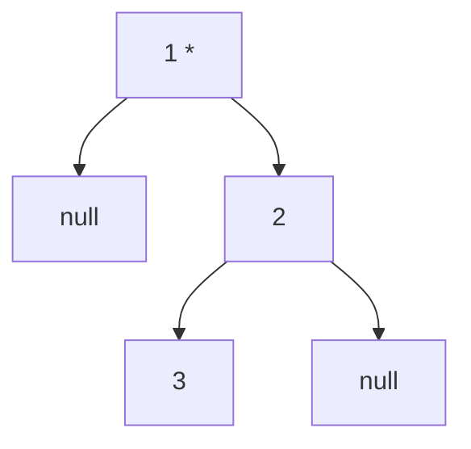
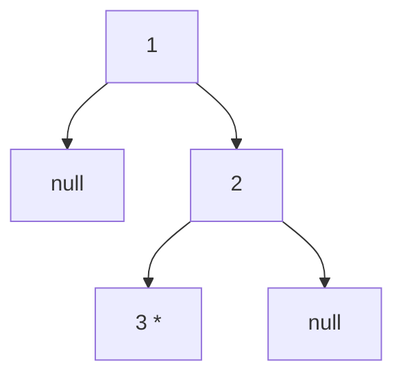
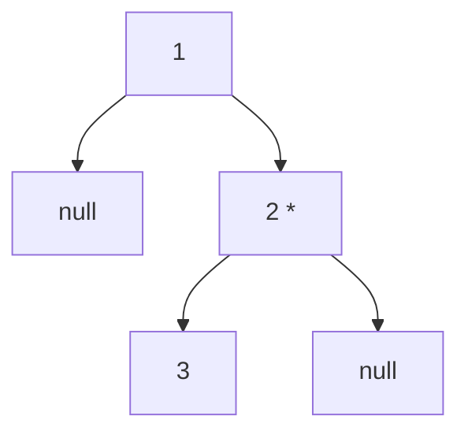

# Problem 94: Binary Tree Inorder Traversal

**Difficulty:** Easy  
**Tags:** Stack, Tree, Depth-First Search, Binary Tree  
**Pattern:** Tree Traversal / Stack  
**Link:** [leetcode.com/problems/binary-tree-inorder-traversal](https://leetcode.com/problems/binary-tree-inorder-traversal/)

## Description

Given the `root` of a binary tree, return *the inorder traversal of its nodes' values*.

 

Example 1:

**Input:** root = [1,null,2,3]

**Output:** [1,3,2]

**Explanation:**

Example 2:

**Input:** root = [1,2,3,4,5,null,8,null,null,6,7,9]

**Output:** [4,2,6,5,7,1,3,9,8]

**Explanation:**

Example 3:

**Input:** root = []

**Output:** []

Example 4:

**Input:** root = [1]

**Output:** [1]

 

**Constraints:**

	- The number of nodes in the tree is in the range `[0, 100]`.
	- `-100 <= Node.val <= 100`

 

**Follow up:** Recursive solution is trivial, could you do it iteratively?

## Approach: Tree Traversal / Stack

Iterative inorder: go left as far as possible, pop and process, then go right.

## Pseudocode

```
1. Push all left nodes onto stack
2. Pop, record value
3. Move to right child, repeat
```

## Algorithm Flow



## Visual State Transitions

**Inorder Traversal of tree [1,null,2,3]:**

**Step 1:** Start at root 1, no left child



Stack: [1], Visit: 1

**Step 2:** Move to right child 2, go left to 3



Stack: [2,3], Visit: 3

**Step 3:** Pop 2, no right child



Result: [1, 3, 2]

## Complexity Analysis

- **Time:** O(n)
- **Space:** O(n)

## Solution (Python3)

```python
class Solution:
    def inorderTraversal(self, root) -> list[int]:
        result = []
        stack = []
        curr = root
        while curr or stack:
            while curr:
                stack.append(curr)
                curr = curr.left
            curr = stack.pop()
            result.append(curr.val)
            curr = curr.right
        return result
```

## Solution (C++)

```cpp
#include <algorithm>
#include <functional>
#include <string>
#include <vector>
using namespace std;

class Solution {
public:
    vector<int> inorderTraversal(TreeNode* root) {
        // DFS on binary tree - O(n) time, O(h) space
        function<int(TreeNode*)> dfs = [&](TreeNode* node) -> int {
            if (!node) return 0;
            int left = dfs(node->left);
            int right = dfs(node->right);
            return 1 + max(left, right);
        };
        return dfs(root);
    }
};
```
