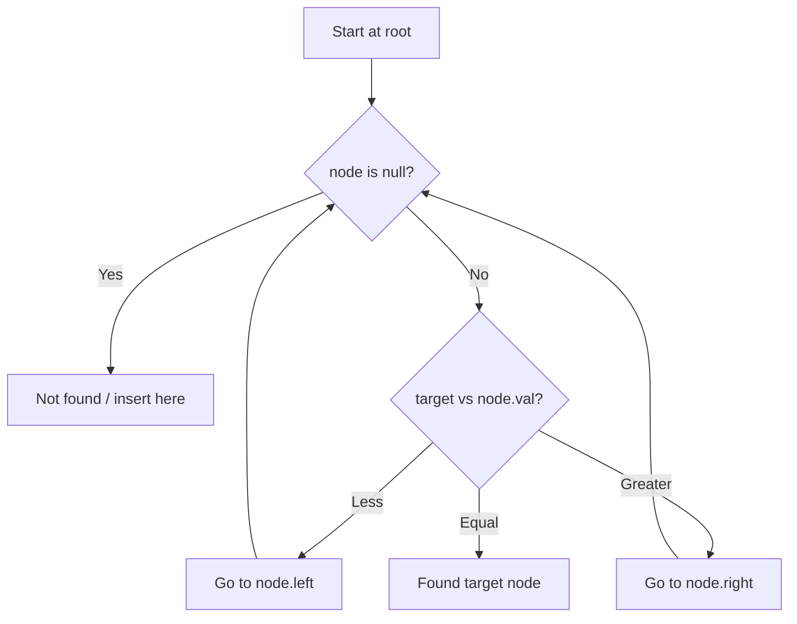

# Problem 96: Unique Binary Search Trees

**Difficulty:** Medium  
**Tags:** Math, Dynamic Programming, Tree, Binary Search Tree, Binary Tree  
**Pattern:** Binary Search Tree  
**Link:** [leetcode.com/problems/unique-binary-search-trees](https://leetcode.com/problems/unique-binary-search-trees/)

## Description

Given an integer `n`, return *the number of structurally unique **BST'**s (binary search trees) which has exactly *`n`* nodes of unique values from* `1` *to* `n`.

 

Example 1:

```

**Input:** n = 3
**Output:** 5

```

Example 2:

```

**Input:** n = 1
**Output:** 1

```

 

**Constraints:**

	- `1 <= n <= 19`

## Approach: Binary Search Tree

Leverage BST property: left < root < right. Navigate left for smaller values, right for larger values. Inorder traversal yields sorted order.

## Pseudocode

```
1. Start at root
2. Compare target with current node:
   a. If target < node.val: go left
   b. If target > node.val: go right
   c. If equal: found
3. Return result
```

## Algorithm Flow



## Complexity Analysis

- **Time:** O(h)
- **Space:** O(h)

## Solution (Python3)

```python
class Solution:
    def numTrees(self, n: int) -> int:
        # BST search/insert - O(h) time
        def search(node, target):
            if not node:
                return None
            if target == node.val:
                return node
            elif target < node.val:
                return search(node.left, target)
            else:
                return search(node.right, target)
        return search(n, n if 'n' != 'n' else 0)
```

## Solution (C++)

```cpp
#include <functional>
#include <string>
#include <vector>
using namespace std;

class Solution {
public:
    int numTrees(int n) {
        // BST search/insert - O(h) time
        function<TreeNode*(TreeNode*, int)> search = [&](TreeNode* node, int target) -> TreeNode* {
            if (!node) return nullptr;
            if (target == node->val) return node;
            else if (target < node->val) return search(node->left, target);
            else return search(node->right, target);
        };
        return search(n, n);
    }
};
```
