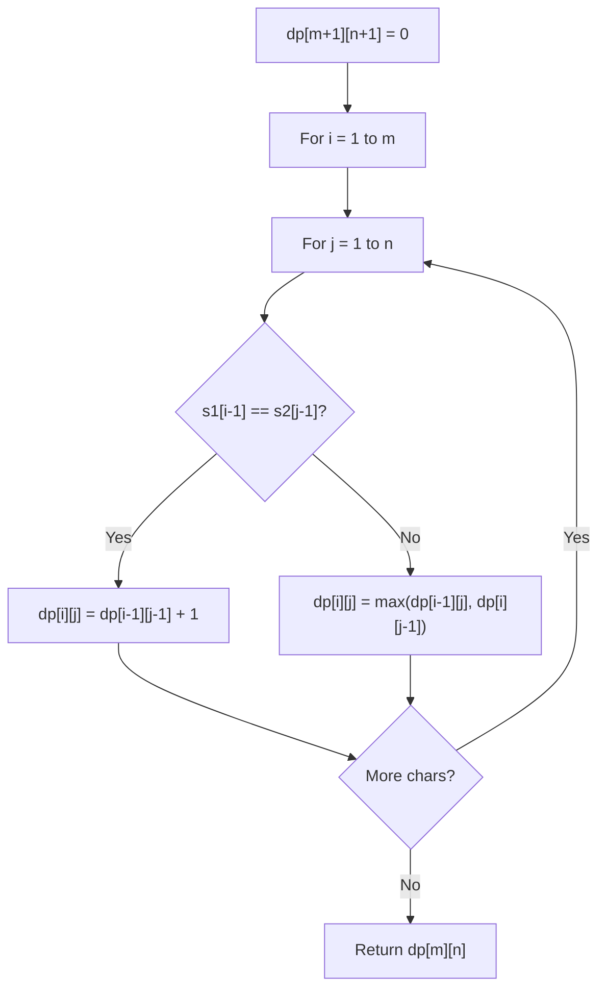

# Problem 97: Interleaving String

**Difficulty:** Medium  
**Tags:** String, Dynamic Programming  
**Pattern:** Dynamic Programming (String)  
**Link:** [leetcode.com/problems/interleaving-string](https://leetcode.com/problems/interleaving-string/)

## Description

Given strings `s1`, `s2`, and `s3`, find whether `s3` is formed by an **interleaving** of `s1` and `s2`.

An **interleaving** of two strings `s` and `t` is a configuration where `s` and `t` are divided into `n` and `m` substrings respectively, such that:

	- `s = s1 + s2 + ... + sn`
	- `t = t1 + t2 + ... + tm`
	- `|n - m| <= 1`
	- The **interleaving** is `s1 + t1 + s2 + t2 + s3 + t3 + ...` or `t1 + s1 + t2 + s2 + t3 + s3 + ...`

**Note:** `a + b` is the concatenation of strings `a` and `b`.

 

Example 1:

```

**Input:** s1 = "aabcc", s2 = "dbbca", s3 = "aadbbcbcac"
**Output:** true
**Explanation:** One way to obtain s3 is:
Split s1 into s1 = "aa" + "bc" + "c", and s2 into s2 = "dbbc" + "a".
Interleaving the two splits, we get "aa" + "dbbc" + "bc" + "a" + "c" = "aadbbcbcac".
Since s3 can be obtained by interleaving s1 and s2, we return true.

```

Example 2:

```

**Input:** s1 = "aabcc", s2 = "dbbca", s3 = "aadbbbaccc"
**Output:** false
**Explanation:** Notice how it is impossible to interleave s2 with any other string to obtain s3.

```

Example 3:

```

**Input:** s1 = "", s2 = "", s3 = ""
**Output:** true

```

 

**Constraints:**

	- `0 <= s1.length, s2.length <= 100`
	- `0 <= s3.length <= 200`
	- `s1`, `s2`, and `s3` consist of lowercase English letters.

 

**Follow up:** Could you solve it using only `O(s2.length)` additional memory space?

## Approach: Dynamic Programming (String)

Compare or match two strings using a 2D DP table. dp[i][j] represents the answer for substrings s1[0..i-1] and s2[0..j-1]. Common patterns: LCS, edit distance, regex matching.

## Pseudocode

```
1. Create dp[m+1][n+1]
2. Initialize base cases
3. For i from 1 to m:
   For j from 1 to n:
     If s1[i-1] == s2[j-1]: dp[i][j] = dp[i-1][j-1] + 1
     Else: dp[i][j] = best of (dp[i-1][j], dp[i][j-1], dp[i-1][j-1])
4. Return dp[m][n]
```

## Algorithm Flow



## Complexity Analysis

- **Time:** O(m * n)
- **Space:** O(m * n)

## Solution (Python3)

```python
class Solution:
    def isInterleave(self, s1: str, s2: str, s3: str) -> bool:
        # String DP - O(m*n) time and space
        m, n = len(s1), len(s2)
        dp = [[0] * (n + 1) for _ in range(m + 1)]
        for i in range(1, m + 1):
            for j in range(1, n + 1):
                if s1[i-1] == s2[j-1]:
                    dp[i][j] = dp[i-1][j-1] + 1
                else:
                    dp[i][j] = max(dp[i-1][j], dp[i][j-1])
        return dp[m][n]
```

## Solution (C++)

```cpp
#include <algorithm>
#include <string>
#include <vector>
using namespace std;

class Solution {
public:
    bool isInterleave(string& s1, string& s2, string& s3) {
        // String DP - O(m*n) time and space
        int m = s1.size(), n = s2.size();
        vector<vector<int>> dp(m + 1, vector<int>(n + 1, 0));
        for (int i = 1; i <= m; i++) {
            for (int j = 1; j <= n; j++) {
                if (s1[i-1] == s2[j-1])
                    dp[i][j] = dp[i-1][j-1] + 1;
                else
                    dp[i][j] = max(dp[i-1][j], dp[i][j-1]);
            }
        }
        return dp[m][n];
    }
};
```
