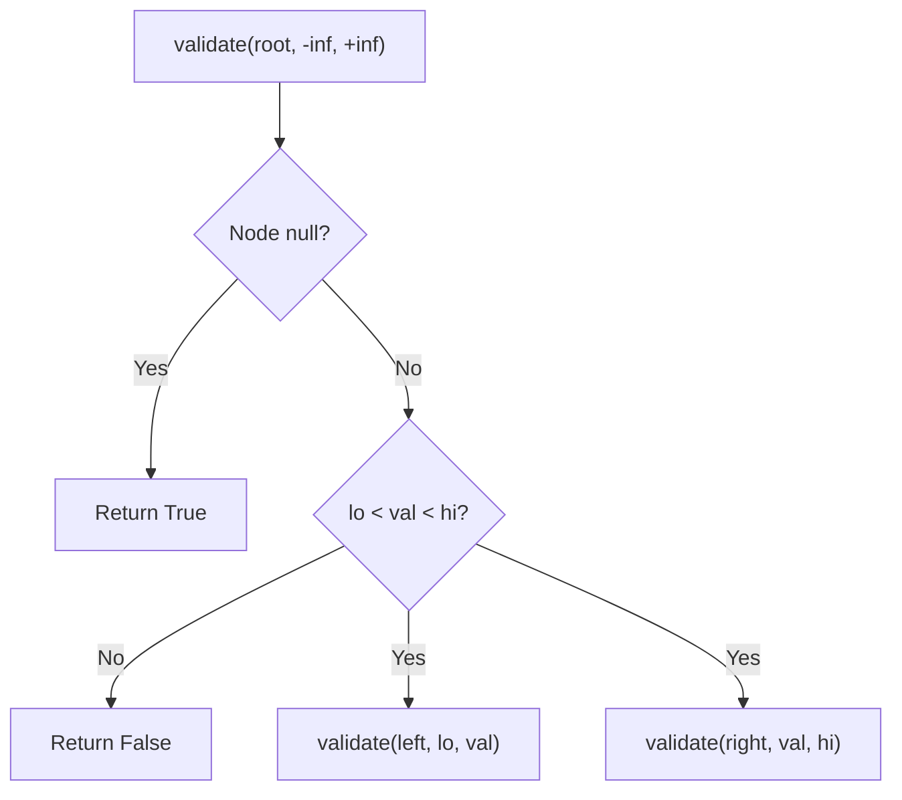

# Problem 98: Validate Binary Search Tree

**Difficulty:** Medium  
**Tags:** Tree, Depth-First Search, Binary Search Tree, Binary Tree  
**Pattern:** Tree / DFS  
**Link:** [leetcode.com/problems/validate-binary-search-tree](https://leetcode.com/problems/validate-binary-search-tree/)

## Description

Given the `root` of a binary tree, *determine if it is a valid binary search tree (BST)*.

A **valid BST** is defined as follows:

	- The left subtree of a node contains only nodes with keys **strictly less than** the node's key.
	- The right subtree of a node contains only nodes with keys **strictly greater than** the node's key.
	- Both the left and right subtrees must also be binary search trees.

 

Example 1:

```

**Input:** root = [2,1,3]
**Output:** true

```

Example 2:

```

**Input:** root = [5,1,4,null,null,3,6]
**Output:** false
**Explanation:** The root node's value is 5 but its right child's value is 4.

```

 

**Constraints:**

	- The number of nodes in the tree is in the range `[1, 10^4]`.
	- `-2^31 <= Node.val <= 2^31 - 1`

## Approach: Tree / DFS

DFS with bounds: each node must be within (lo, hi). Left subtree narrows hi, right narrows lo.

## Pseudocode

```
1. validate(node, lo, hi):
   If null: True
   If not lo < val < hi: False
   Recurse left with (lo, val), right with (val, hi)
```

## Algorithm Flow



## Complexity Analysis

- **Time:** O(n)
- **Space:** O(h)

## Solution (Python3)

```python
class Solution:
    def isValidBST(self, root) -> bool:
        def validate(node, lo, hi):
            if not node:
                return True
            if node.val <= lo or node.val >= hi:
                return False
            return validate(node.left, lo, node.val) and validate(node.right, node.val, hi)
        return validate(root, float('-inf'), float('inf'))
```

## Solution (C++)

```cpp
#include <functional>
#include <string>
#include <vector>
using namespace std;

class Solution {
public:
    bool isValidBST(TreeNode* root) {
        // BST search/insert - O(h) time
        function<TreeNode*(TreeNode*, int)> search = [&](TreeNode* node, int target) -> TreeNode* {
            if (!node) return nullptr;
            if (target == node->val) return node;
            else if (target < node->val) return search(node->left, target);
            else return search(node->right, target);
        };
        return search(root, root);
    }
};
```
