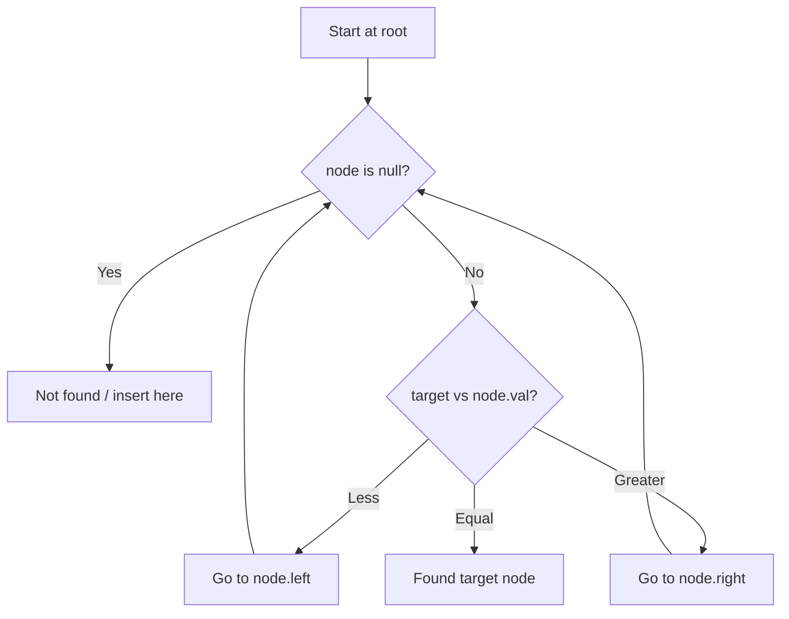

# Problem 99: Recover Binary Search Tree

**Difficulty:** Medium  
**Tags:** Tree, Depth-First Search, Binary Search Tree, Binary Tree  
**Pattern:** Binary Search Tree  
**Link:** [leetcode.com/problems/recover-binary-search-tree](https://leetcode.com/problems/recover-binary-search-tree/)

## Description

You are given the `root` of a binary search tree (BST), where the values of **exactly** two nodes of the tree were swapped by mistake. *Recover the tree without changing its structure*.

 

Example 1:

```

**Input:** root = [1,3,null,null,2]
**Output:** [3,1,null,null,2]
**Explanation:** 3 cannot be a left child of 1 because 3 > 1. Swapping 1 and 3 makes the BST valid.

```

Example 2:

```

**Input:** root = [3,1,4,null,null,2]
**Output:** [2,1,4,null,null,3]
**Explanation:** 2 cannot be in the right subtree of 3 because 2 < 3. Swapping 2 and 3 makes the BST valid.

```

 

**Constraints:**

	- The number of nodes in the tree is in the range `[2, 1000]`.
	- `-2^31 <= Node.val <= 2^31 - 1`

 

**Follow up:** A solution using `O(n)` space is pretty straight-forward. Could you devise a constant `O(1)` space solution?

## Approach: Binary Search Tree

Leverage BST property: left < root < right. Navigate left for smaller values, right for larger values. Inorder traversal yields sorted order.

## Pseudocode

```
1. Start at root
2. Compare target with current node:
   a. If target < node.val: go left
   b. If target > node.val: go right
   c. If equal: found
3. Return result
```

## Algorithm Flow



## Complexity Analysis

- **Time:** O(h)
- **Space:** O(h)

## Solution (Python3)

```python
class Solution:
    def recoverTree(self, root: Optional[TreeNode]) -> None:
        # BST search/insert - O(h) time
        def search(node, target):
            if not node:
                return None
            if target == node.val:
                return node
            elif target < node.val:
                return search(node.left, target)
            else:
                return search(node.right, target)
        return search(root, root if 'root' != 'root' else 0)
```

## Solution (C++)

```cpp
#include <functional>
#include <string>
#include <vector>
using namespace std;

class Solution {
public:
    void recoverTree(TreeNode* root) {
        // BST search/insert - O(h) time
        function<TreeNode*(TreeNode*, int)> search = [&](TreeNode* node, int target) -> TreeNode* {
            if (!node) return nullptr;
            if (target == node->val) return node;
            else if (target < node->val) return search(node->left, target);
            else return search(node->right, target);
        };
        return search(root, root);
    }
};
```
