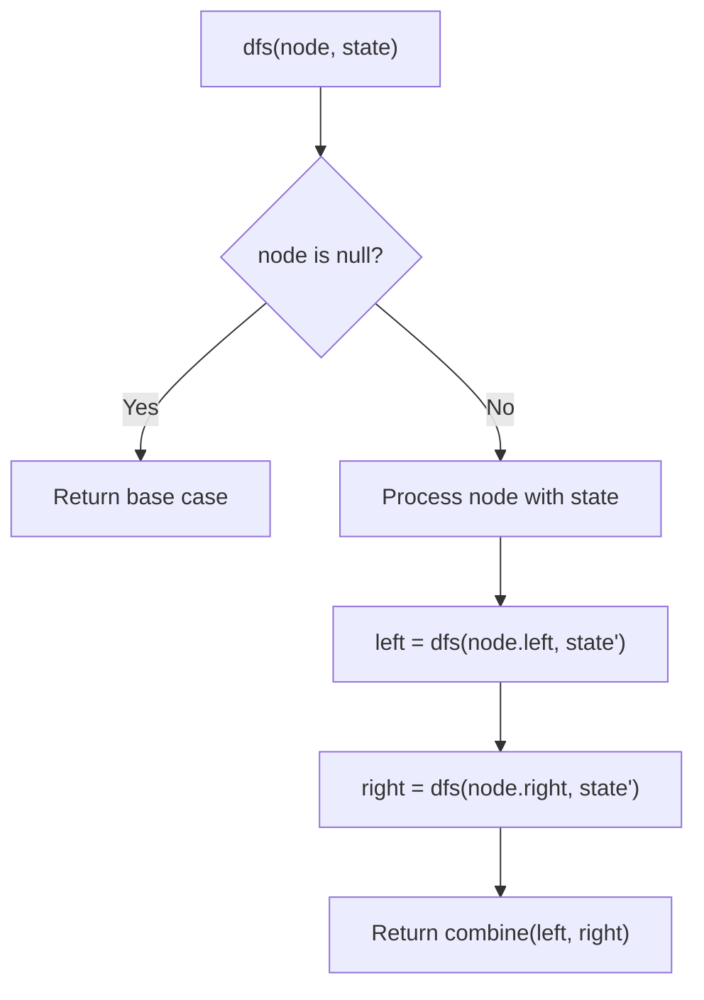
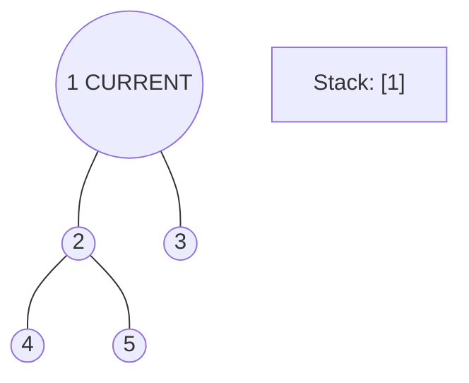
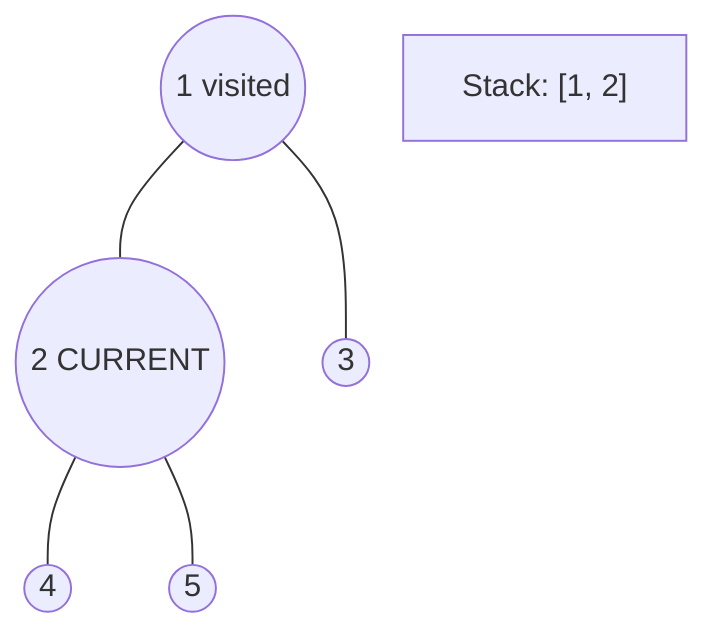
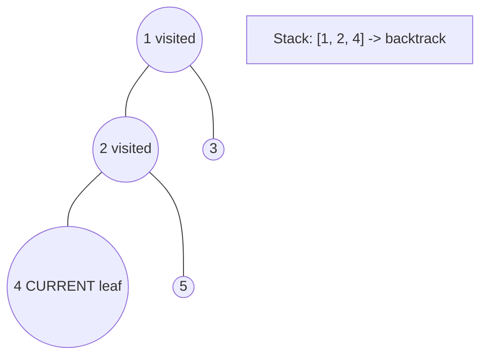
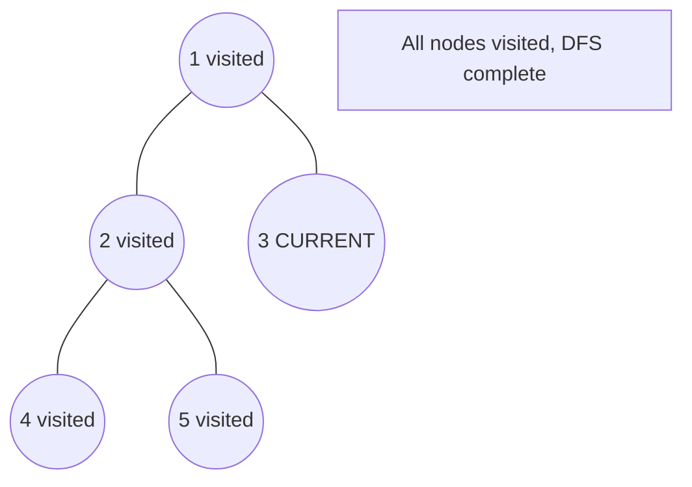

# Problem 100: Same Tree

**Difficulty:** Easy  
**Tags:** Tree, Depth-First Search, Breadth-First Search, Binary Tree  
**Pattern:** Tree / DFS  
**Link:** [leetcode.com/problems/same-tree](https://leetcode.com/problems/same-tree/)

## Description

Given the roots of two binary trees `p` and `q`, write a function to check if they are the same or not.

Two binary trees are considered the same if they are structurally identical, and the nodes have the same value.

 

Example 1:

```

**Input:** p = [1,2,3], q = [1,2,3]
**Output:** true

```

Example 2:

```

**Input:** p = [1,2], q = [1,null,2]
**Output:** false

```

Example 3:

```

**Input:** p = [1,2,1], q = [1,1,2]
**Output:** false

```

 

**Constraints:**

	- The number of nodes in both trees is in the range `[0, 100]`.
	- `-10^4 <= Node.val <= 10^4`

## Approach: Tree / DFS

Recursive comparison: both null = same, one null = different, else compare values and recurse.

## Pseudocode

```
1. Both null: True
2. One null: False
3. Values equal AND left same AND right same
```

## Algorithm Flow



## Visual State Transitions

**DFS Tree Traversal Step-by-Step:**

**Frame 1: Start at root**


**Frame 2: Go left - visit node 2**


**Frame 3: Go left - visit node 4 (leaf)**


**Frame 4: Backtrack, visit node 5, then node 3**



## Complexity Analysis

- **Time:** O(n)
- **Space:** O(h)

## Solution (Python3)

```python
class Solution:
    def isSameTree(self, p, q) -> bool:
        if not p and not q:
            return True
        if not p or not q:
            return False
        return p.val == q.val and self.isSameTree(p.left, q.left) and self.isSameTree(p.right, q.right)
```

## Solution (C++)

```cpp
#include <algorithm>
#include <functional>
#include <string>
#include <vector>
using namespace std;

class Solution {
public:
    bool isSameTree(TreeNode* p, TreeNode* q) {
        // DFS on binary tree - O(n) time, O(h) space
        function<int(TreeNode*)> dfs = [&](TreeNode* node) -> int {
            if (!node) return 0;
            int left = dfs(node->left);
            int right = dfs(node->right);
            return 1 + max(left, right);
        };
        return dfs(p);
    }
};
```
