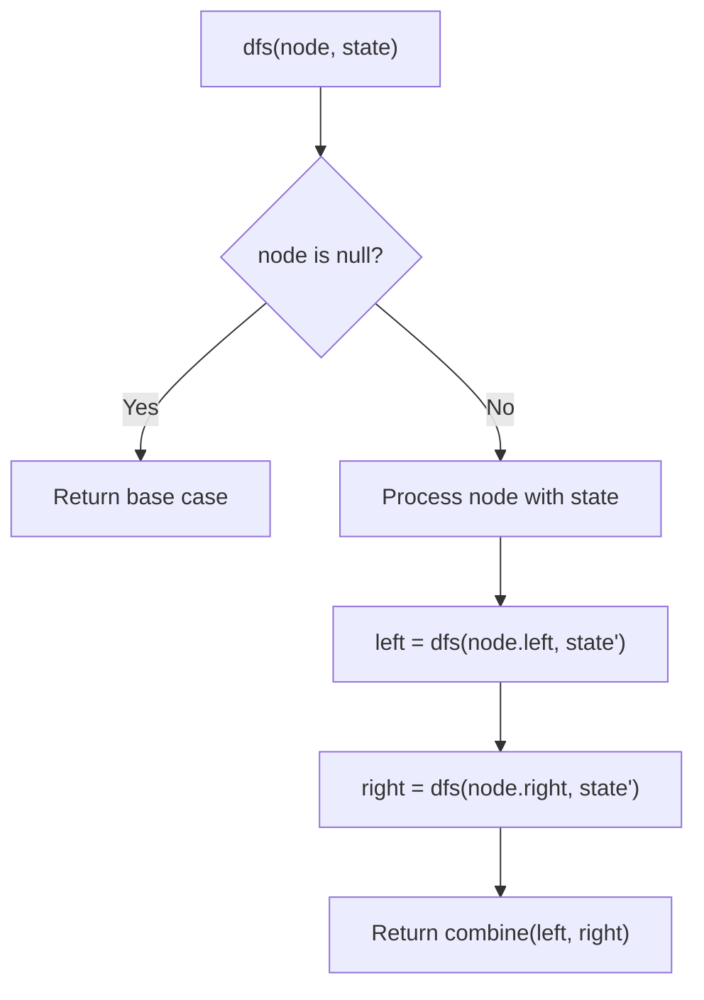
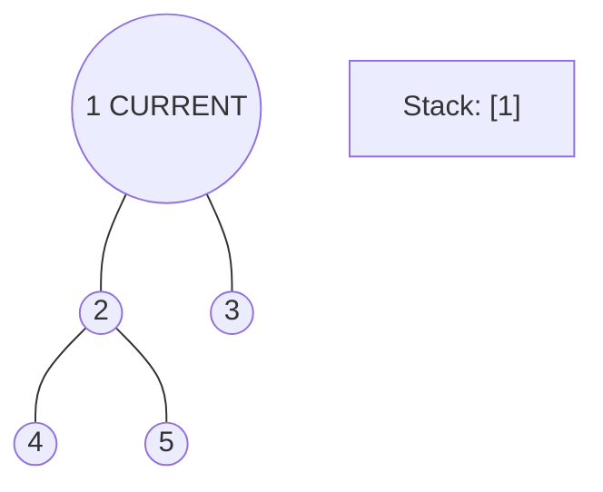
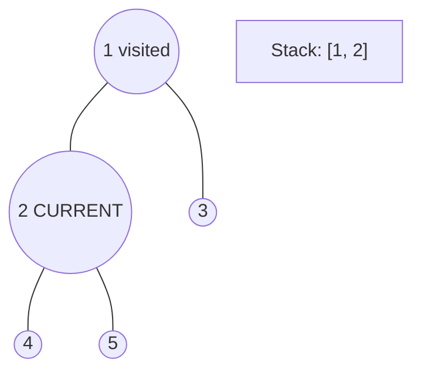
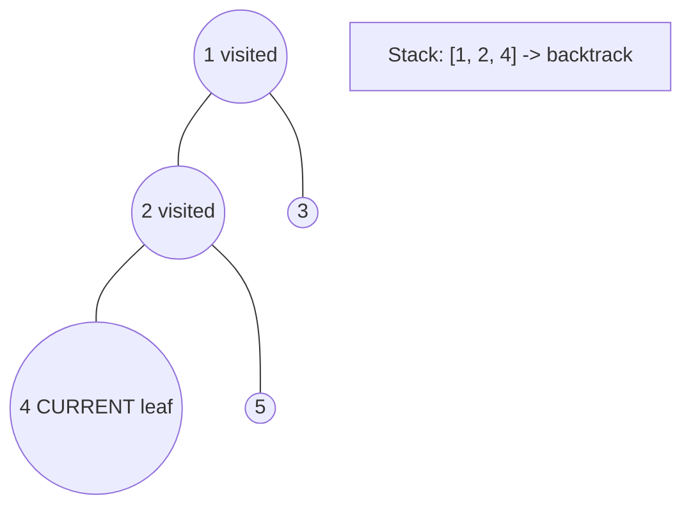
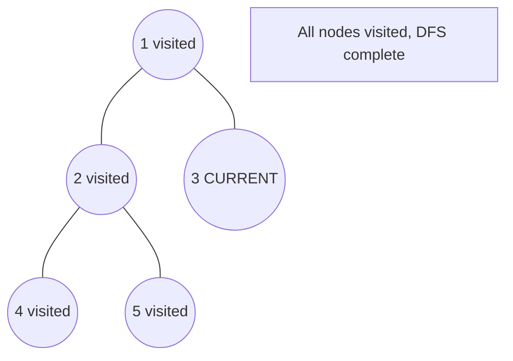

# Problem 101: Symmetric Tree

**Difficulty:** Easy  
**Tags:** Tree, Depth-First Search, Breadth-First Search, Binary Tree  
**Pattern:** Tree / DFS  
**Link:** [leetcode.com/problems/symmetric-tree](https://leetcode.com/problems/symmetric-tree/)

## Description

Given the `root` of a binary tree, *check whether it is a mirror of itself* (i.e., symmetric around its center).

 

Example 1:

```

**Input:** root = [1,2,2,3,4,4,3]
**Output:** true

```

Example 2:

```

**Input:** root = [1,2,2,null,3,null,3]
**Output:** false

```

 

**Constraints:**

	- The number of nodes in the tree is in the range `[1, 1000]`.
	- `-100 <= Node.val <= 100`

 

**Follow up:** Could you solve it both recursively and iteratively?

## Approach: Tree / DFS

Check if left subtree mirrors right subtree: compare l.left with r.right and l.right with r.left.

## Pseudocode

```
1. mirror(l, r):
   Both null: True; one null: False
   l.val == r.val AND mirror(l.left, r.right) AND mirror(l.right, r.left)
```

## Algorithm Flow



## Visual State Transitions

**DFS Tree Traversal Step-by-Step:**

**Frame 1: Start at root**


**Frame 2: Go left - visit node 2**


**Frame 3: Go left - visit node 4 (leaf)**


**Frame 4: Backtrack, visit node 5, then node 3**



## Complexity Analysis

- **Time:** O(n)
- **Space:** O(h)

## Solution (Python3)

```python
class Solution:
    def isSymmetric(self, root) -> bool:
        def mirror(l, r):
            if not l and not r:
                return True
            if not l or not r:
                return False
            return l.val == r.val and mirror(l.left, r.right) and mirror(l.right, r.left)
        return mirror(root.left, root.right) if root else True
```

## Solution (C++)

```cpp
#include <algorithm>
#include <functional>
#include <string>
#include <vector>
using namespace std;

class Solution {
public:
    bool isSymmetric(TreeNode* root) {
        // DFS on binary tree - O(n) time, O(h) space
        function<int(TreeNode*)> dfs = [&](TreeNode* node) -> int {
            if (!node) return 0;
            int left = dfs(node->left);
            int right = dfs(node->right);
            return 1 + max(left, right);
        };
        return dfs(root);
    }
};
```
