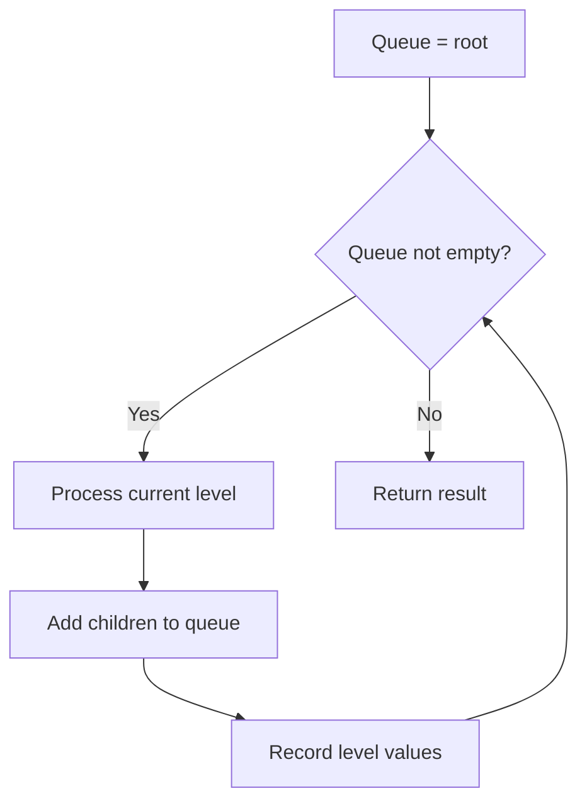
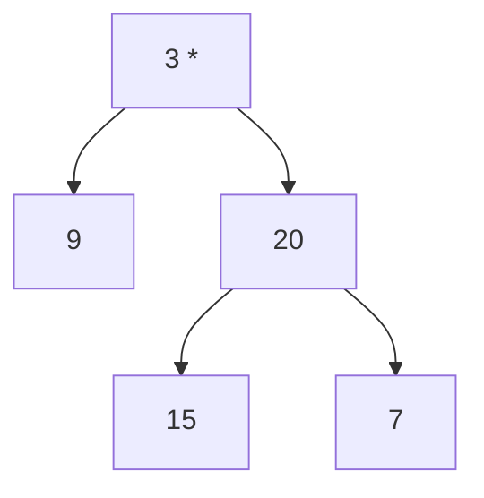
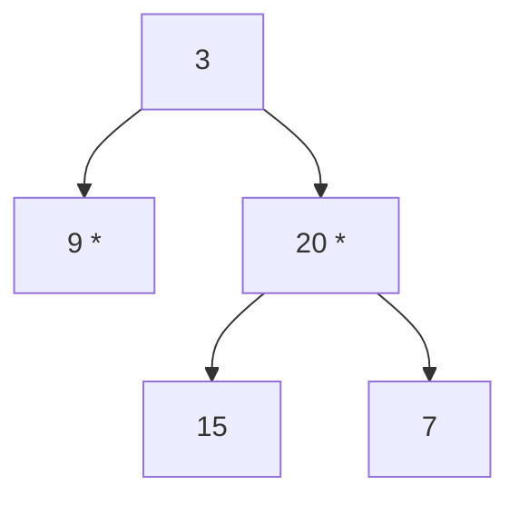
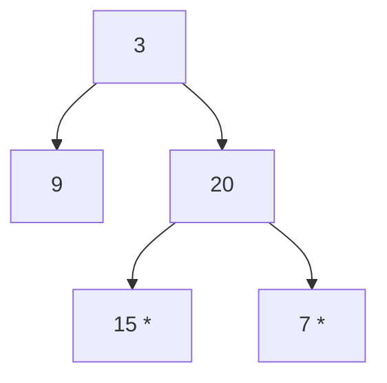

# Problem 102: Binary Tree Level Order Traversal

**Difficulty:** Medium  
**Tags:** Tree, Breadth-First Search, Binary Tree  
**Pattern:** BFS / Tree  
**Link:** [leetcode.com/problems/binary-tree-level-order-traversal](https://leetcode.com/problems/binary-tree-level-order-traversal/)

## Description

Given the `root` of a binary tree, return *the level order traversal of its nodes' values*. (i.e., from left to right, level by level).

 

Example 1:

```

**Input:** root = [3,9,20,null,null,15,7]
**Output:** [[3],[9,20],[15,7]]

```

Example 2:

```

**Input:** root = [1]
**Output:** [[1]]

```

Example 3:

```

**Input:** root = []
**Output:** []

```

 

**Constraints:**

	- The number of nodes in the tree is in the range `[0, 2000]`.
	- `-1000 <= Node.val <= 1000`

## Approach: BFS / Tree

BFS with queue. Process one level at a time by tracking queue size.

## Pseudocode

```
1. Queue = [root]
2. While queue not empty:
   Process all nodes at current level
   Add children to queue
   Record level values
```

## Algorithm Flow



## Visual State Transitions

**Level Order BFS on tree [3,9,20,null,null,15,7]:**

**Step 1:** Level 0 - Process root



Queue: [3] -> Process -> Result: [[3]]

**Step 2:** Level 1 - Process 9 and 20



Queue: [9,20] -> Process -> Result: [[3],[9,20]]

**Step 3:** Level 2 - Process 15 and 7



Queue: [15,7] -> Process -> Result: [[3],[9,20],[15,7]]

## Complexity Analysis

- **Time:** O(n)
- **Space:** O(n)

## Solution (Python3)

```python
from collections import deque

class Solution:
    def levelOrder(self, root):
        if not root:
            return []
        result = []
        queue = deque([root])
        while queue:
            level = []
            for _ in range(len(queue)):
                node = queue.popleft()
                level.append(node.val)
                if node.left:
                    queue.append(node.left)
                if node.right:
                    queue.append(node.right)
            result.append(level)
        return result
```

## Solution (C++)

```cpp
#include <queue>
#include <string>
#include <vector>
using namespace std;

class Solution {
public:
    vector<vector<int>> levelOrder(TreeNode* root) {
        // BFS level-order traversal - O(n) time, O(n) space
        vector<vector<int>> result;
        if (!root) return result;
        queue<TreeNode*> q;
        q.push(root);
        while (!q.empty()) {
            int sz = q.size();
            vector<int> level;
            for (int i = 0; i < sz; i++) {
                TreeNode* node = q.front(); q.pop();
                level.push_back(node->val);
                if (node->left) q.push(node->left);
                if (node->right) q.push(node->right);
            }
            result.push_back(level);
        }
        return result;
    }
};
```
