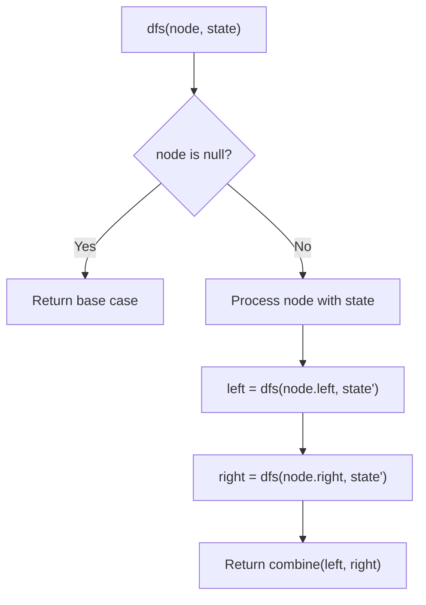
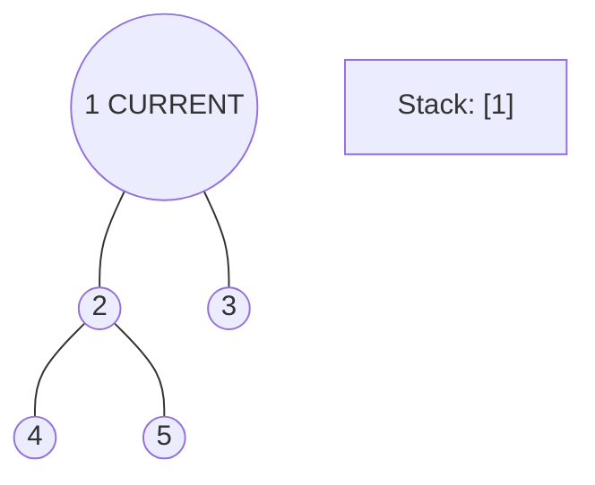
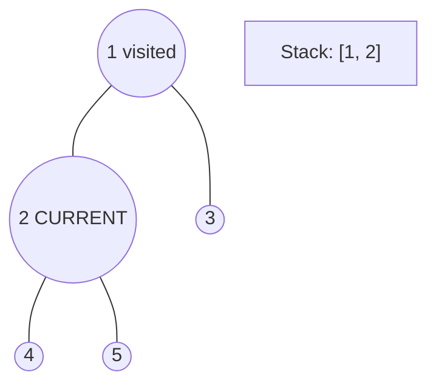
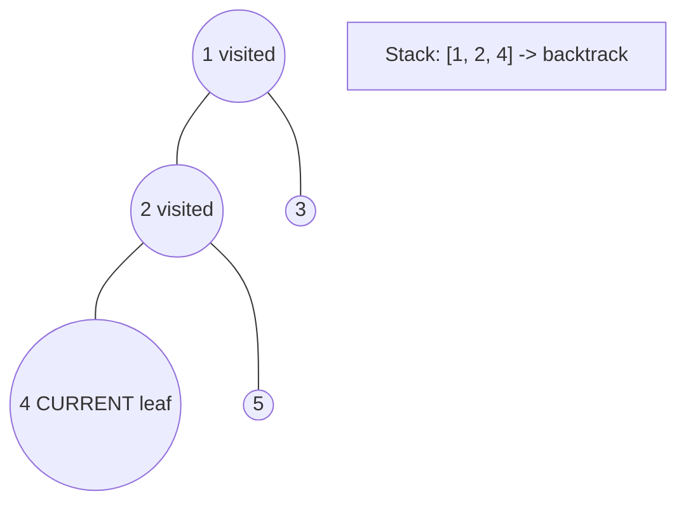
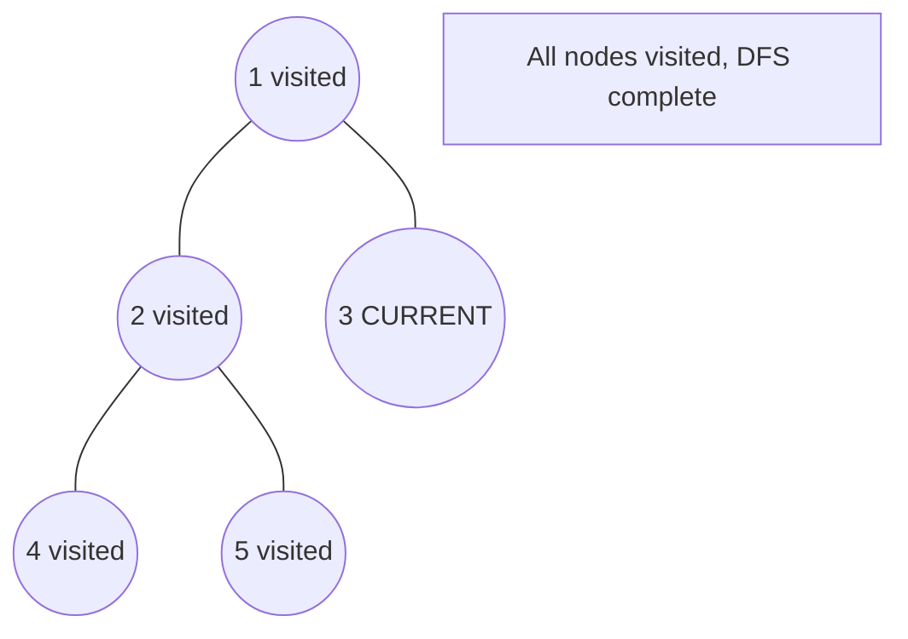

# Problem 104: Maximum Depth of Binary Tree

**Difficulty:** Easy  
**Tags:** Tree, Depth-First Search, Breadth-First Search, Binary Tree  
**Pattern:** Tree / DFS  
**Link:** [leetcode.com/problems/maximum-depth-of-binary-tree](https://leetcode.com/problems/maximum-depth-of-binary-tree/)

## Description

Given the `root` of a binary tree, return *its maximum depth*.

A binary tree's **maximum depth** is the number of nodes along the longest path from the root node down to the farthest leaf node.

 

Example 1:

```

**Input:** root = [3,9,20,null,null,15,7]
**Output:** 3

```

Example 2:

```

**Input:** root = [1,null,2]
**Output:** 2

```

 

**Constraints:**

	- The number of nodes in the tree is in the range `[0, 10^4]`.
	- `-100 <= Node.val <= 100`

## Approach: Tree / DFS

Recursive: depth = 1 + max(left depth, right depth).

## Pseudocode

```
1. If null: return 0
2. Return 1 + max(depth(left), depth(right))
```

## Algorithm Flow



## Visual State Transitions

**DFS Tree Traversal Step-by-Step:**

**Frame 1: Start at root**


**Frame 2: Go left - visit node 2**


**Frame 3: Go left - visit node 4 (leaf)**


**Frame 4: Backtrack, visit node 5, then node 3**



## Complexity Analysis

- **Time:** O(n)
- **Space:** O(h)

## Solution (Python3)

```python
class Solution:
    def maxDepth(self, root) -> int:
        if not root:
            return 0
        return 1 + max(self.maxDepth(root.left), self.maxDepth(root.right))
```

## Solution (C++)

```cpp
#include <algorithm>
#include <functional>
#include <string>
#include <vector>
using namespace std;

class Solution {
public:
    int maxDepth(TreeNode* root) {
        // DFS on binary tree - O(n) time, O(h) space
        function<int(TreeNode*)> dfs = [&](TreeNode* node) -> int {
            if (!node) return 0;
            int left = dfs(node->left);
            int right = dfs(node->right);
            return 1 + max(left, right);
        };
        return dfs(root);
    }
};
```
