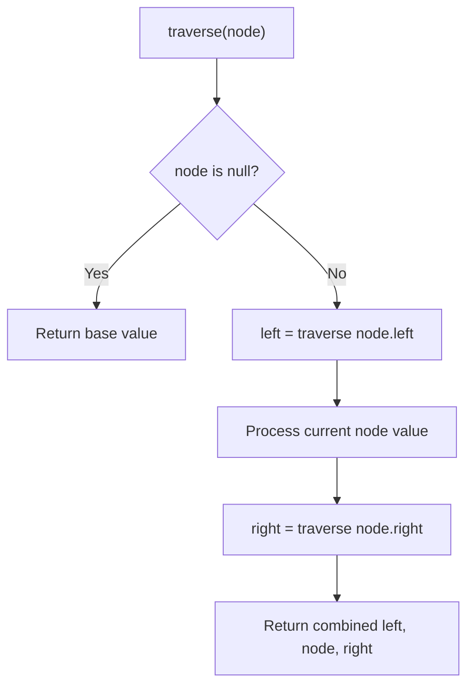

# Problem 106: Construct Binary Tree from Inorder and Postorder Traversal

**Difficulty:** Medium  
**Tags:** Array, Hash Table, Divide and Conquer, Tree, Binary Tree  
**Pattern:** Tree Traversal  
**Link:** [leetcode.com/problems/construct-binary-tree-from-inorder-and-postorder-traversal](https://leetcode.com/problems/construct-binary-tree-from-inorder-and-postorder-traversal/)

## Description

Given two integer arrays `inorder` and `postorder` where `inorder` is the inorder traversal of a binary tree and `postorder` is the postorder traversal of the same tree, construct and return *the binary tree*.

 

Example 1:

```

**Input:** inorder = [9,3,15,20,7], postorder = [9,15,7,20,3]
**Output:** [3,9,20,null,null,15,7]

```

Example 2:

```

**Input:** inorder = [-1], postorder = [-1]
**Output:** [-1]

```

 

**Constraints:**

	- `1 <= inorder.length <= 3000`
	- `postorder.length == inorder.length`
	- `-3000 <= inorder[i], postorder[i] <= 3000`
	- `inorder` and `postorder` consist of **unique** values.
	- Each value of `postorder` also appears in `inorder`.
	- `inorder` is **guaranteed** to be the inorder traversal of the tree.
	- `postorder` is **guaranteed** to be the postorder traversal of the tree.

## Approach: Tree Traversal

Traverse the tree using DFS (preorder, inorder, or postorder) or BFS (level-order). At each node, compute or accumulate a value and recurse on children.

## Pseudocode

```
1. Define recursive function traverse(node):
   a. Base case: if node is null, return default
   b. Recurse on left child
   c. Process current node
   d. Recurse on right child
   e. Return combined result
2. Call traverse(root)
```

## Algorithm Flow



## Complexity Analysis

- **Time:** O(n)
- **Space:** O(h)

## Solution (Python3)

```python
class Solution:
    def buildTree(self, inorder: List[int], postorder: List[int]) -> Optional[TreeNode]:
        # Tree traversal - O(n) time, O(h) space
        result = []
        def traverse(node):
            if not node:
                return
            result.append(node.val)
            traverse(node.left)
            traverse(node.right)
        traverse(inorder)
        return result if isinstance(None, list) else result[0] if result else None
```

## Solution (C++)

```cpp
#include <functional>
#include <string>
#include <vector>
using namespace std;

class Solution {
public:
    TreeNode* buildTree(vector<int>& inorder, vector<int>& postorder) {
        // Tree traversal - O(n) time, O(h) space
        vector<int> result;
        function<void(TreeNode*)> traverse = [&](TreeNode* node) {
            if (!node) return;
            result.push_back(node->val);
            traverse(node->left);
            traverse(node->right);
        };
        traverse(inorder);
        return result;
    }
};
```
