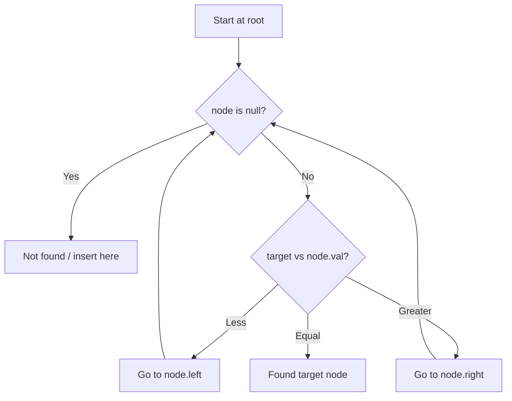

# Problem 108: Convert Sorted Array to Binary Search Tree

**Difficulty:** Easy  
**Tags:** Array, Divide and Conquer, Tree, Binary Search Tree, Binary Tree  
**Pattern:** Binary Search Tree  
**Link:** [leetcode.com/problems/convert-sorted-array-to-binary-search-tree](https://leetcode.com/problems/convert-sorted-array-to-binary-search-tree/)

## Description

Given an integer array `nums` where the elements are sorted in **ascending order**, convert *it to a ****height-balanced*** *binary search tree*.

 

Example 1:

```

**Input:** nums = [-10,-3,0,5,9]
**Output:** [0,-3,9,-10,null,5]
**Explanation:** [0,-10,5,null,-3,null,9] is also accepted:

```

Example 2:

```

**Input:** nums = [1,3]
**Output:** [3,1]
**Explanation:** [1,null,3] and [3,1] are both height-balanced BSTs.

```

 

**Constraints:**

	- `1 <= nums.length <= 10^4`
	- `-10^4 <= nums[i] <= 10^4`
	- `nums` is sorted in a **strictly increasing** order.

## Approach: Binary Search Tree

Leverage BST property: left < root < right. Navigate left for smaller values, right for larger values. Inorder traversal yields sorted order.

## Pseudocode

```
1. Start at root
2. Compare target with current node:
   a. If target < node.val: go left
   b. If target > node.val: go right
   c. If equal: found
3. Return result
```

## Algorithm Flow



## Complexity Analysis

- **Time:** O(h)
- **Space:** O(h)

## Solution (Python3)

```python
class Solution:
    def sortedArrayToBST(self, nums: List[int]) -> Optional[TreeNode]:
        # BST search/insert - O(h) time
        def search(node, target):
            if not node:
                return None
            if target == node.val:
                return node
            elif target < node.val:
                return search(node.left, target)
            else:
                return search(node.right, target)
        return search(nums, nums if 'nums' != 'nums' else 0)
```

## Solution (C++)

```cpp
#include <functional>
#include <string>
#include <vector>
using namespace std;

class Solution {
public:
    TreeNode* sortedArrayToBST(vector<int>& nums) {
        // BST search/insert - O(h) time
        function<TreeNode*(TreeNode*, int)> search = [&](TreeNode* node, int target) -> TreeNode* {
            if (!node) return nullptr;
            if (target == node->val) return node;
            else if (target < node->val) return search(node->left, target);
            else return search(node->right, target);
        };
        return search(nums, nums);
    }
};
```
