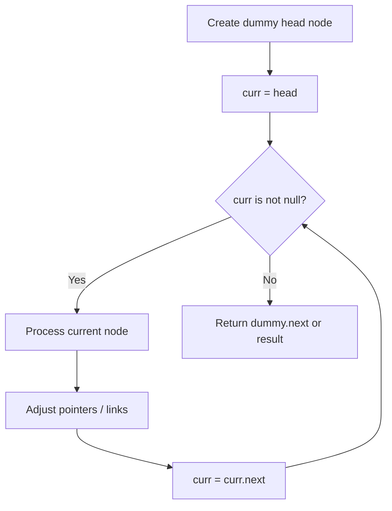
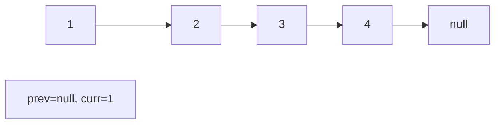
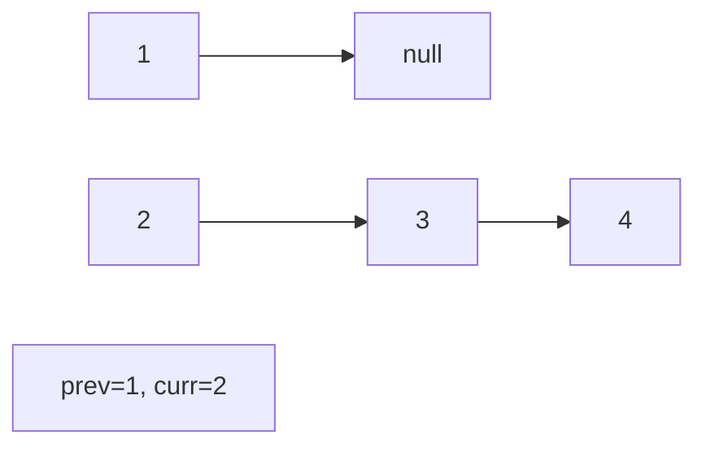
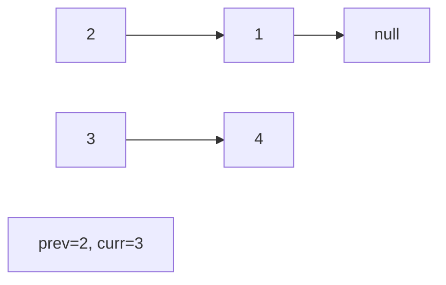
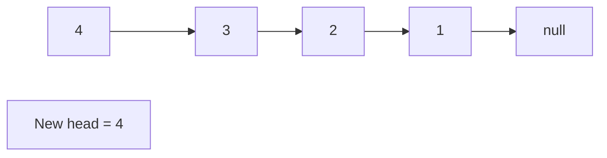

# Problem 114: Flatten Binary Tree to Linked List

**Difficulty:** Medium  
**Tags:** Linked List, Stack, Tree, Depth-First Search, Binary Tree  
**Pattern:** Linked List  
**Link:** [leetcode.com/problems/flatten-binary-tree-to-linked-list](https://leetcode.com/problems/flatten-binary-tree-to-linked-list/)

## Description

Given the `root` of a binary tree, flatten the tree into a "linked list":

	- The "linked list" should use the same `TreeNode` class where the `right` child pointer points to the next node in the list and the `left` child pointer is always `null`.
	- The "linked list" should be in the same order as a **pre-order**** traversal** of the binary tree.

 

Example 1:

```

**Input:** root = [1,2,5,3,4,null,6]
**Output:** [1,null,2,null,3,null,4,null,5,null,6]

```

Example 2:

```

**Input:** root = []
**Output:** []

```

Example 3:

```

**Input:** root = [0]
**Output:** [0]

```

 

**Constraints:**

	- The number of nodes in the tree is in the range `[0, 2000]`.
	- `-100 <= Node.val <= 100`

 

**Follow up:** Can you flatten the tree in-place (with `O(1)` extra space)?

## Approach: Linked List

Traverse or manipulate the linked list using pointer techniques. Common patterns: dummy head node for edge cases, fast/slow pointers for cycle detection or middle finding, in-place reversal, and merge operations.

## Pseudocode

```
1. Create dummy head if needed
2. Initialize pointer(s) at head
3. Traverse / modify list:
   a. Process current node
   b. Adjust next pointers as needed
   c. Move to next node
4. Return dummy.next or result
```

## Algorithm Flow



## Visual State Transitions

**Linked List Operation (Reverse):**

**Frame 1: Initial list**


**Frame 2: Reverse first link**


**Frame 3: Reverse second link**


**Frame 4: Fully reversed**



## Complexity Analysis

- **Time:** O(n)
- **Space:** O(1)

## Solution (Python3)

```python
class Solution:
    def flatten(self, root: Optional[TreeNode]) -> None:
        # Linked list traversal/manipulation
        dummy = ListNode(0)
        dummy.next = root
        prev, curr = dummy, root
        while curr:
            nxt = curr.next
            # Process current node
            prev = curr
            curr = nxt
        return dummy.next
```

## Solution (C++)

```cpp
#include <string>
#include <vector>
using namespace std;

class Solution {
public:
    void flatten(TreeNode* root) {
        // Linked list traversal/manipulation
        ListNode dummy(0);
        dummy.next = root;
        ListNode* prev = &dummy;
        ListNode* curr = root;
        while (curr) {
            ListNode* nxt = curr->next;
            // Process current node
            prev = curr;
            curr = nxt;
        }
        return dummy.next;
    }
};
```
