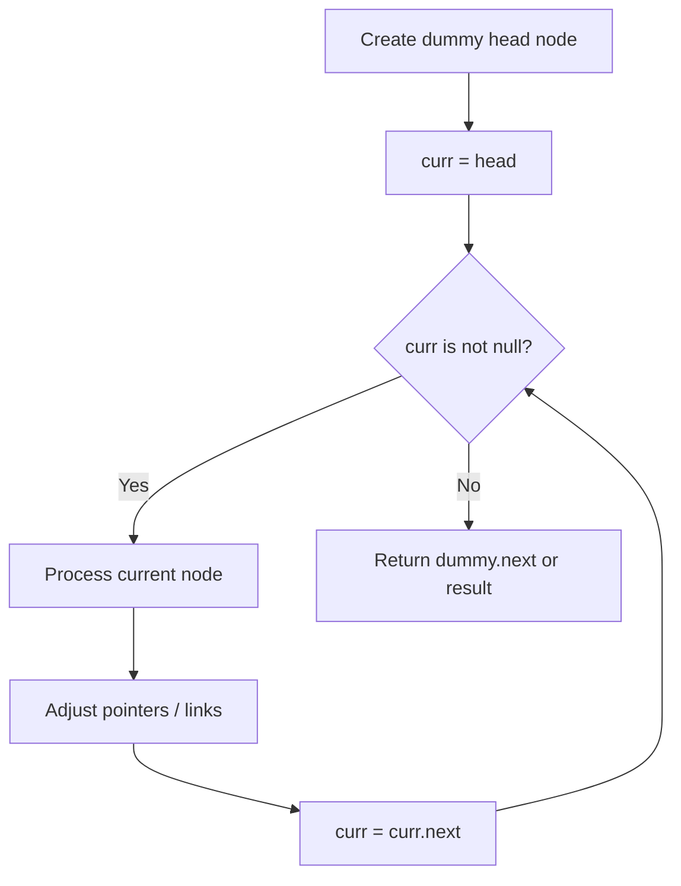
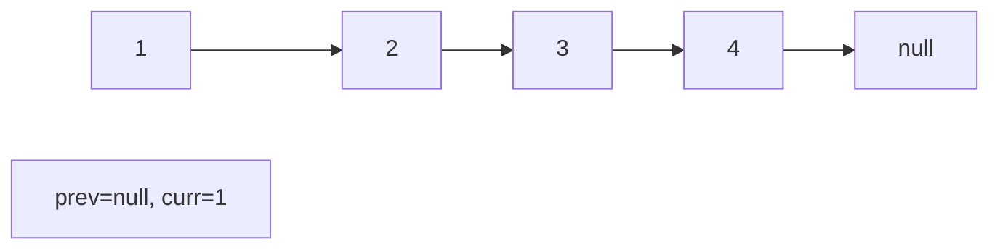
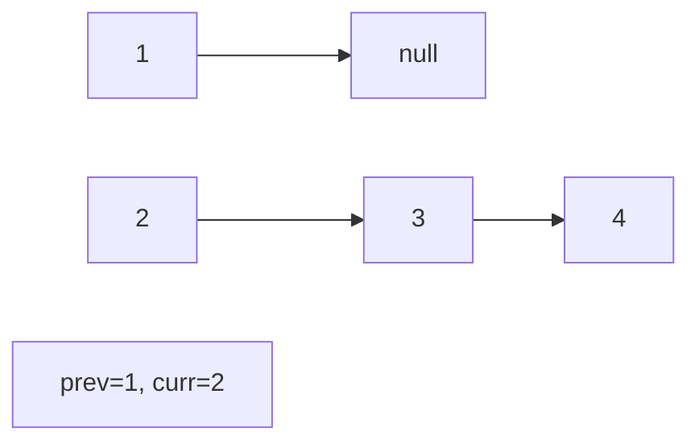
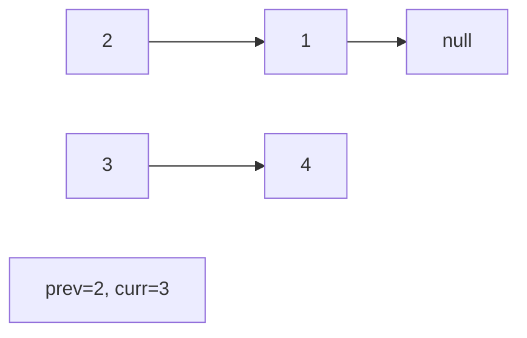
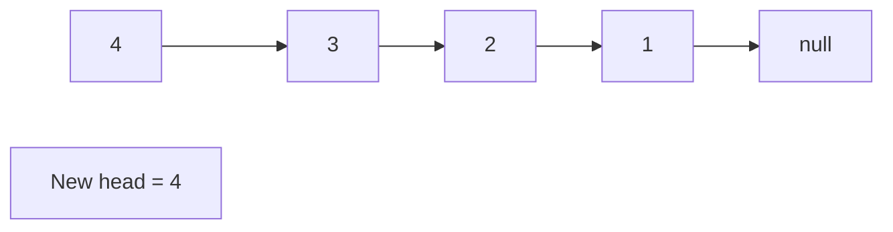

# Problem 116: Populating Next Right Pointers in Each Node

**Difficulty:** Medium  
**Tags:** Linked List, Tree, Depth-First Search, Breadth-First Search, Binary Tree  
**Pattern:** Linked List  
**Link:** [leetcode.com/problems/populating-next-right-pointers-in-each-node](https://leetcode.com/problems/populating-next-right-pointers-in-each-node/)

## Description

You are given a **perfect binary tree** where all leaves are on the same level, and every parent has two children. The binary tree has the following definition:

```

struct Node {
  int val;
  Node *left;
  Node *right;
  Node *next;
}

```

Populate each next pointer to point to its next right node. If there is no next right node, the next pointer should be set to `NULL`.

Initially, all next pointers are set to `NULL`.

 

Example 1:

```

**Input:** root = [1,2,3,4,5,6,7]
**Output:** [1,#,2,3,#,4,5,6,7,#]
**Explanation: **Given the above perfect binary tree (Figure A), your function should populate each next pointer to point to its next right node, just like in Figure B. The serialized output is in level order as connected by the next pointers, with '#' signifying the end of each level.

```

Example 2:

```

**Input:** root = []
**Output:** []

```

 

**Constraints:**

	- The number of nodes in the tree is in the range `[0, 2^12 - 1]`.
	- `-1000 <= Node.val <= 1000`

 

**Follow-up:**

	- You may only use constant extra space.
	- The recursive approach is fine. You may assume implicit stack space does not count as extra space for this problem.

## Approach: Linked List

Traverse or manipulate the linked list using pointer techniques. Common patterns: dummy head node for edge cases, fast/slow pointers for cycle detection or middle finding, in-place reversal, and merge operations.

## Pseudocode

```
1. Create dummy head if needed
2. Initialize pointer(s) at head
3. Traverse / modify list:
   a. Process current node
   b. Adjust next pointers as needed
   c. Move to next node
4. Return dummy.next or result
```

## Algorithm Flow



## Visual State Transitions

**Linked List Operation (Reverse):**

**Frame 1: Initial list**


**Frame 2: Reverse first link**


**Frame 3: Reverse second link**


**Frame 4: Fully reversed**



## Complexity Analysis

- **Time:** O(n)
- **Space:** O(1)

## Solution (Python3)

```python
class Node:
    def __init__(self, val: int, left: 'Node', right: 'Node', next: 'Node'):
        # Initialize data structure
        self.val = val
        self.left = left
        self.right = right
        self.next = next

    def connect(self, root: 'Optional[Node]') -> 'Optional[Node]':
        return None

```

## Solution (C++)

```cpp
#include <string>
#include <vector>
using namespace std;

class Node {
public:
    Node(int val, Node* left, Node* right, Node* next) {
        // Initialize
    }

    Node* connect(Node* root) {
        return nullptr;
    }

};
```
