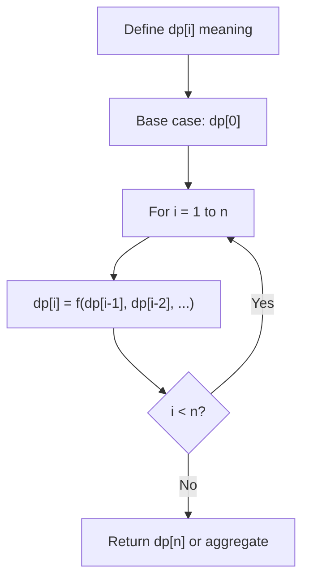
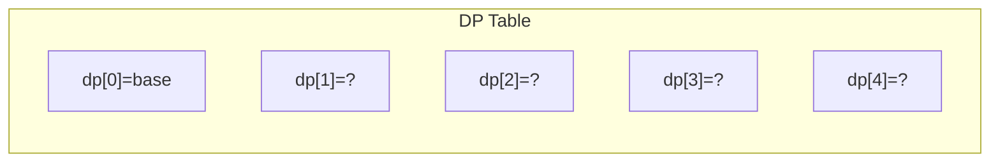
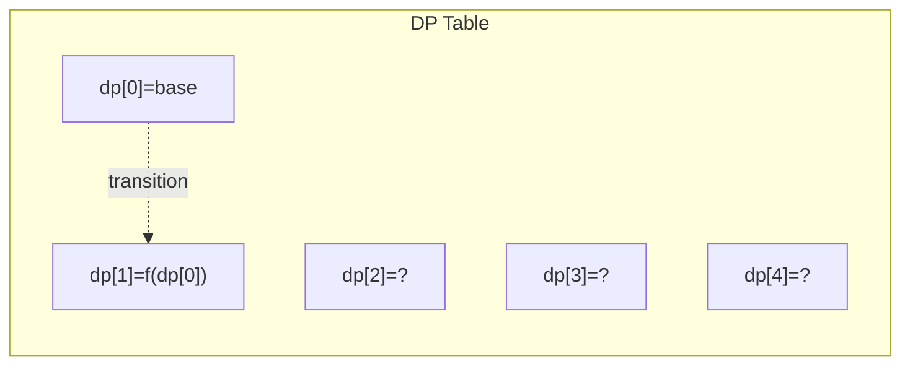
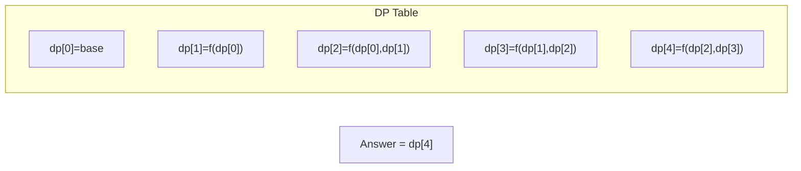

# Problem 119: Pascal's Triangle II

**Difficulty:** Easy  
**Tags:** Array, Dynamic Programming  
**Pattern:** Dynamic Programming (1D)  
**Link:** [leetcode.com/problems/pascals-triangle-ii](https://leetcode.com/problems/pascals-triangle-ii/)

## Description

Given an integer `rowIndex`, return the `rowIndex^th` (**0-indexed**) row of the **Pascal's triangle**.

In **Pascal's triangle**, each number is the sum of the two numbers directly above it as shown:

 

Example 1:

```
**Input:** rowIndex = 3
**Output:** [1,3,3,1]

```
Example 2:

```
**Input:** rowIndex = 0
**Output:** [1]

```
Example 3:

```
**Input:** rowIndex = 1
**Output:** [1,1]

```

 

**Constraints:**

	- `0 <= rowIndex <= 33`

 

**Follow up:** Could you optimize your algorithm to use only `O(rowIndex)` extra space?

## Approach: Dynamic Programming (1D)

Break the problem into overlapping subproblems. Define dp[i] as the optimal value for the subproblem ending at or considering index i. Build the solution bottom-up, using previously computed dp values.

## Pseudocode

```
1. Define dp[i] = optimal value for subproblem i
2. Base case: dp[0] = initial value
3. For i from 1 to n:
   a. dp[i] = recurrence(dp[i-1], dp[i-2], ...)
4. Return dp[n] or max/min of dp
```

## Algorithm Flow



## Visual State Transitions

**1D Dynamic Programming Table Build:**

**Frame 1: Initialize base cases**


**Frame 2: Fill dp[1] from dp[0]**


**Frame 3: Fill remaining cells**



## Complexity Analysis

- **Time:** O(n)
- **Space:** O(n)

## Solution (Python3)

```python
class Solution:
    def getRow(self, rowIndex: int) -> List[int]:
        # Dynamic programming (1D) - O(n) time, O(n) space
        if not rowIndex:
            return 0
        n = len(rowIndex) if isinstance(rowIndex, list) else rowIndex
        dp = [0] * (n + 1)
        dp[0] = 1  # base case
        for i in range(1, n + 1):
            dp[i] = dp[i-1]  # transition (customize per problem)
            if i >= 2:
                dp[i] += dp[i-2]
        return dp[n]
```

## Solution (C++)

```cpp
#include <string>
#include <vector>
using namespace std;

class Solution {
public:
    vector<int> getRow(int rowIndex) {
        // Dynamic programming (1D) - O(n) time, O(n) space
        int n = rowIndex;
        if (n <= 0) return 0;
        vector<int> dp(n + 1, 0);
        dp[0] = 1;
        for (int i = 1; i <= n; i++) {
            dp[i] = dp[i-1];
            if (i >= 2) dp[i] += dp[i-2];
        }
        return dp[n];
    }
};
```
