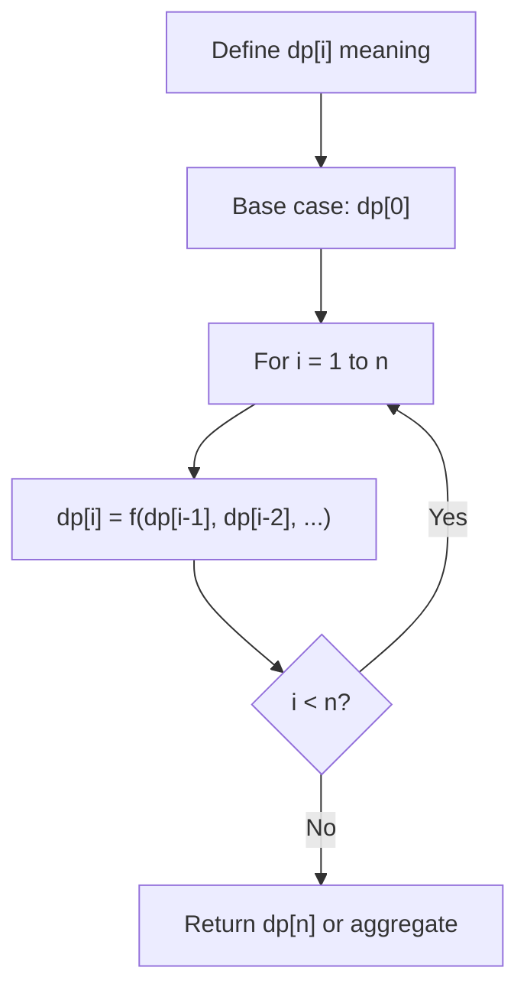
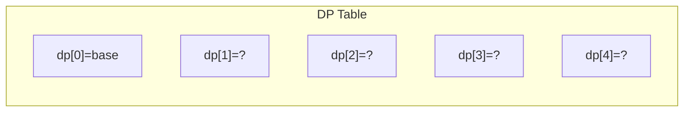
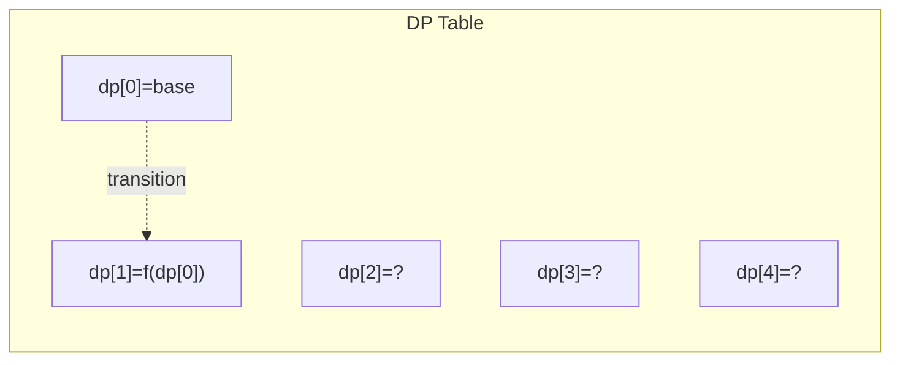
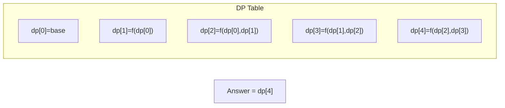

# Problem 120: Triangle

**Difficulty:** Medium  
**Tags:** Array, Dynamic Programming  
**Pattern:** Dynamic Programming (1D)  
**Link:** [leetcode.com/problems/triangle](https://leetcode.com/problems/triangle/)

## Description

Given a `triangle` array, return *the minimum path sum from top to bottom*.

For each step, you may move to an adjacent number of the row below. More formally, if you are on index `i` on the current row, you may move to either index `i` or index `i + 1` on the next row.

 

Example 1:

```

**Input:** triangle = [[2],[3,4],[6,5,7],[4,1,8,3]]
**Output:** 11
**Explanation:** The triangle looks like:
   2
  3 4
 6 5 7
4 1 8 3
The minimum path sum from top to bottom is 2 + 3 + 5 + 1 = 11 (underlined above).

```

Example 2:

```

**Input:** triangle = [[-10]]
**Output:** -10

```

 

**Constraints:**

	- `1 <= triangle.length <= 200`
	- `triangle[0].length == 1`
	- `triangle[i].length == triangle[i - 1].length + 1`
	- `-10^4 <= triangle[i][j] <= 10^4`

 

**Follow up:** Could you do this using only `O(n)` extra space, where `n` is the total number of rows in the triangle?

## Approach: Dynamic Programming (1D)

Break the problem into overlapping subproblems. Define dp[i] as the optimal value for the subproblem ending at or considering index i. Build the solution bottom-up, using previously computed dp values.

## Pseudocode

```
1. Define dp[i] = optimal value for subproblem i
2. Base case: dp[0] = initial value
3. For i from 1 to n:
   a. dp[i] = recurrence(dp[i-1], dp[i-2], ...)
4. Return dp[n] or max/min of dp
```

## Algorithm Flow



## Visual State Transitions

**1D Dynamic Programming Table Build:**

**Frame 1: Initialize base cases**


**Frame 2: Fill dp[1] from dp[0]**


**Frame 3: Fill remaining cells**



## Complexity Analysis

- **Time:** O(n)
- **Space:** O(n)

## Solution (Python3)

```python
class Solution:
    def minimumTotal(self, triangle: List[List[int]]) -> int:
        # Dynamic programming (1D) - O(n) time, O(n) space
        if not triangle:
            return 0
        n = len(triangle) if isinstance(triangle, list) else triangle
        dp = [0] * (n + 1)
        dp[0] = 1  # base case
        for i in range(1, n + 1):
            dp[i] = dp[i-1]  # transition (customize per problem)
            if i >= 2:
                dp[i] += dp[i-2]
        return dp[n]
```

## Solution (C++)

```cpp
#include <string>
#include <vector>
using namespace std;

class Solution {
public:
    int minimumTotal(vector<vector<int>>& triangle) {
        // Dynamic programming (1D) - O(n) time, O(n) space
        int n = triangle;
        if (n <= 0) return 0;
        vector<int> dp(n + 1, 0);
        dp[0] = 1;
        for (int i = 1; i <= n; i++) {
            dp[i] = dp[i-1];
            if (i >= 2) dp[i] += dp[i-2];
        }
        return dp[n];
    }
};
```
