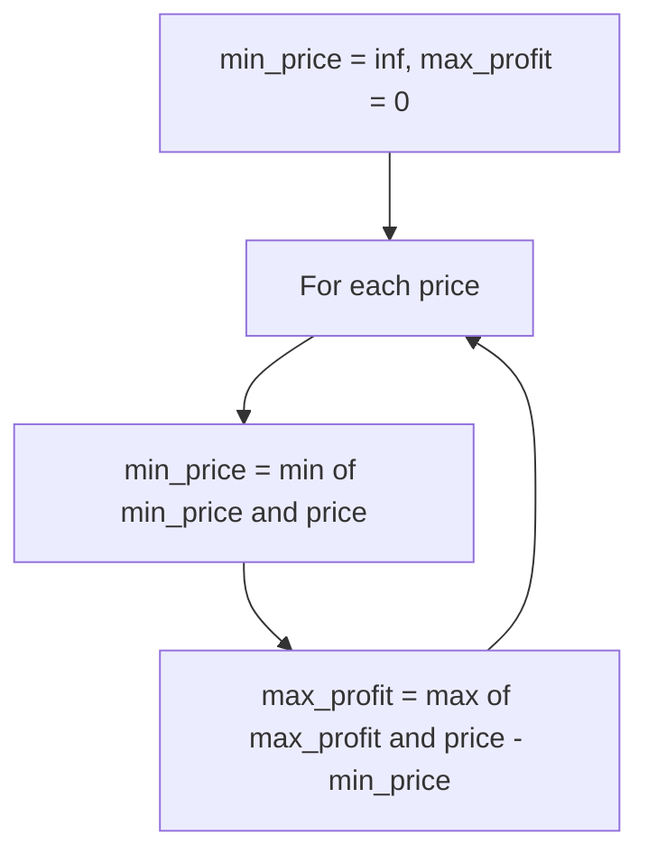
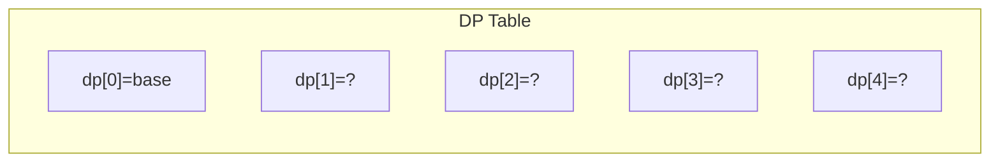
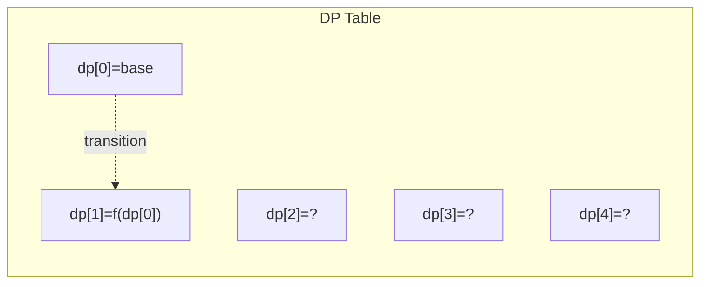
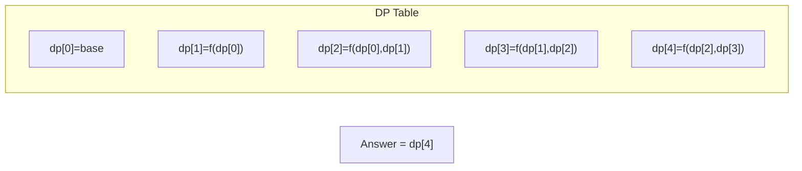

# Problem 121: Best Time to Buy and Sell Stock

**Difficulty:** Easy  
**Tags:** Array, Dynamic Programming  
**Pattern:** Greedy / One Pass  
**Link:** [leetcode.com/problems/best-time-to-buy-and-sell-stock](https://leetcode.com/problems/best-time-to-buy-and-sell-stock/)

## Description

You are given an array `prices` where `prices[i]` is the price of a given stock on the `i^th` day.

You want to maximize your profit by choosing a **single day** to buy one stock and choosing a **different day in the future** to sell that stock.

Return *the maximum profit you can achieve from this transaction*. If you cannot achieve any profit, return `0`.

 

Example 1:

```

**Input:** prices = [7,1,5,3,6,4]
**Output:** 5
**Explanation:** Buy on day 2 (price = 1) and sell on day 5 (price = 6), profit = 6-1 = 5.
Note that buying on day 2 and selling on day 1 is not allowed because you must buy before you sell.

```

Example 2:

```

**Input:** prices = [7,6,4,3,1]
**Output:** 0
**Explanation:** In this case, no transactions are done and the max profit = 0.

```

 

**Constraints:**

	- `1 <= prices.length <= 10^5`
	- `0 <= prices[i] <= 10^4`

## Approach: Greedy / One Pass

Track minimum price seen. At each price, compute potential profit = price - min_price.

## Pseudocode

```
1. min_price = inf, max_profit = 0
2. For each price: update min, update max profit
3. Return max_profit
```

## Algorithm Flow



## Visual State Transitions

**1D Dynamic Programming Table Build:**

**Frame 1: Initialize base cases**


**Frame 2: Fill dp[1] from dp[0]**


**Frame 3: Fill remaining cells**



## Complexity Analysis

- **Time:** O(n)
- **Space:** O(1)

## Solution (Python3)

```python
class Solution:
    def maxProfit(self, prices: list[int]) -> int:
        min_price = float('inf')
        max_profit = 0
        for price in prices:
            min_price = min(min_price, price)
            max_profit = max(max_profit, price - min_price)
        return max_profit
```

## Solution (C++)

```cpp
#include <string>
#include <vector>
using namespace std;

class Solution {
public:
    int maxProfit(vector<int>& prices) {
        // Dynamic programming (1D) - O(n) time, O(n) space
        int n = prices;
        if (n <= 0) return 0;
        vector<int> dp(n + 1, 0);
        dp[0] = 1;
        for (int i = 1; i <= n; i++) {
            dp[i] = dp[i-1];
            if (i >= 2) dp[i] += dp[i-2];
        }
        return dp[n];
    }
};
```
